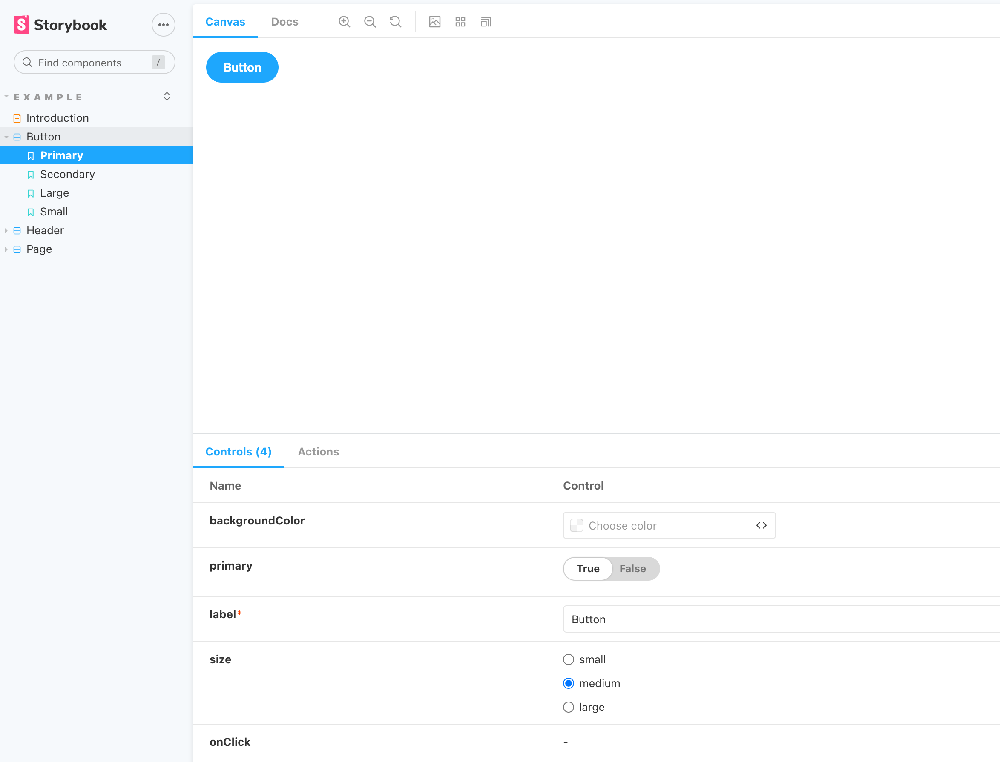
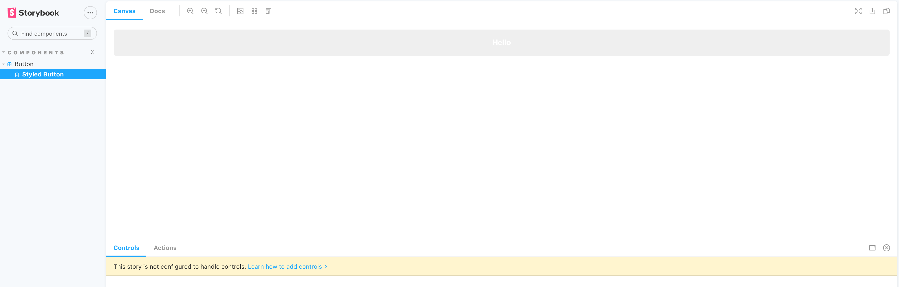
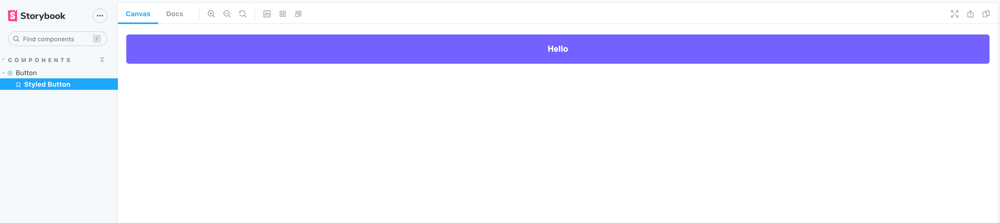
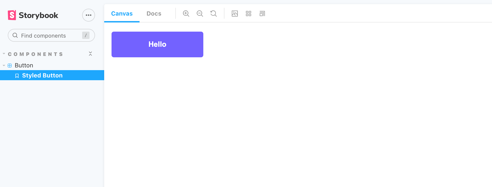
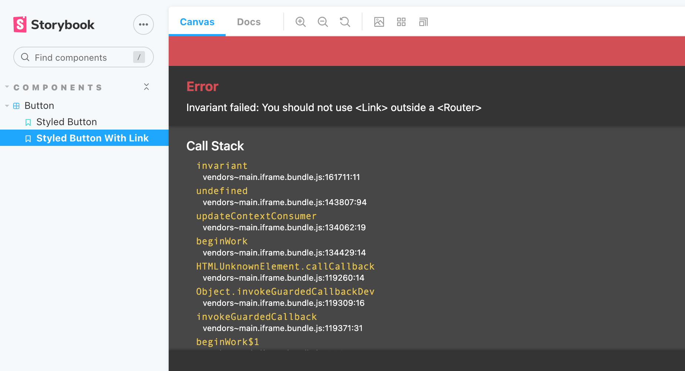
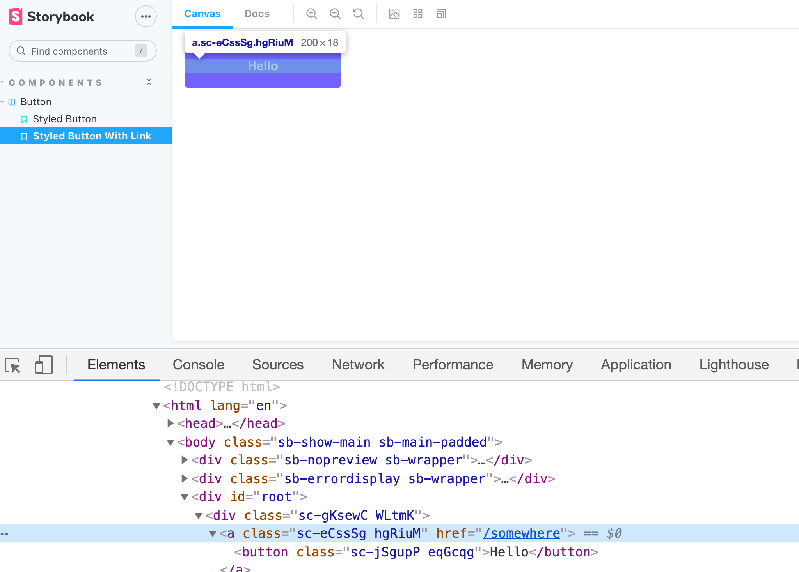
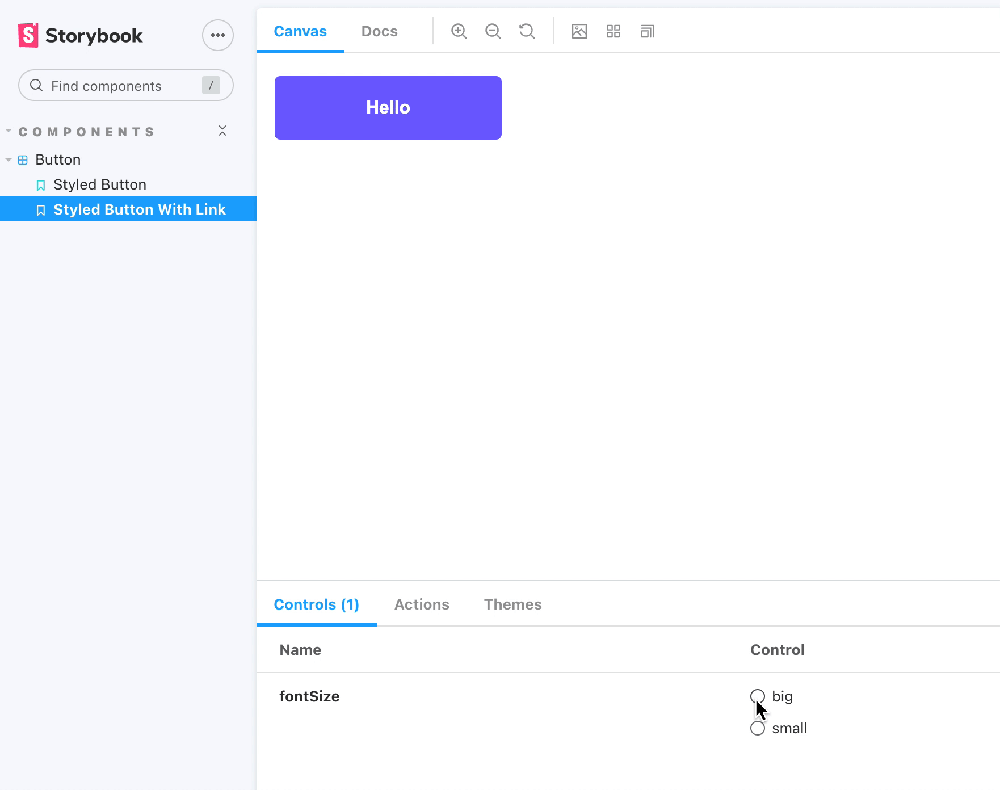

지금 껏 컴포넌트의 CSS 코드를 변경하면, 변경된 컴포넌트를 확인하기 위해 컴포넌트를 사용한 곳에 가서 직접 변화를 확인해야 했습니다.

지금부터는 Storybook 라이브러리를 활용하여 버튼 컴포넌트를 독립적으로 렌더링하고, 쉽게 변경된 내용을 확인할 수 있는 환경을 만들어 보도록 하겠습니다.

## Storybook 설치하기

```jsx
npx sb init
```

## Storybook 실행하기

```jsx
npm run storybook
```

storybook을 설치했으니, 실행하여 어떤 구조로 구성되어 있는지 살펴보도록 하겠습니다.



실행하면 [localhost:6006](http://localhost:6006) 주소로 storybook 웹페이지에 접근할 수 있습니다.

storybook을 설치하면 storybook 라이브러리에서 설정해 놓은 예시 데이터들을 볼 수 있습니다. Button 컴포넌트에서 하단 컨트롤 탭에서 props의 설정을 바꿔가면서 UI 테스트가 가능한 것을 알 수 있습니다.

이제 이 버튼을 우리의 버튼으로 바꿔 보도록 하겠습니다.

## Storybook에서 버튼 만들기

```jsx
// src/components/Button/index.stories.js
import React from "react";
import Button from "./";

// 사용할 컴포넌트에 대한 명세
export default {
	title: "Atoms/Button",
	component: [Button],
};

// 외부에 보여질 컴포넌트
export const StyledButton = () => <Button>Hello</Button>;
```

storybook 파일을 만들 때에는 반드시, \*.stories.js 형태로 파일을 생성해야 합니다. 그래야 storybook 라이브러리가 storybook 파일임을 확인하고, 렌더링을 해줍니다.

위와 같이 변경하고, storybook을 실행해 보도록 하겠습니다.

storybook은 자동으로 변경을 감지하여 재시작이 되므로 따로 재시작 해줄 필요는 없습니다.



왼쪽에 이름이 Styled Button 이름으로 하나의 버튼이 생긴 것을 알 수 있습니다. 그리고 Canvas에 보면 Hello 버튼이 만들어 진 것을 알 수 있습니다.

그런데 이상한 점이 하나 있는데, 우리가 만들었던 버튼의 색깔이 아닌 회색입니다.

이러한 이유는 storybook에 테마를 적용하지 않았기 때문입니다.

## Storybook에 테마 적용하기

Storybook에는 addon 이라는 개념이 있습니다. 쉽게 이야기하면 Storybook 내부에서 사용하는 또 다른 라이브러리입니다. 많은 개발자들이 다양한 addon을 개발해 두었는데, 그중에서 우리는 `storybook-addon-styled-component-theme` addon을 활용하여 테마를 적용해 보도록 하겠습니다.

### styled-component theme add on 설치하기

add on 상세 설명 페이지 ([링크](https://storybook.js.org/addons/storybook-addon-styled-component-theme))

```jsx
npm install --save-dev storybook-addon-styled-component-theme
```

### add-on 설정 셋팅하기

```jsx
// ./storybook/preview.js
import { addDecorator } from "@storybook/react";
import { withThemesProvider } from "storybook-addon-styled-component-theme";
import { ThemeProvider } from "styled-components";
import theme from "../src/theme";

...
// storybook에 theme를 불러와 실행 시켜주기
addDecorator(withThemesProvider([theme]), ThemeProvider);
```

```jsx
// ./storybook/main.js
module.exports = {
	addons: [
		...
		"storybook-addon-styled-component-theme/dist/preset",
		...
	],
};
```

테마 적용이 완료되었으니, 다시 storybook을 실행해 보도록 하겠습니다.



정상적으로 우리가 사용하는 버튼이 렌더링 된 것을 확인 할 수 있습니다.

## StoryBook에 Container 컴포넌트 추가하기

우리가 만든 버튼은 width가 100%로 되어 있기 때문에 화면 전체를 꼭 채우게 됩니다.

그래서 Storybook 내부에서만 사용할 Container 컴포넌트를 하나 만들고, 감싸 주도록 하겠습니다.

```jsx
// src/components/Button/index.stories.js
...
import styled from "styled-components";
...

const Container = styled.div`
	width: 200px;
`;

export const StyledButton = () => (
	<Container>
		<Button>Hello</Button>
	</Container>
);
```

실행해 보도록 하겠습니다.



컨테이너 사이즈 내에서 버튼의 사이즈가 조절 된 것을 알 수 있습니다.

## Storybook에 컴포넌트 추가하기

우리가 만든 버튼 컴포넌트를 보면, to Props 존재 여부에 따라 버튼이 링크로 감싸집니다. 이러한 상황도 Storybook에서 만들 수 있는데, 아래와 같이 코드를 추가해 보도록 하겠습니다.

```jsx
...
import styled from "styled-components";
...

...
export const StyledButtonWithLink = () => (
	<Container>
		<Button to="/somewhere">Hello</Button>
	</Container>
);
```

실행해 보도록 하겠습니다.



그런데 또 에러가 발생합니다. 왜냐하면 React-Router를 사용하도록 설정이 되어 있지 않기 때문입니다.

## Storybook에서 React-Router 사용하기

### 라이브러리 설치하기

```jsx
npm install --save-dev storybook-react-router
```

### Storybook에 React-Router 설정하기

```jsx
// ./storybook/preview.js
import StoryRouter from "storybook-react-router";

...
addDecorator(StoryRouter());
...
```

스토리북 설정 코드에서 위 코드를 추가합니다.

그리고 Storybook을 재시작합니다.



화면처럼 버튼도 잘 그려지고, a 태그까지 잘 감싸진 것을 확인 할 수 있습니다.

## Storybook에 동적으로 props 추가하기

버튼의 font-size를 storybook에서 바꿀 수 있도록 코드를 변경 해 보도록 하겠습니다.

우선 button 컴포넌트에서 fontSize를 props로 받을 수 있도록 코드를 수정하도록 하겠습니다.

```jsx
// src/components/Button/index.js

...
const Button = ({ to, onClick, children, fontSize }) =>
	to ? (
		<StyledLink to={to}>
			<StyledButton onClick={onClick} fontSize={fontSize}>
				{children}
			</StyledButton>
		</StyledLink>
	) : (
		<StyledButton onClick={onClick} fontSize={fontSize}>
			{children}
		</StyledButton>
	);
...
export default Button;
```

fontSize를 args로 받아와서 Button 컴포넌트에 넘겨주는 과정을 아래와 같이 작성합니다.

```jsx
// src/components/Button/index.stories.js

// 사용할 컴포넌트에 대한 명세
export default {
	...
	// fontSize 값을 storybook에서 받을 수 있도록 설정하기
	argTypes: {
		fontSize: {
			control: {
				type: "radio",
				options: ["big", "small"],
			},
		},
	},
};

...

// storybook에서 설정한 args 옵션을 받아와 Button 컴포넌트에 추가해주기
export const StyledButton = (args) => (
	<Container>
		<Button {...args}>Hello</Button>
	</Container>
);

// storybook에서 설정한 args 옵션을 받아와 Button 컴포넌트에 추가해주기
export const StyledButtonWithLink = (args) => (
	<Container>
		<Button to="/somewhere" {...args}>
			Hello
		</Button>
	</Container>
);
```

위와 같이 코드를 변경하고 실행해 보도록 하겠습니다.



라디오 버튼 선택에 따라서 버튼의 크기가 커지고 작아지는 것을 볼 수 있습니다.

이외에도 Storybook을 설정하는 방법은 무궁무진합니다.

그래서 필요할 때마다 기능을 찾아서 쓰는 방법을 추천드립니다.

## 전체 코드 살펴보기

- 깃허브에서 전체 코드 보기 -> [바로가기](https://github.com/CodePotStudio/starter-quiz-app/tree/additional-material-00)

## Somthing More!!!

반드시 공부해야 하는 건 아니지만, 도움이 될 만한 자료들을 공유하고 있습니다.

- StoryBook 좀 더 자세히 알아보기 공식 문서 ([링크](https://storybook.js.org/docs/react/get-started/introduction))
