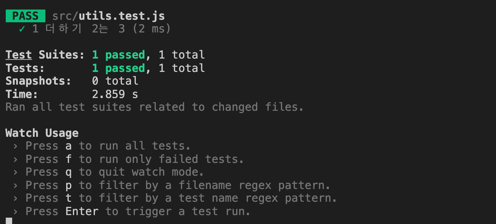
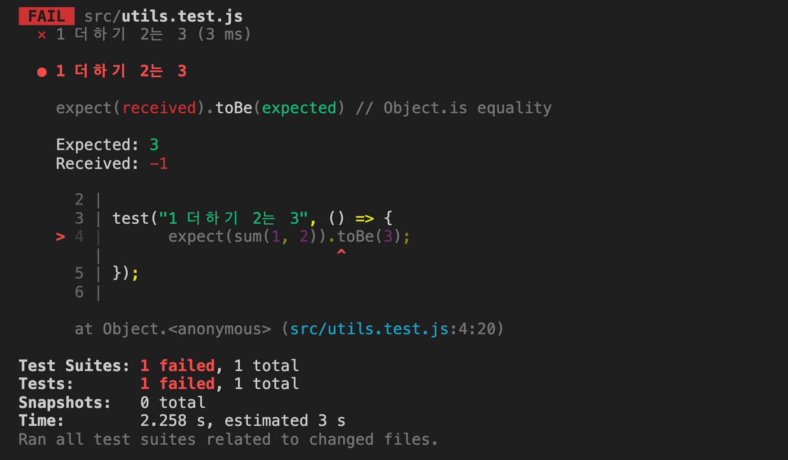
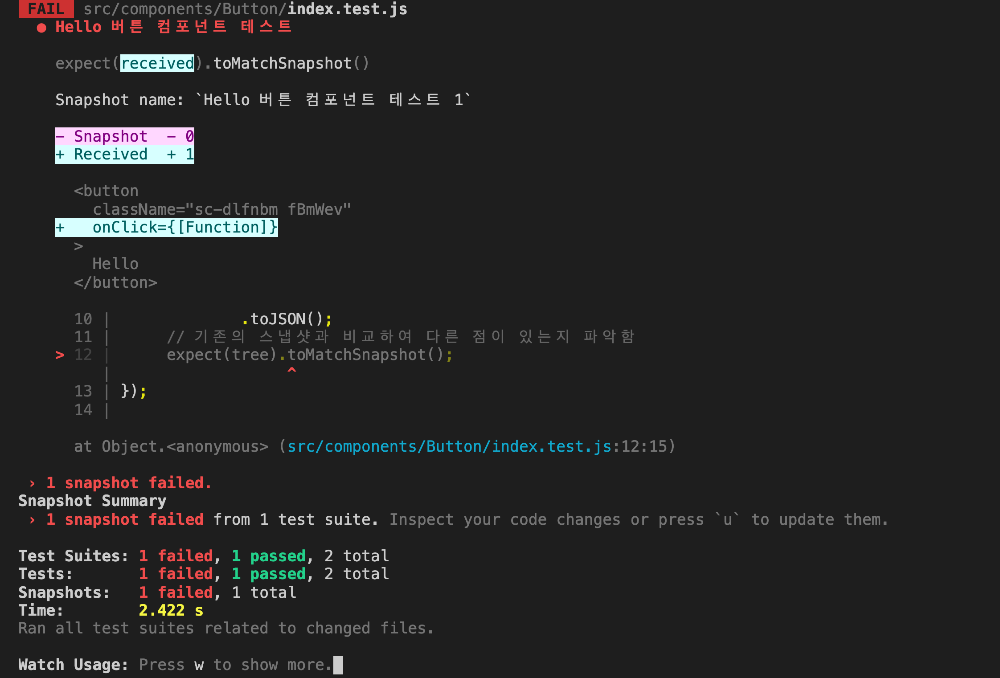
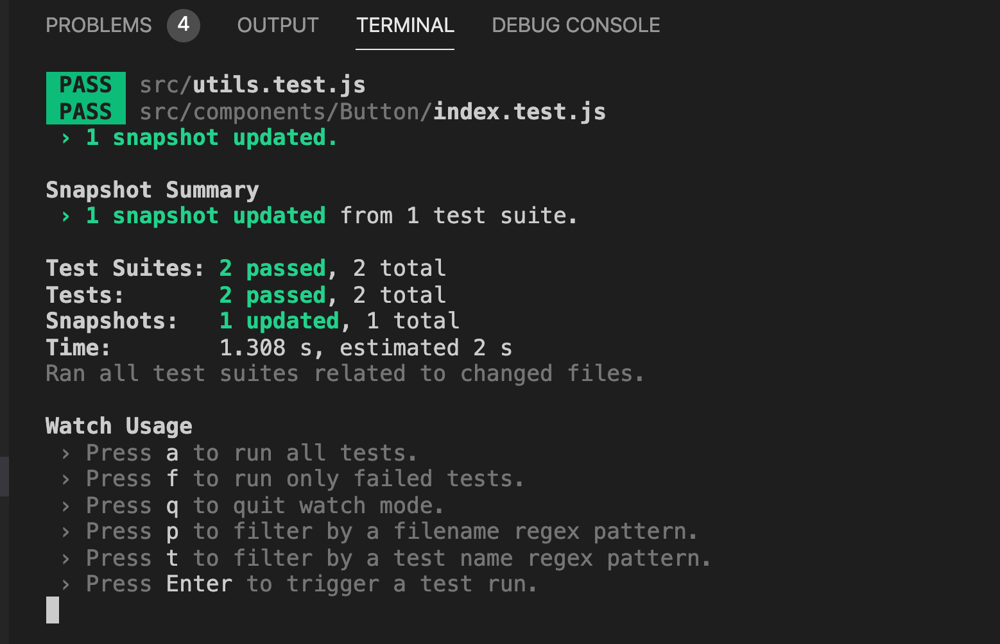

## 테스트 코드란?

테스트 코드란 반복적으로 테스트하는 업무들을 자동화해주는 것을 일컫습니다. 예를 들어, A라는 함수를 만들었는데, 테스트 코드가 없다면 A 함수를 사용하는 곳에 가서 실제로 원하는 대로 동작하는지 확인을 해야 합니다. 하지만 테스트코드가 있다면 A함수를 수정할 때 A 함수를 사용하는 곳에서 결과를 확인하지 않고, 테스트 코드로 이를 대신할 수 있습니다.

아래 글에서 천천히 위 내용을 다루니 이해가 안되더라도 걱정하지 마세요!!

## React에서의 테스트 코드 만들기

React에서는 jest 라이브러리를 활용하여 테스트 코드를 작성합니다. 이번 파트에서는 jest를 활용하여 간단한 함수 테스트 코드와 컴포넌트 렌더링 테스트 코드를 짜보도록 하겠습니다.

## Jest 설치하기

Jest는 CRA로 프로젝트를 설치한 경우 자동으로 같이 설치가 됩니다.

그리고 불필요한 파일도 정리하고 가겠습니다.

기존에 있던 `App.test.js` 파일을 삭제해 주세요. CRA에서 기본으로 생성하는 test 코드입니다.

## Jest로 함수 테스트 코드 작성하기

우선 테스트할 `sum` 함수를 하나 만들어 보도록 하겠습니다.

```jsx
// utils.js

const sum = (a, b) => a + b;
export { sum };
```

`sum` 함수는 `a`와 `b`를 매개변수로 받아 결과 값으로 두 값을 더해주는 단순한 함수입니다.

### 간단한 테스트 코드 작성하기

sum 함수를 테스트할 테스트 코드를 작성해 보도록 하겠습니다.

jest는 storybook처럼 `*.test.js`로 중간에 파일 명 사이에 test를 넣어주어야 jest가 테스트 코드임을 확인하고 실행합니다. 꼭 명심해 주세요.

```jsx
// utils.test.js

import { sum } from "./utils";

// test 함수의 첫번째 인자로는 test의 이름이 들어 갑니다.
// test 함수의 두번째 인자로는 함수가 들어가며 이 곳에서 우리가 작성한 코드가 정상적으로 의도한 대로 작성하는지를 확인합니다.
test("1 더하기 2는 3", () => {
	expect(sum(1, 2)).toBe(3);
});
```

코드의 의미에 대해서 알아 보도록 하겠습니다.

```jsx
expect(sum(1, 2)).toBe(3);
```

우리가 만든 sum 함수에 1과 2를 넣었을 때, 결과가 3인지를 확인하는 코드입니다. 만약 1과 2를 넣었을 때 결과가 3이 아니라면 에러를 발생시키게 됩니다.

즉, sum 함수를 정상적으로 잘 만들었다면 위 테스트 코드를 실행했을 때 에러가 발생하지 않을 것입니다. 하지만 만약에 sum 함수를 잘못 작성하였다면 에러가 발생하므로 sum 코드를 잘못 되었음을 테스트 코드를 통해 알 수 있게 됩니다.

### 테스트 코드 실행하기

작성한 테스트 코드를 아래 명령어를 통해 실행해 보도록 하겠습니다.

```jsx
npm test
```

테스트 코드가 정상적으로 통과된 것을 알 수 있습니다.



통과되었다는 의미는 sum 함수에 1과 2를 매개변수로 넣어서 실행해 보았더니, 3이 나왔다는 것을 의미합니다.

그럼 실패하면 어떻게 될까요?

제가 다른 코드를 수정하다가 실수로 sum 함수를 아래와 같이 변경했습니다.

```jsx
// utils.js

const sum = (a, b) => a - b;
export { sum };
```

위와 같이 코드를 변경하고 테스트 코드를 실행해 보도록 하겠습니다.



테스트 코드가 통과를 하지 못했으며, 테스트 코드에서 예상하기에는 결과(Expected)가 3이 나와야 하는데, 실제 코드를 실행(Received)해 보니 -1이 나왔다고 합니다.

여기서 바로 테스트 코드의 힘을 알 수 있습니다. 누군가의 실수 혹은 작업으로 코드를 변경하였을 때, 테스트 코드를 미리 작성해 두면 코드의 문제점 여부를 손쉽게 파악할 수 있습니다.

## React 컴포넌트 테스트하기

javascript 함수 뿐만 아니라, React의 컴포넌트 또한 테스트 코드 작성이 가능합니다. 즉, 우리가 원하는 대로 화면에 제대로 렌더링이 되었는지 실제로 눈으로 확인하지 않고, 테스트 코드로 확인이 가능합니다.

### react-test-renderer 설치하기

```jsx
yarn add --dev react-test-renderer
```

### Snapshot Testing하기

컴포넌트는 일반적인 함수 테스팅과 다른 점이 있습니다. 테스팅 함수의 경우 sum(1, 2)의 결과를 3으로 예측할 수 있지만, 컴포넌트 렌더링이 어떻게 될지 일일이 예측하는 것은 어렵습니다. 그래서 jest에서는 snapshot testing이라는 기능을 지원하는데, 이는 최초에 테스트를 실행할 때 컴포넌트 렌더링 결과를 저장해 놓고, 다음 테스트부터는 해당 렌더링 결과와 비교하여 테스트 통과 여부를 판단합니다.

개념에 대해 간략하게 이해가 되었으니, 실제로 코드를 보면서 설명해 보도록 하겠습니다.

```jsx
// components/Button/index.test.js

import { Button } from "components";
import renderer from "react-test-renderer";

test("Hello 버튼 컴포넌트 테스트", () => {
	// 테스트를 실행하면 스냅샷을 생성함
	const tree = renderer.create(<Button>Hello</Button>).toJSON();
	// 기존의 스냅샷과 비교하여 다른 점이 있는지 파악함
	expect(tree).toMatchSnapshot();
});
```

위와 같이 코드를 생성하고, 테스트 코드를 실행해 보도록 하겠습니다.

코드를 실행하면 아래와 같은 snapshot 파일이 생긴 것을 알 수 있습니다.

```jsx
// components/Button/__snapshot__/index.test.js.snap

// Jest Snapshot v1, https://goo.gl/fbAQLP

exports[`Hello 버튼 컴포넌트 테스트 1`] = `
<button
  className="sc-dlfnbm fBmWev"
>
  Hello
</button>
`;
```

즉, 이제 jest는 이 스냅샷 파일을 기준으로 우리가 원하는 대로 작동하고 있는지를 판단하게 됩니다.

```jsx
// components/Button/index.test.js

import { Button } from "components";
import renderer from "react-test-renderer";

test("Hello 버튼 컴포넌트 테스트", () => {
	// 테스트를 실행하면 스냅샷을 생성함
	const tree = renderer
		.create(<Button onClick={() => console.log("hello")}>Hello</Button>)
		.toJSON();
	// 기존의 스냅샷과 비교하여 다른 점이 있는지 파악함
	expect(tree).toMatchSnapshot();
});
```

위와 같이 `Button` 컴포넌트에 `onClick` 함수 추가하고 다시 테스트를 돌려 보도록 하겠습니다.



그러면 위와 같이 스냅샷과 코드가 일치하지 않아 테스트 코드가 실패된 것을 알 수 있습니다.

### snapshot 업데이트하기

만약에 우리가 작성한 버튼 컴포넌트가 우리가 실제로 원하는 형태라서 스냅샷을 업데이트 해야 할 땐 어떻게 해야 할까요?

아래의 명령어를 통해서 스냅샷을 현재 작성된 기준으로 다시 업데이트 할 수 있습니다.

```jsx
yarn test -u
```

위 코드를 실행해보면 아래처럼 정상적으로 테스트가 통과된 것을 알 수 있습니다.



간략하게 나마 테스트 코드에 대해서 알아 보았습니다.

테스트 코드는 typescript와 더불어 유저에게 배포되기 전 사전에 에러를 방지하고, 코드 품질을 높이는데 큰 도움이 됩니다. 꼭 시간이 되실 때 한 번 적용해 보는 것을 추천드립니다.

## 전체 코드 살펴보기

- 깃허브에서 전체 코드 보기 -> [바로가기](https://github.com/CodePotStudio/starter-quiz-app/tree/additional-material-02)
