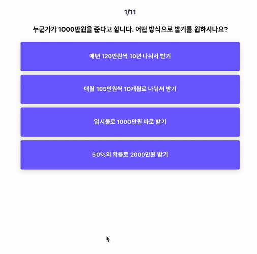
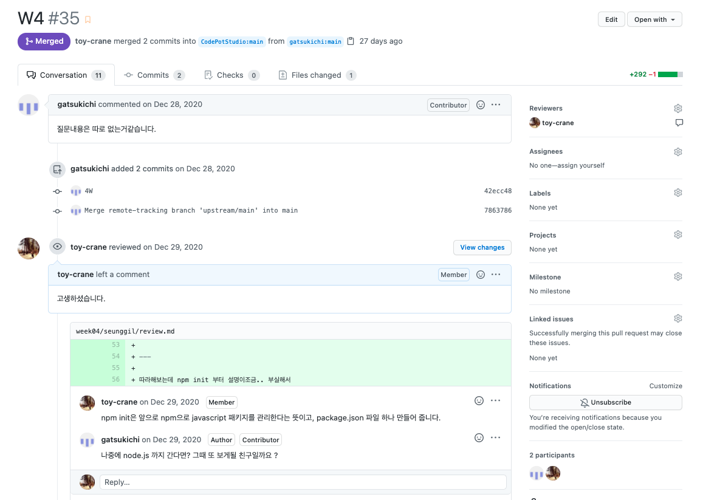

## **React 개발에서 배포까지**는 어떤 클래스인가요?

**React** **개발에서 배포까지 클래스**는 미니 프로젝트를 바탕으로 빠르게 React를 알아가는 수업입니다.

- 2주마다 한 번씩 실제 웹서비스를 외부에 배포합니다.
- 2주마다 기존에 있던 코드를 더 좋은, 더 나은 코드로 리팩토링을 하며 다시 배포합니다.
- 8주가 지나면 아래와 같은 자신만의 성향 테스트를 만들 수 있게 됩니다. ([sample](https://www.usaant.kr/))

  

개발을 할 때 가장 중요한 것은 **빠르게 실행하고, 그 속에서 개선점을 파악해 새로운 코드를 제품에 적용하는 과정**입니다. 그래서 이 번 클래스는 2주마다 실제로 배포를 하며, 개선점을 찾아 나가려고 합니다. 그리고 배포 속에서 얻은 교훈들을 코드에 지속적으로 적용합니다. 그 과정 속에 왜 이러한 기술들을 현업에서 사용하는지 원리와 사용방법들을 훨씬 쉽게 깨닫게 될 수 있을 것이라고 확신합니다.

## 어떤 사람이 적합 한가요?

- React 클래스이기 때문에, 기본적인 JavaScript 이해도(ES5, ES6)를 요구합니다.
  - 기초 Javascript는 이해하고 있으나 ES5, ES6에 대한 지식이 부족하신 분은 온보딩 기간 동안 튜터가 수업자료를 공유드립니다.
- 매주 공부 해야할 분량이 많습니다. 최소 일주일에 6시간 이상씩 시간을 할당할 수 있는 분들이 적합합니다.

## 클래스는 어떻게 진행 되나요?

- 강의 듣고 일주일간 복습 및 과제하기

  - 강의 코드를 집에서 처음부터 끝까지 다시 따라 합니다.
  - 복습을 하고도 시간이 남는다면 튜터가 알려준 추가 자료들을 학습합니다. (정말 정말 중요해요!!!!!)

- 리뷰 및 과제 남기기 (매주 월요일 자정까지)

  - 매주 일요일 자정 12시까지 정해진 **깃허브에 일주일간 배운 내용을 요약하고, 과제도 추가하여 커밋**을 합니다.

    [TWIL 작성 가이드](https://www.notion.so/TWIL-54b991044e43480b90068f87f6416509)

  - 깃허브에 커밋을 못했거나, **과제 검사에서 불성실한 제출이 확인된 경우 환급을 받지 못합니다.**

- Peer 및 튜터 리뷰 (매주 화요일 수업 전까지)

  - 자유롭게 다른 스터디원들이 쓴 글을 보고, `github`에서 몰랐던 것이나 궁금한 점들에 대해 이야기를 나눕니다.
  - 튜터가 과제와 리뷰를 보고 피드백을 남깁니다.
    **1기 PR 리뷰**
    

- React 수업 (매주 화요일 수업 시간 / 온라인)
  정해진 커리큘럼에 따라 줌을 통해 온라인으로 수업이 진행됩니다.
  전반부 2시간은 커리큘럼에 있는 새로운 내용들을 배웁니다.
  후반부 1시간은 수강생분들의 과제와 리뷰를 보고, 상호 피드백을 시간을 갖습니다. 코드 리뷰와 앞으로의 개발 방향에 대해 이야기를 나눕니다.

## 클래스 일정은 어떻게 되나요?

- 수업 시간: **매주 화요일 오후 7:30 ~ 10:30**
- 클래스 일정: 2/16 ~ 4/13 (총 8주 / 휴식기 1주 포함)
- 장소: 줌 온라인

## 모집 인원은 몇 명인가요?

- 최대 8명입니다.

## 신청 기간과 비용은 어떻게 되나요?

- 신청 기간: 추후 공지
- 참가 비용: 300,000원 (8주)
  - 8주 강의 **전체 참가 및 과제 제출 시, 10만원 환급** 해드리고 있습니다.
- 입금 계좌: 카카오뱅크 3333-09-1840091 김한울
- 입금 기간: 추후 공지
- 신청 방법

  - 구글 폼을 2/7까지 작성하여 제출
    [링크](https://forms.gle/LxNhtqPyEgyDnsfC9)

## 이 점은 유의해 주세요 🧐

### 환불 규정

- 남은 강의는 전체 비용에서 1/8을 하여 남은 횟수 만큼을 돌려 드립니다.
  - 환불은 반드시 1주 전에 말씀해주셔야 해당 주차 부터 환불이 적용됩니다.
- 개인 사정으로 인해 참가하지 못한 수업 비용은 환불 되지 않습니다.

## Code Pot, 스터디 리더는 누구인가요?

- 김 한울
  - 현) 스타트업 창업 준비
  - 현) 스파르타 코딩 클럽 6,7,8,9,10,11기 튜터
  - 전) 피플펀드 대출 UX 테크 리드
  - 전) KT 테크니컬 아키텍처팀 근무
  - 한양대학교 정보시스템학과 졸
  - [Medium](https://toycrane.medium.com/) / [Github](https://github.com/toy-crane)
