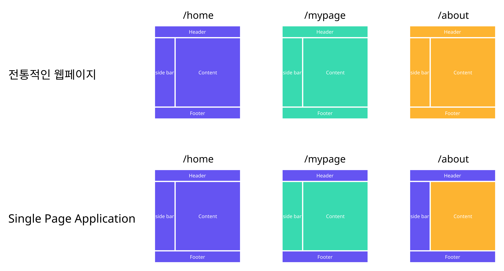
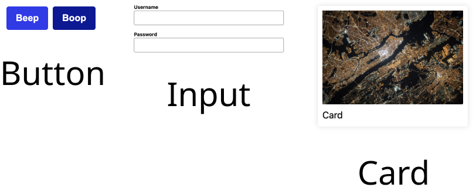

## React?

페이스북에서 만든 편리하게 웹페이지를 만들어 주는 `Javascript` 라이브러리입니다.
:::note 라이브러리란?
다른 개발자들이 여러 사람들을 위해서 만들어 놓은 코드를 의미합니다. 대부분의 개발자들이 모든 것을 직접 만들지 않고, 다른 사람들이 만들어 놓은 코드들을 가지고 조합해서 사용하고 있어요!
:::

## React를 쓰면 뭐가 좋은가요?

### Single Page Application

위 그림에서 볼 수 있듯이, 전통적인 웹페이지는 각 `url`로 `HTML` 요청을 보내면 새로운 `HTML`을 클라이언트에게 내려 줬습니다. 이에 반해 `single page application`의 경우, 최초에 페이지에 접근할 때 모든 `HTML`과 `javscript`를 다 내려 받고, `url`에 따라 필요한 부분만 업데이트를 해주는 구조입니다. 이로 인해서 서버를 거치지 않아도 되며, 빠르게 페이지 로딩을 해줄 수 있는 장점이 있습니다.

:::note 클라이언트란?
클라이언트는 `HTTP` 요청을 보내는 주체로 유저가 사용하는 브라우저가 됩니다.
:::

:::note 서버란?
브라우저에서 요청한 데이터를 내려주는 주체로 우리가 정한 규칙대로 행동하는 하나의 큰 컴퓨터로 생각하면 편합니다.:::
:::

### Component 기반의 UI

컴포넌트는 레고 블럭과 비슷해요. 자동차를 만든다고 하면 필요한 블럭들 (3칸, 10칸, 바퀴, ...)을 가져와서 조립하는 것처럼 `React`도 여러 컴포넌트 단위로 `UI`를 나눌 수 있습니다.

위의 그림처럼 우리가 필요로 하는 `Component`를 만들고, 이 `Component`를 필요로 하는 곳에서 원하는 대로 사용할 수 있어요 (이를 개발용어로 재사용성이 좋은 컴포넌트라고 이야기 합니다)

### 모든 플랫폼에서 사용이 가능합니다

`React`는 기본적으로 웹 개발 용으로 시작했지만 다른 플랫폼에서도 사용이 가능합니다. `React Native`를 통해서 앱도 만들 수 있고, `Electron`을 통해서 PC 앱도 만들 수 있습니다. 내부에서 사용하는 문법은 같으나, 각 플랫폼에 맞춰서 조금 더 공부해야할 내용들이 있습니다.

## Somthing More!!!

반드시 공부해야 하는 건 아니지만, 도움이 될 만한 자료들을 공유하고 있습니다.

1. 서버 사이드 렌더링과 클라이언트 사이드 렌더링의 차이점
   [링크](https://www.notion.so/toycrane/React-f85380b6c9d340419c3707075a68133c#79cd258553414462af7157c858d7e447)
