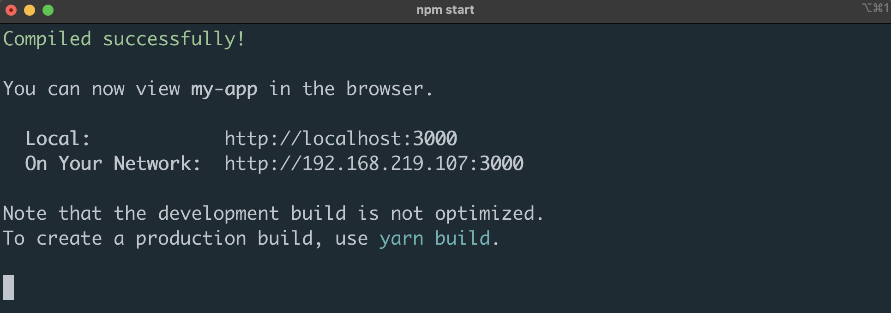
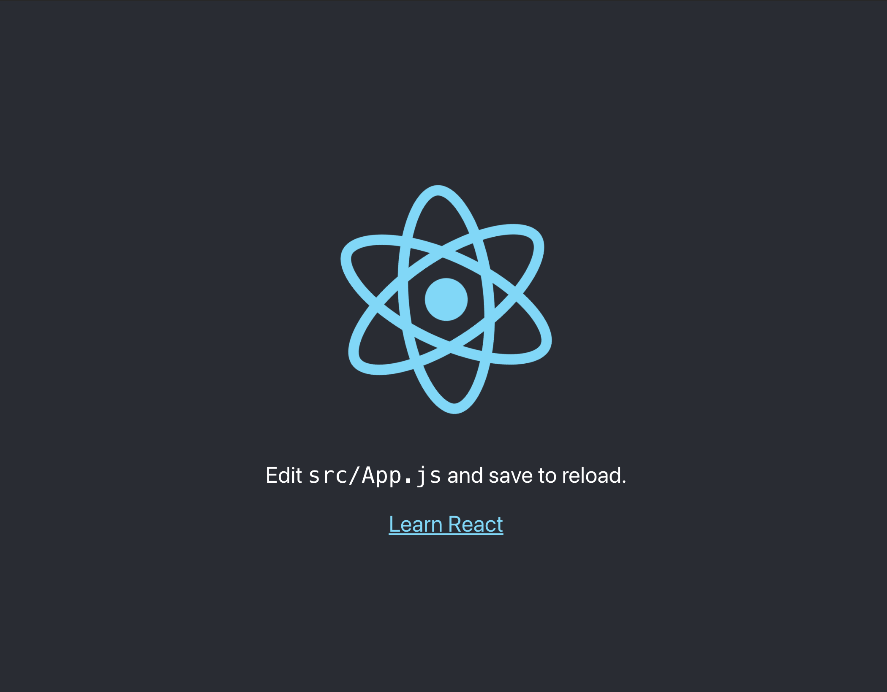

## 1. Create React App 이란?

이름에서도 알 수 있듯이 React 쉽게 사용할 수 있도록 만들어 주는 도구입니다. React를 사용하려면 여러 셋팅들을 하나하나 일일이 해주어야 하는데, Create React App을 활용하면 누구나 손쉽게 바로 React를 사용할 수 있게 만들어 줍니다.

## 2. Node.js 설치하기

([링크](https://nodejs.org/en/))로 이동하여 왼쪽에 있는 Node.js LTS 버전을 설치합니다.

:::note `React`를 공부하는데 `Node.js`는 왜 설치해야 하나요?
`javascript`로 작성된 라이브러리를 설치할 때, 사용하는 `NPM`을 사용하기 위함입니다. `NPM`은 `Node.js`가 설치가 되면 자동으로 설치가 됩니다.
:::

## 3. 첫 React Project 만들어 보기

`gitbash` 혹은 `terminal`을 실행합니다.

```jsx
# react 프로젝트 초기하기
npx create-react-app my-app

# 폴더 이동하기
cd my-app

# react 실행하기
npm start
```

:::note npx는 설치하지 않았는데, 어떤 명령어 인가요?
npx는 npm의 확장 버전으로 npm이 하지 못했던 일들을 추가적으로 할 수 있게 도와줍니다. 또한 npx는 npm이 설치되면 자동으로 설치가 됩니다.
:::

코드를 실행하면, 아래와 같은 터미널 화면이 뜨면서 정상적으로 react 코드가 실행된 것을 볼 수 있습니다.


터미널에 적혀 있는 http://localhost:3000 주소로 접속해 보도록 하겠습니다.

위와 같은 화면이 뜬다면, `React`가 정상적으로 실행되었고, `React`에 입문하시게 된 것 입니다.

축하드립니다 👏👏👏‌

이 주소는 앞으로 웹페이지를 확인하는 주소로 계속해서 사용하게 될 것이니 잘 알아두세요.

## 4. Something More !!!‌

반드시 공부해야 하는 건 아니지만, 도움이 될 만한 자료들을 공유하고 있습니다.

### `Javascript` 패키지 도구로는 `yarn`과 `npm`이 있습니다.

[참고 자료 읽어보기](https://devgunho.tistory.com/entry/Yarn-vs-npm-Package-Manager)

### `create-react-app`은 유용한 기능들을 많이 가지고 있습니다.

[참고 자료 읽어보기](https://create-react-app.dev/docs/getting-started)

### 튜터처럼 `VS Code`에서 터미널 창 실행하는 방법

- 윈도우 👉 [링크](https://tnsgud.tistory.com/648)
- MAC 👉 vs-code 상단 메뉴 View → Terminal을 클릭
