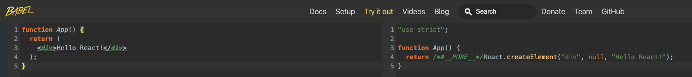
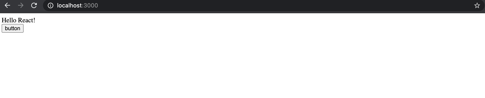
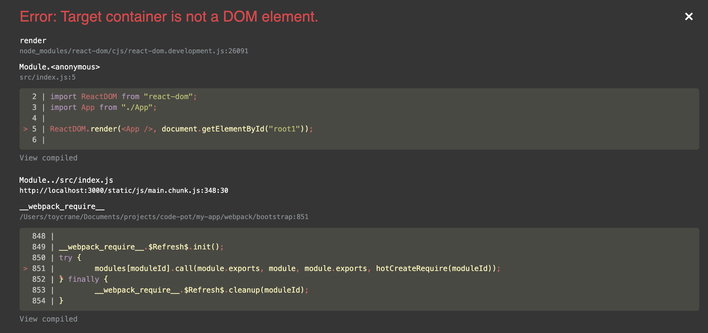

## JSX가 뭘까?

```jsx
function App() {
	return <div>Hello React!</div>;
}
```

위의 코드에서 return 부분을 보면 함수도 아니고, 문자열도 아닌 이상한 문법이 있지 않나요?

`<div>Hello React!</div>` 이 부분... 뭔가 이상하죠?

이상하다고 생각하시는게 맞아요. 이게 바로 **JSX** 입니다.

**JSX는 React에서 HTML을 쉽게 사용할 수 있는 문법**이라고 보시면 됩니다.

그런데 브라우저는 HTML, CSS, `Javascript`만 이해할 수 있다고 배웠는데 어떻게 저런 문법을 사용할 수 있는 것일까요? 이유는 `create react app`으로 `React` 앱을 최초 생성할 때, 설치되는 라이브러리 `babel`이 `JSX`라는 문법을 이해할 수 있도록 도와 줍니다.

즉, 우리가 `JSX`로 `HTML`을 작성하면 `React` 파일을 실행할 때 `babel`이 자동으로 `JSX` 코드를 브라우저가 이해할 수 있는 `Javascript` 코드로 변환해 주는 것이죠.

변환하면 어떻게 생겼냐구요? 이렇게 생겼습니다.


```jsx
function App() {
	return React.createElement("div", null, "Hello world!");
}
```

일반적인 Javascript 함수처럼 생기지 않았나요? 그렇습니다. 이 역할을 바로 `babel`이 합니다.

## JSX로 만든 컴포넌트는 어디에 그려지는 걸까?

이제 `App Component`를 만든 것은 알겠는데, 그럼 `App Component`는 `HTML`에 어디에 그려지는걸까요??

이제 그 비밀을 풀어보도록 하겠습니다.

우선 `create-react-app` 을 통해서 만든 `index.js` 에서 불필요한 코드들부터 제거하고 시작하겠습니다.

아래와 같이 `index.js` 파일을 수정해주세요.

```jsx
// index.js
import React from "react";
import ReactDOM from "react-dom";
import App from "./App";

ReactDOM.render(<App />, document.getElementById("root"));
```

그리고 정상적으로 잘 작동하는지 `npm start` 로 실행을 해보겠습니다.

위와 같이 아까 만들었던 컴포넌트가 뜬다면 정상적으로 실행 된 것입니다.

정상적으로 작동하는 것을 확인했으니, `index.js`에 있는 코드들을 분석해 보도록 하겠습니다.

```jsx
ReactDOM.render(<App />, document.getElementById("root"));
```

`ReactDOM.render` 함수의 역할은 정해진 위치에 원하는 컴포넌트를 렌더링(`HTML`에 내가 원하는 컴포넌트를 표현)하는 것입니다.

첫 번째 인자로 `Component`를 받고, 두번째 인자로는 실제로 `Component`를 그릴 위치를 받습니다.

즉, 위 코드를 해석해 보면,

1. `html`에서 `id`가 `root`인 엘리먼트를 찾는다. (`document.getElementById('root')`)
2. 찾은 엘리먼트에 `<App />` 컴포넌트를 렌더링 한다.

그런데 위에서 이야기하는 `html`은 어디에 있을까요?

그건 `create-react-app`을 통해서 `React` 프로젝트를 만들면 `public` 폴더가 생기는데 그 안에 `index.html`이 있습니다.

```html
// public/index.html
<!DOCTYPE html>
<html lang="en">
	<head>
		...
	</head>
	<body>
		...
		<div id="root"></div>
		...
	</body>
</html>
```

그 곳에 보면 `id`가 `root`인 `div` 태그를 하나 찾을 수 있는데 이 곳이 `React`에서 `Component`를 최초 렌더링 하는 곳입니다.

만약에? `document.getElementById('root')` 에서 `root`가 아닌, `root1`로 바꾸면 어떻게 될까요?


위와 같이 `Target container is not a DOM element.` (root1을 가진 element가 없으니 그릴 수 없다) 라고 하며 에러를 발생시킵니다. 지극히 당연한 상황입니다. id가 root1인 엘리먼트에 App 컴포넌트를 그리려고 했는데, 아무리 찾아도 없으니 에러를 발생시키는 것입니다.

앞으로 이 부분을 주로 사용할 일은 없지만, React를 이해하는데 가장 기초가 되기에 간단하게 설명을 해보았습니다. 다음 챕터에서는 JSX에서 자주 쓰는 문법에 대해서 알아 보도록 하겠습니다.

## Something More!!!

반드시 공부해야 하는 건 아니지만, 도움이 될 만한 자료들을 공유하고 있습니다.

- JSX 없이 React 사용해 보기 (JSX 원리를 이해하는데 큰 도움이 됩니다)
  - [https://ko.reactjs.org/docs/react-without-jsx.html](https://ko.reactjs.org/docs/react-without-jsx.html)
