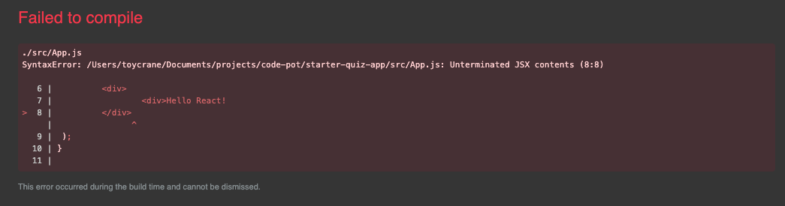
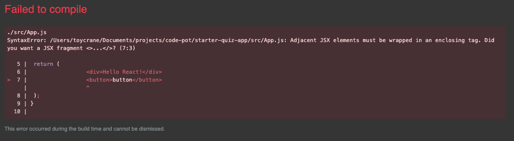

JSX를 배웠으니, JSX의 유용한 문법들 몇 가지만 배워보도록 하겠습니다.

## JSX에서 표현식 사용하기

JSX는 중괄호 안에 유효한 모든 javscript 표현식을 넣을 수 있습니다.

### 표현식(expressions)과 문장 (statements)

표현식은 **값을 산출해내는 코드의 조각들**을 일컫습니다. 표현식은 말로 표현하기 참 어려운 개념인데, 예시를 보면서 설명 해보도록 하겠습니다.

```jsx
// 숫자 표현식
10;
10 + 20;

// 문자 표현식
("hello");
"hello" + "world";

// 논리 표현식
30 > 20;
10 < 20;

// 할당 연산자를 통한 표현식
i = 10;
total = 0;
fruits[1] = "avocado";

// 함수 호출 표현식
sayHello();
```

이에 반해 **문장은 특정한 행동을 하겠다는 설명**입니다. 말이 어렵습니다. 이 것도 예제로 설명해 보도록 하겠습니다.

```jsx
// 변수 선언
var sum;
var average;

// if, else 문
if (expression)
    statement 1
else
    statement 2

// for 문
for(let i = 0; i < 10; i++){
	console.log(i)
}
```

### JSX에서 변수 넣기

먼저 변수를 JSX 내부에 넣어보도록 하겠습니다.

```jsx
const name = "code pot";
const App = () => {
	return <div>{name}</div>;
};
```

위 코드처럼 선언한 변수를 중괄호로 감싸 JSX에서 사용할 수 있습니다.

### JSX에서 함수 사용하기

```jsx
const user = {
  firstName: 'toy',
  lastName: 'crane'
};

const formatName(user) {
  return user.firstName + ' ' + user.lastName;
}

const App = () => {
	return <div>{formatName(user)}</div>
}
```

### JSX에서 if문처럼 사용하기

위에서 이야기 했던 것처럼 JSX 내 에서는 표현식만 사용할 수 있습니다. 그래서 if문과 같은 효과를 내려면 삼항 연산자를 사용해야 합니다.

```jsx
const isLogin = true;
const App = () => {
	// isLogin이 True이면 첫번째 요소인 <div>로그인 완료</div>의 표현식을 실행
	// isLogin이 False이면 두번째 요소인 <div>로그인 해주세요</div> 표현식을 실행
	return {isLogin ? <div>로그인 완료</div> : <div>로그인 해주세요</div>
```

### JSX에서 for문처럼 사용하기

if문과 마찬가지로 for문도 문장이기 때문에 사용할 수 없습니다. 그래서 주로 map을 사용합니다.

```jsx
const fruits = ["사과", "감", "배", "딸기"];
const App = () => {
	// fruits를 한바퀴 씩 돌면서 fruits가 끝날 때까지
	// map 안에 있는 함수((fruit) => <div>{fruit}</div>)를 실행함
	// 함수 안에 있는 fruit은 fruits 리스트의 각 요소입니다.
	return fruits.map((fruit) => <div>{fruit}</div>);
};
```

## JSX 사용시 이것만은... 꼭 주의 해주세요!!!!!!

### React import 하기

JSX를 `babel`이 이해하고, `Javascript`로 변환하기 위해서는 `import React from "react"` 를 해주어야 합니다.

`React v17` 이후는 업데이트가 되면서 `import React from "react"` 를 넣지 않더라도 `babel`이 자동으로 `JSX`로 인식하고 `javascript`로 변환해 줍니다.

### HTML처럼 태그를 반드시 닫아야 해요

```jsx
function App() {
  return (
    <div>Hello React!
  );
}
```

닫지 않으면 아래와 같이 컴파일 에러가 발생합니다


### HTML과 달리 반드시 최상위 태그(부모 태그)가 있어야 해요

```jsx
import React from "react";

function App() {
	return (
		// 컴포넌트 최상위 부모 태그
		<div>
			<div>Hello React!</div>
			<button>button</button>
		</div>
	);
}

export default App;
```

최상위 태그를 넣지 않으면?

마찬가지로 전체 엘리먼트를 `tag`로 감싸달라며, 컴파일 에러가 발생합니다.

만약에 `div`를 최상위 태그로 넣기 싫다면, `<> </>` fragment를 사용하세요

`fragment`는 브라우저에 나타나지 않는 태그로 `element`들을 감쌀 때 사용합니다.

```jsx
import React from "react";

function App() {
	return (
		// 컴포넌트 최상위 부모 태그 (fragment 사용)
		<>
			<div>Hello React!</div>
			<button>button</button>
		</>
	);
}

export default App;
```

## Somthing More!!!

반드시 공부해야 하는 건 아니지만, 도움이 될 만한 자료들을 공유하고 있습니다.

- const와 let의 차이는 무엇일까?
  - [https://velog.io/@bathingape/JavaScript-var-let-const-차이점](https://velog.io/@bathingape/JavaScript-var-let-const-%EC%B0%A8%EC%9D%B4%EC%A0%90)
- 자바스크립트-값-표현식-구문-리터럴-의미-설명
  - [https://oneroomtable.tistory.com/entry/자바스크립트-값-표현식-구문-리터럴-의미-설명](https://oneroomtable.tistory.com/entry/%EC%9E%90%EB%B0%94%EC%8A%A4%ED%81%AC%EB%A6%BD%ED%8A%B8-%EA%B0%92-%ED%91%9C%ED%98%84%EC%8B%9D-%EA%B5%AC%EB%AC%B8-%EB%A6%AC%ED%84%B0%EB%9F%B4-%EC%9D%98%EB%AF%B8-%EC%84%A4%EB%AA%85)
