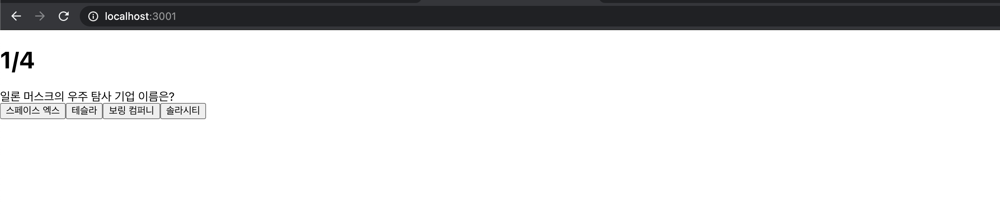
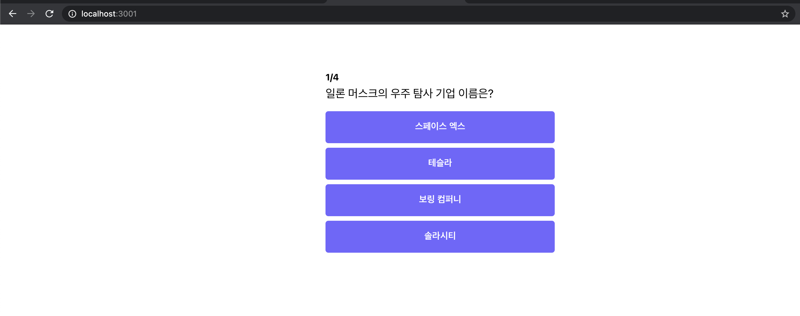

컴포넌트 사용 방법을 알아 봤으니, 이제는 간단한 퀴즈 페이지를 만들어 보도록 하겠습니다.
아래와 같은 디자인으로 페이지를 만들어 보도록 하겠습니다.


## App 컴포넌트 뼈대 만들기

우선 App 컴포넌트의 뼈대를 만들어 보겠습니다.

`App.js` 코드

```jsx
import React from "react";

function App() {
	return (
		<div>
			<div>
				<div>
					<h1>1/4</h1>
					<div>일론 머스크의 우주 탐사 기업 이름은?</div>
				</div>
				<div>
					<button>스페이스 엑스</button>
					<button>테슬라</button>
					<button>보링 컴퍼니</button>
					<button>솔라시티</button>
				</div>
			</div>
		</div>
	);
}

export default App;
```

위 코드를 실행해보도록 하겠습니다.

위와 같이 아무런 스타일이 없는 무색 무취의 `HTML`이 나오게 됩니다. `HTML`을 꾸미려면 `CSS` 파일이 필요한데 `CSS` 파일을 아직 작성하지 않았습니다. 이제 이 무색무취한 `HTML`에 스타일을 입혀 보도록 하겠습니다.

## App Component에 Class 추가하기

우선 색을 입히려면 `HTML`을 칠할 수 있게 선택자를 `HTML`에 넣어 주어야 합니다.

```jsx
import React from "react";

function App() {
	return (
		<div className="container">
			<div className="app">
				<div className="question-section">
					<h1 className="question-header">
						<span>1</span>/4
					</h1>
					<div className="question-text">
						일론 머스크의 우주 탐사 기업 이름은?
					</div>
				</div>
				<div className="answer-section">
					<button>스페이스 엑스</button>
					<button>테슬라</button>
					<button>보링 컴퍼니</button>
					<button>솔라시티</button>
				</div>
			</div>
		</div>
	);
}

export default App;
```

퀴즈를 크게 `class` 이름을 `question-sction` 과 `answer-section` 로 주어 크게 두 영역으로 나눴습니다. 그리고 className이 `container` 인 친구로 전체 컴포넌트를 감싸 주었습니다.

:::note `className`은 HTML에서 사용하는 `class`와 같습니다. react는 `html`의 속성으로 -를 사용할 수 없기 때문에, camal case로 속성 값을 작성합니다.
:::

## App Component에 CSS 입히기

`App.css` 에 있던 내용을 지우고, 아래의 `css` 코드를 복사하여 붙여넣기 해주세요.

```css
body {
	font-family: -apple-system, BlinkMacSystemFont, "Segoe UI", "Roboto",
		"Oxygen", "Ubuntu", "Cantarell", "Fira Sans", "Droid Sans",
		"Helvetica Neue", sans-serif;
}

.container {
	display: flex;
	justify-content: center;
	align-items: center;
}

.app {
	width: 400px;
	margin-top: 72px;
}

.question-section {
	margin-bottom: 16px;
}

.question-header {
	font-size: 16px;
	font-weight: bold;
	margin-bottom: 8px;
}

.question-text {
	font-size: 20px;
	margin-bottom: 8px;
}

.answer-section {
	display: flex;
	flex-direction: column;
	justify-content: center;
	align-items: center;
	margin-bottom: 8px;
}

button {
	font-size: 16px;
	color: #ffffff;
	background-color: rgb(115, 98, 255);
	border-radius: 5px;
	border: 0px;
	height: 56px;
	padding: 4px;
	margin: 4px;
	cursor: pointer;
	width: 100%;
	outline: none;
	font-weight: 700;
}

button:hover {
	background-color: #a99fee;
}
```

그리고 `App` 컴포넌트에서 해당 `CSS`를 불러보도록 하겠습니다.

`App.js` 상단에 우리가 만든 `css` 파일을 아래와 같이 `import` 합니다.

```jsx
// app.js
import React from "react";
import "./App.css";

...
```

그리고 다시 서버를 실행해보도록 하겠습니다.

아래와 같이 화면이 뜬다면 성공적으로 우리가 만든 `css`가 `App` 컴포넌트에 적용된 것을 알 수 있습니다. 👏👏👏👏


:::note
상세한 CSS의 문법은 이번 수업의 범위에서 벗어나 자세하게 설명하지 않았습니다. 혹시나 CSS가 궁금하신 분을 위해 몇 가지 핵심적으로 사용되는 기술을 Something More!!에 추가해 두었으니, 참고 해주세요.
:::

## 전체 코드 살펴보기‌

- 깃허브에서 전체 코드 보기 -> [바로가기](https://github.com/CodePotStudio/starter-quiz-app/tree/week01-6)
- 온라인에서 마음대로 테스트 해보기 (Code Sandbox)-> [바로가기](https://codesandbox.io/s/kwijeu-keomponeonteu-mandeulgi-jp5cl)

:::note Code Sandbox가 무엇인가요?
코드를 쉽게 공유하는 사이트로, 누구든지 쉽게 온라인에서 코드를 수정하고, 변경된 내용들을 바로 바로 확인 할 수 있는 툴입니다.
:::

## Something More!!

- CSS에서 요소를 선택하고, 스타일을 입히자
  - CSS 선택자 이해하기 → [http://www.nextree.co.kr/p8468/](http://www.nextree.co.kr/p8468/)
- CSS에서 배치는 어떻게 해야 할까?
  - Flex 완전 정복하기 → [https://studiomeal.com/archives/197](https://studiomeal.com/archives/197)
