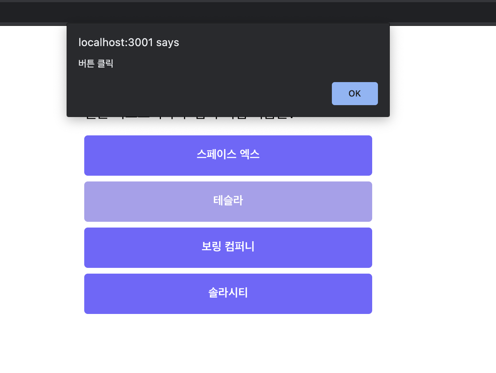
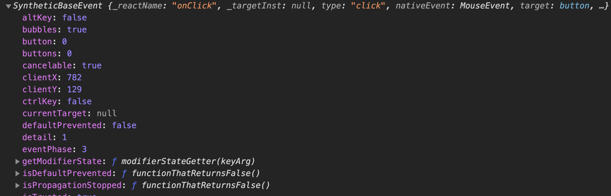
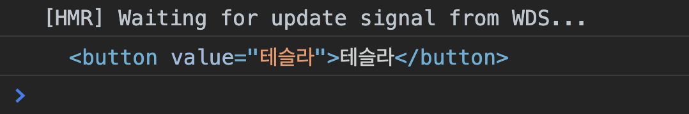
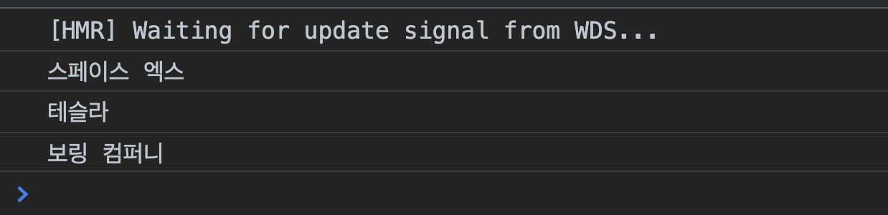
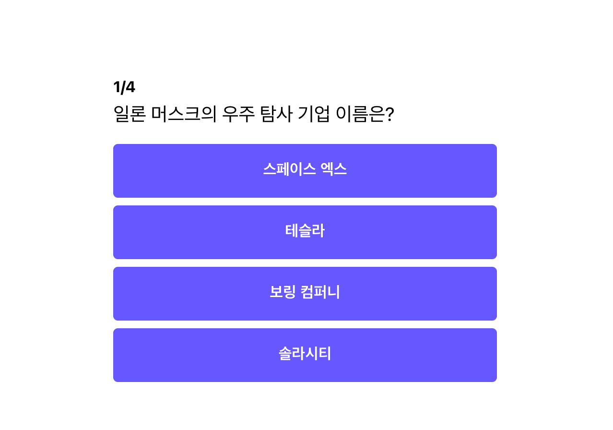

이전 챕터에서 만든 퀴즈의 경우, `HTML`과 `CSS`를 만들었을 뿐 아직 정답과 오답을 체크할 수 없습니다. 이제는 클릭했을 때, 정답인지 아닌지를 알려주는 기능을 만들어 보도록 하겠습니다.
그 전에 `React`에서는 이벤트를 어떻게 다루는지 기존에 `HTML`에서 다루던 방식과는 무엇이 다른지부터 알아보고 가도록 하겠습니다.

:::note **event는 무엇인가요?**
어떤 사건을 의미합니다. 브라우저에서 사건이란 유저가 행하는 행동 (버튼 클릭, 필드에 값을 입력, 스크롤)과 브라우저에 일어나는 일(`HTML`이 전부 `rendering` 되었을 때)들을 의미합니다.
더 많은 이벤트가 궁금하다면 아래 공식 Mozilla 페이지를 참고해 주세요
[Mozilla 이벤트 설명 페이지](https://developer.mozilla.org/ko/docs/Web/Events)
:::

## HTML에서 Event 처리하기

```jsx
<button onclick="sayHello()">안녕하세요</button>
```

일반적인 `HTML`에서 `click event`를 다룰 때, **소문자 `onclick` 이벤트**에 함수를 ""로 감싸 **문자열 형태로 실행(`sayHello()`)**하여 넣어 주었습니다.

## React에서 Event 처리하기

```jsx
<button onClick={sayHello}>안녕하세요</button>
```

`React`에서는 `HTML`과는 달리 **이벤트 명에 캐멀 케이스(camelCase)를 사용**하여야 하며, **함수 자체를 이벤트 핸들러에 전달**해 주어야 합니다.

## 퀴즈에 이벤트 연결하기

아까의 `App.js`에서 버튼에 이벤트를 달아 보도록 하겠습니다.

```jsx
import React from "react";
import "./App.css";

function App() {
	const handleClick = () => {
		alert("버튼 클릭");
	};

	return (
		<div className="container">
			<div className="app">
				<div className="question-section">
					<h1 className="question-header">
						<span>1</span>/4
					</h1>
					<div className="question-text">
						일론 머스크의 우주 탐사 기업 이름은?
					</div>
				</div>
				<div className="answer-section">
					<button onClick={handleClick}>스페이스 엑스</button>
					<button onClick={handleClick}>테슬라</button>
					<button onClick={handleClick}>보링 컴퍼니</button>
					<button onClick={handleClick}>솔라시티</button>
				</div>
			</div>
		</div>
	);
}

export default App;
```

첫번째로 `App` 컴포넌트 내부에 `handleClick` 함수를 만들어 주었습니다.

`handleClick` 함수가 실행되면 버튼 클릭 알림 창이 뜨도록 코드를 추가했습니다.

```jsx
const handleClick = () => {
	alert("버튼 클릭");
};
```

두번째로 만든 `handleClick` 함수를 `button`에 연결해 주었습니다.

```jsx
// App.js
...
<button onClick={handleClick}>스페이스 엑스</button>
<button onClick={handleClick}>테슬라</button>
<button onClick={handleClick}>보링 컴퍼니</button>
<button onClick={handleClick}>솔라시티</button>
...
```

실행을 해보면 어떤 버튼을 클릭하더라도 '버튼 클릭' 창이 뜨는 것을 알 수 있습니다.


## 발생한 이벤트의 값 가져오기

이벤트가 발생을 감지하여 우리가 원하는 함수(`handleClick`)를 실행했습니다. 하지만 유저가 클릭한 버튼이 어떤 것인지 모르기 때문에 정답인지 오답인지 알 수가 없습니다. 그래서 이번에는 이벤트가 발생한 엘리먼트의 값들을 가져와 보도록 하겠습니다.

### button에 value 값 넣어주기

우선 버튼에 `value` 값을 넣어주도록 하겠습니다. `value` 값은 `event` 객체에서 접근이 가능하기 때문에 아래와 같이 `value` 값을 추가해 줍니다. 자세한 내용은 아래 이벤트 부분에서 다룹니다.

```jsx
//app.js
...
<button onClick={handleClick} value="스페이스 엑스">
	스페이스 엑스
</button>
<button onClick={handleClick} value="테슬라">
	테슬라
</button>
<button onClick={handleClick} value="보링 컴퍼니">
	보링 컴퍼니
</button>
<button onClick={handleClick} value="솔라시티">
	솔라시티
</button>
...
```

### 이벤트 핸들링 함수에서 event 받기

```jsx
// app.js
...
const handleClick = (e) => {
		alert('버튼 클릭');
	}
...
<button onClick={handleClick} value="스페이스 엑스">
	스페이스 엑스
</button>
...
```

`React`에서는 이벤트 핸들러(`onClick`, `onSubmit`, ....)에 함수를 연결하면 함수의 첫번째 인자로 `event` 객체를 전달해 줍니다. 저는 전달받은 이벤트의 이름을 `e`로 하여 받았으며, 그것을 `console` 창에 출력해보도록 하겠습니다.

```jsx
// app.js
import React from "react";
import "./App.css";

function App() {
	const handleClick = (e) => {
		console.log(e);
		alert("버튼 클릭");
	};

	return (
		<div className="container">
			<div className="app">
				<div className="question-section">
					<h1 className="question-header">
						<span>1</span>/4
					</h1>
					<div className="question-text">
						일론 머스크의 우주 탐사 기업 이름은?
					</div>
				</div>
				<div className="answer-section">
					<button onClick={handleClick} value="스페이스 엑스">
						스페이스 엑스
					</button>
					<button onClick={handleClick} value="테슬라">
						테슬라
					</button>
					<button onClick={handleClick} value="보링 컴퍼니">
						보링 컴퍼니
					</button>
					<button onClick={handleClick} value="솔라시티">
						솔라시티
					</button>
				</div>
			</div>
		</div>
	);
}

export default App;
```

위 코드를 실행하고, 콘솔창에 찍힌 것을 보면 아래와 같이 엄청 많은 정보를 담은 `event` 객체가 출력되는 것을 볼 수 있습니다.

이 중에서 실제로 필요한 것은 실제로 클릭이 된 객체이므로, `event` 객체 내의 `target`에 접근하여 실제 값을 가져와 보도록 하겠습니다.

```jsx
//app.js
...
const handleClick = (e) => {
		console.log(e.target);
	};
...
```

다시 실행하고, 테슬라 버튼을 클릭하였더니 아래와 같이 `button` 태그가 그대로 출력되는 것을 알 수 있습니다.

여기서 우리가 필요한 값은 `value`이기 때문에 여기서 `value` 값만 뽑아 보도록 하겠습니다.

```jsx
//app.js
...
const handleClick = (e) => {
		console.log(e.target.value);
	};
...
```

위와 같이 코드를 변경하고 실행하면 아래와 같이 클릭한 버튼의 이름을 정확하게 가져오는 것을 알 수 있습니다

드디어 우리가 클릭한 버튼의 값을 정확하게 가져올 수 있게 되었습니다. 이제 마지막으로 정답 오답 체크를 해보도록 하겠습니다.

**전체 코드**

```jsx
// app.js
import React from "react";
import "./App.css";

function App() {
	const handleClick = (e) => {
		console.log(e.target.value);
	};

	return (
		<div className="container">
			<div className="app">
				<div className="question-section">
					<h1 className="question-header">
						<span>1</span>/4
					</h1>
					<div className="question-text">
						일론 머스크의 우주 탐사 기업 이름은?
					</div>
				</div>
				<div className="answer-section">
					<button onClick={handleClick} value="스페이스 엑스">
						스페이스 엑스
					</button>
					<button onClick={handleClick} value="테슬라">
						테슬라
					</button>
					<button onClick={handleClick} value="보링 컴퍼니">
						보링 컴퍼니
					</button>
					<button onClick={handleClick} value="솔라시티">
						솔라시티
					</button>
				</div>
			</div>
		</div>
	);
}

export default App;
```

## 정답 오답 체크하기

정답 오답 체크하기는 아직 퀴즈가 하나이기 때문에 오히려 훨씬 쉽습니다.

아래와 같이 버튼의 값을 answer 변수에 받고, if문으로 정답일 때와 오답일 때를 분리하여 처리해 주었습니다.

```jsx
//app.js
const handleClick = (e) => {
	const answer = e.target.value;
	if (answer === "스페이스 엑스") {
		alert("정답 👏👏👏");
	} else {
		alert("오답 😣😣😣");
	}
};
```

실행을 하면 아래와 같이 나오게 됩니다.

정답을 클릭했을 때는 정답을, 오답을 클릭했을 때는 오답 알림이 뜰 수 있도록 구현을 하였습니다.  이로써 간단하게 퀴즈를 페이지를 만들어 보았습니다. 👏 👏 👏

다음 챕터에서는 지금 만든 페이지의 부족한 점을 짚어보고, 다음 챕터에서 할 내용들을 간단하게 훓어 보도록 하겠습니다.

## 전체 코드 살펴보기‌

- 깃허브에서 전체 코드 보기 -> [바로가기](https://github.com/CodePotStudio/starter-quiz-app/tree/week01-7)
- 온라인에서 마음대로 테스트 해보기 (Code Sandbox)-> [바로가기](https://codesandbox.io/s/jeongdab-odab-gineung-cugahagi-o68t4)

  Code Sandbox가 무엇인가요?
  코드를 쉽게 공유하는 사이트로, 누구든지 쉽게 온라인에서 코드를 수정하고, 변경된 내용들을 바로 바로 확인 할 수 있는 툴입니다.

## Somthing More!!!

반드시 공부해야 하는 건 아니지만, 도움이 될 만한 자료들을 공유하고 있습니다.

- event가 조금 더 궁금하다면?
  - [https://ooeunz.tistory.com/17](https://ooeunz.tistory.com/17)
