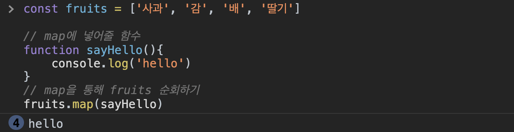
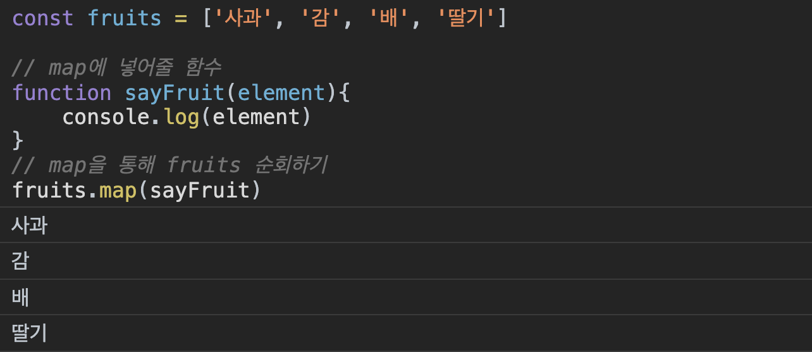
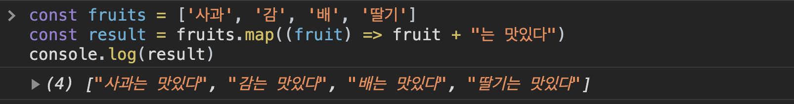

1주차에 만든 `App` 컴포넌트를 살펴 보겠습니다.

```jsx
...
		<button onClick={handleClick} value="스페이스 엑스">
			스페이스 엑스
		</button>
		<button onClick={handleClick} value="테슬라">
			테슬라
		</button>
		<button onClick={handleClick} value="보링 컴퍼니">
			보링 컴퍼니
		</button>
		<button onClick={handleClick} value="솔라시티">
			솔라시티
		</button>
...
```

`button` 태그들을 보면 값(스페이스 엑스, 테슬라, 보링 컴퍼니, ...)만 다를 뿐인데 코드가 중복됩니다. 이럴 때는 **반복문을 통해서 중복되는 코드를 줄이라고(don't repeat yourself) 배웠는데, JSX에서는 for문(statement) 을 사용할 수가 없습니다. 그러므로 지난 시간에 배운 map을 통해서 코드를 조금 더 단순화** 해보도록 하겠습니다.

## 배열 내장 함수 (map)

배열의 내장 함수에는 `map` 외에도 많은 것들이 있지만 지금은 퀴즈를 만드는데 필요한 `map`만 우선적으로 자세하게 알아보도록 하겠습니다. 프로젝트를 진행하는 과정에서 다른 내장 함수를 쓰게 되면 그 때 또 자세하게 설명하고 넘어가도록 하겠습니다.

### map 함수의 원리

`map`은 배열을 순회 하면서 **인자로 넣어준 함수를 실행**합니다.

```jsx
const fruits = ["사과", "감", "배", "딸기"];

// map에 넣어줄 함수
function sayHello() {
	console.log("hello");
}
// map을 통해 fruits 순회하기
fruits.map(sayHello);
```

위 코드를 실행하면 어떻게 나올까요?



제가 위에서도 이야기했듯이 배열을 순회하면서 인자에 넣어준 함수(`sayHello`)를 실행시키기 때문에 콘솔창에 "hello"가 4번 찍히는 것을 볼 수 있습니다.

순회하면서 함수를 실행해 주는 것은 알겠는데, 도통 어디에 써야할지 감이 잡히지 않습니다.

```jsx
const fruits = ["사과", "감", "배", "딸기"];

// map에 넣어줄 함수
function sayFruit(element) {
	console.log(element);
}
// map을 통해 fruits 순회하기
fruits.map(sayFruit);
```

위 함수를 실행하면 어떻게 될까요?



위와 같이 리스트의 아이템들이 출력된 것을 볼 수 있습니다. 즉, 리스트를 순회할 때 map 안에 있는 함수의 첫 번째 인자에 리스트 내 요소들이 들어 가는 것을 볼 수 있습니다. 이를 일반 for문으로 바꾸면 아래와 같습니다.

```jsx
const fruits = ["사과", "감", "배", "딸기"];
for (let i = 0; i < fruits.length; i++) {
	console.log(fruits[i]);
}
```

### 화살표 함수로 코드 간결하게 만들기

뿐만 아니라 `arrow function`을 통해서 좀 더 간결하게 코드를 바꿔 줄 수도 있습니다.

```jsx
const fruits = ["사과", "감", "배", "딸기"];

// 일반 함수를 통해서 순회하기
fruits.map(function sayFruit(element) {
	console.log(element);
});

// 화살표 함수를 통해서 순회하기
fruits.map((fruit) => console.log(fruit));
```

훨씬 코드가 간결해 진게 보이시나요? 이 전의 코드와 달리 `element`를 `fruit`으로 바꾸어 주었는데 map의 경우 함수의 첫번째 인자로 리스트의 요소를 넣어주므로 이름은 크게 상관이 없습니다. 이를 보여드리기 위해 이름을 `element`에서 `fruit`으로 변경하였습니다.

### map 함수에서의 return

```jsx
const fruits = ["사과", "감", "배", "딸기"];
const result = fruits.map((fruit) => fruit + "는 맛있다");
console.log(result);
```

위 코드를 실행하면 어떻게 될까요?


위의 콘솔창처럼 각 요소에 "는 맛있다" 문자가 붙은 것을 알 수 있습니다. 즉, **map 함수를 사용하면 리스트의 각 요소에 짝을 맞추어 제가 원하는 작업**들을 할 수 있습니다. (문자열을 더한다거나, 숫자를 제곱하는 등등) 무궁무진한 일들을 쉽게 할 수 있게 도와 줍니다.

비교를 위해 for문으로 구현한 코드도 첨부하여 드립니다.

```jsx
const fruits = ["사과", "감", "배", "딸기"];
let newFruits = [];
for (let i = 0; i < fruits.length; i++) {
	newFruits.push(fruits[i] + "는 맛있다");
}
console.log(newFruits);
```

map을 활용하면 얼마나 코드가 간결하고 깔끔해지는지 이제는 아시겠죠?

## map 함수를 활용하여 코드 단순화하기

map 함수를 통해 단순화 하기 전에 퀴즈 전체 정보를 담고 있는 객체를 만들어 보도록 하겠습니다.

```jsx
// app.js
const quiz = {
	question: "일론 머스크의 우주 탐사 기업 이름은?",
	answers: [
		{ text: "스페이스 엑스", isCorrect: true },
		{ text: "테슬라", isCorrect: false },
		{ text: "보링 컴퍼니", isCorrect: false },
		{ text: "솔라시티", isCorrect: false },
	],
};
```

위와 같이 질문과 답변, 그리고 답변의 오답 여부도 `quiz` 객체에 저장했습니다.

이를 활용하여 `App.js`에 있는 `button` 컴포넌트들을 단순화 해보도록 하겠습니다.

```jsx
// app.js
import React from "react";
import "./App.css";

function App() {
	const quiz = {
		question: "일론 머스크의 우주 탐사 기업 이름은?",
		answers: [
			{ text: "스페이스 엑스", isCorrect: true },
			{ text: "테슬라", isCorrect: false },
			{ text: "보링 컴퍼니", isCorrect: false },
			{ text: "솔라시티", isCorrect: false },
		],
	};

	const handleClick = (e) => {
		const answer = e.target.value;
		if (answer === "스페이스 엑스") {
			alert("정답 👏👏👏");
		} else {
			alert("오답 😣😣😣");
		}
	};

	return (
		<div className="container">
			<div className="app">
				<div className="question-section">
					<h1 className="question-header">
						<span>1</span>/4
					</h1>
					<div className="question-text">{quiz.question}</div>
				</div>
				<div className="answer-section">
					{quiz.answers.map((answer) => (
						<button value={answer.text} onClick={handleClick}>
							{answer.text}
						</button>
					))}
				</div>
			</div>
		</div>
	);
}

export default App;
```

퀴즈명을 `{quiz.question}` 을 활용하여 바꾸어 주었습니다.

button의 경우에는

```jsx
{
	quiz.answers.map((answer) => (
		<button value={answer.text} onClick={handleClick}>
			{answer.text}
		</button>
	));
}
```

`map`을 활용하여 `quiz.answers`를 한 바퀴 돌며 `button` 컴포넌트를 만들어 주었습니다.

다음 파트에서는 `handleClick` 함수에서 `answer === "스페이스 엑스"` 처럼 직접 값을 비교하여 정답 오답 여부를 체크하고 있는데, 이 부분을 좀 더 범용성 있게 바꿔 보도록 하겠습니다.

## 전체 코드 살펴보기‌

- 깃허브에서 전체 코드 보기 -> [바로가기](https://github.com/CodePotStudio/starter-quiz-app/tree/week02-2)

## Somthing More!!!

반드시 공부해야 하는 건 아니지만, 도움이 될 만한 자료들을 공유하고 있습니다.

- DRY 원칙 ([https://medium.com/@covj12/dry-패턴의-의미-b2332d255610](https://medium.com/@covj12/dry-%ED%8C%A8%ED%84%B4%EC%9D%98-%EC%9D%98%EB%AF%B8-b2332d255610))
- 다양한 배열 내장 함수 ([https://learnjs.vlpt.us/basics/09-array-functions.html](https://learnjs.vlpt.us/basics/09-array-functions.html))
