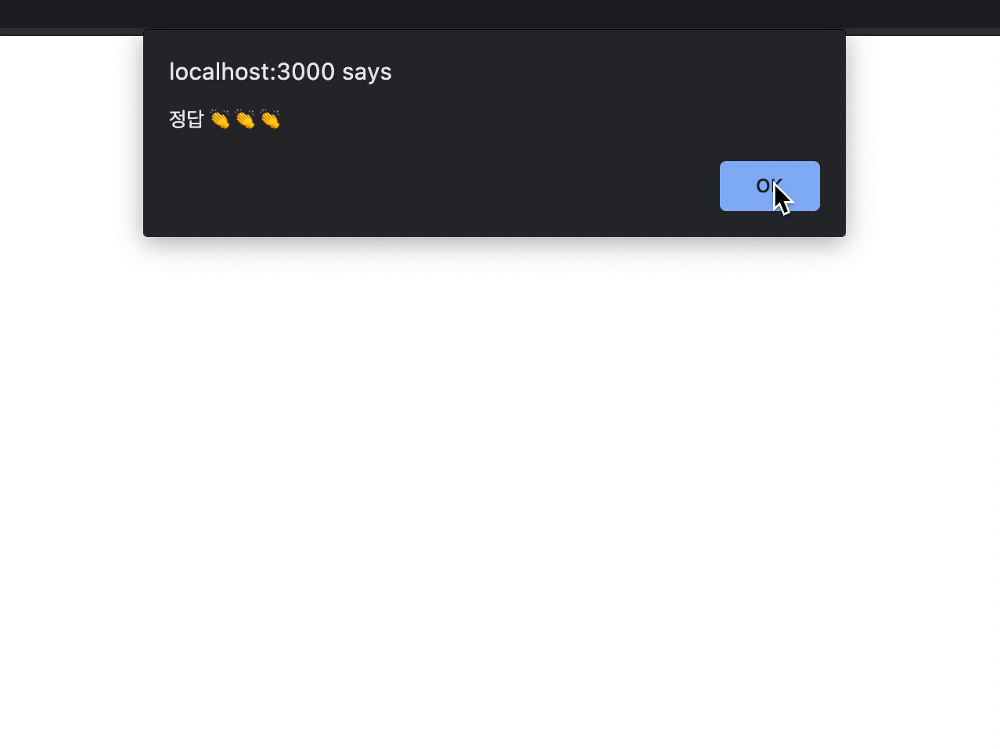

```jsx
// app.js
...
const handleClick = (e) => {
	const answer = e.target.value;
	if (answer === "스페이스 엑스") {
		alert("정답 👏👏👏");
	} else {
		alert("오답 😣😣😣");
	}
};
...
```

`handleClick` 함수에서 `answer === "스페이스 엑스"` 처럼 정답 값을 일일이 확인하고 있는데, 이렇게 되면 다른 퀴즈 문제가 추가될 수 없는 단점이 있습니다. 이 부분을 좀 더 범용성 있게 수정해보록 하겠습니다.

## 이벤트 핸들러에 매개변수 넘기기

저는 `handleClick` 함수를 아래와 같이 바꿀 예정입니다.

```jsx
// app.js
...
const handleClick = (isCorrect) => {
	if (isCorrect){
		alert("정답 👏👏👏");
	} else {
		alert("오답 😣😣😣");
	}
};
...
```

`event`를 받는 대신에 현재 누른 버튼이 정답인지 아닌지를 확인하는 `isCorrect` 값을 받고, 그 것을 기준으로 `alert` 창을 띄어 주려고 합니다.

```jsx
// app.js
const quiz = {
		question: "일론 머스크의 우주 탐사 기업 이름은?",
		answers: [
			{ text: "스페이스 엑스", isCorrect: true },
			{ text: "테슬라", isCorrect: false },
			{ text: "보링 컴퍼니", isCorrect: false },
			{ text: "솔라시티", isCorrect: false },
		],
	};
...
<button value={answer.text} onClick={handleClick}>
	{answer.text}
</button>
...
```

코드를 보아하니, `answer` 안에 `isCorrect` 값이 있으므로 이 값을 `handleClick` 함수에 보내주면 될 것 같습니다. 이럴 때는 아래와 같이 화살표로 한 번 더 감싸 주면 `handleClick`에 우리가 원하는 값을 전달할 수 있습니다.

```jsx
// app.js
...
<button value={answer.text} onClick={() => handleClick(answer.isCorrect)}>
	{answer.text}
</button>
...
```

이제 실행을 해볼까요?? 아래처럼 기존과 같이 정상적으로 잘 작동하는 것을 알 수 있습니다.


## 이렇게 하면 안되요 !!!

그런데 아마 이런 의문이 드는 분들이 있으실 것 같아요.
**굳이 화살표 함수로 감싸지 않고, 바로 보내주면 안될까?**

아래와 같이 말이죠.

```jsx
// app.js
...
<button value={answer.text} onClick={handleClick(answer.isCorrect)}>
	{answer.text}
</button>
...
```

이렇게 되면 최초에 `button` 컴포넌트를 그릴 때 바로 함수를 실행하게 됩니다. 그렇게 됨에 따라 아래처럼 화면을 다 그리지 못한 채 `alert` 창이 떠서 아무것도 못하게 됩니다.



**매개변수로 값을 넘길 때는 항상 함수로 감싸야 된다는 것** 꼭 기억해주세요!!

## 전체 코드 살펴보기‌

- 깃허브에서 전체 코드 보기 -> [바로가기](https://github.com/CodePotStudio/starter-quiz-app/tree/week02-3)
