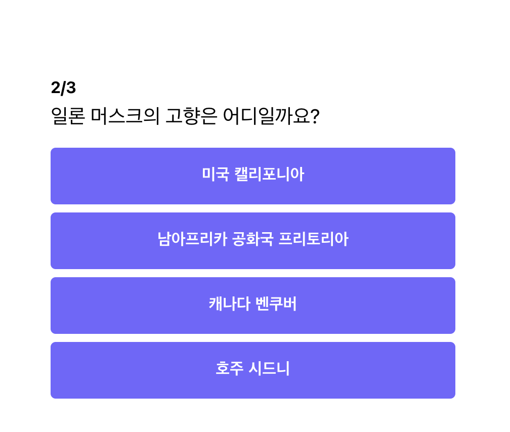
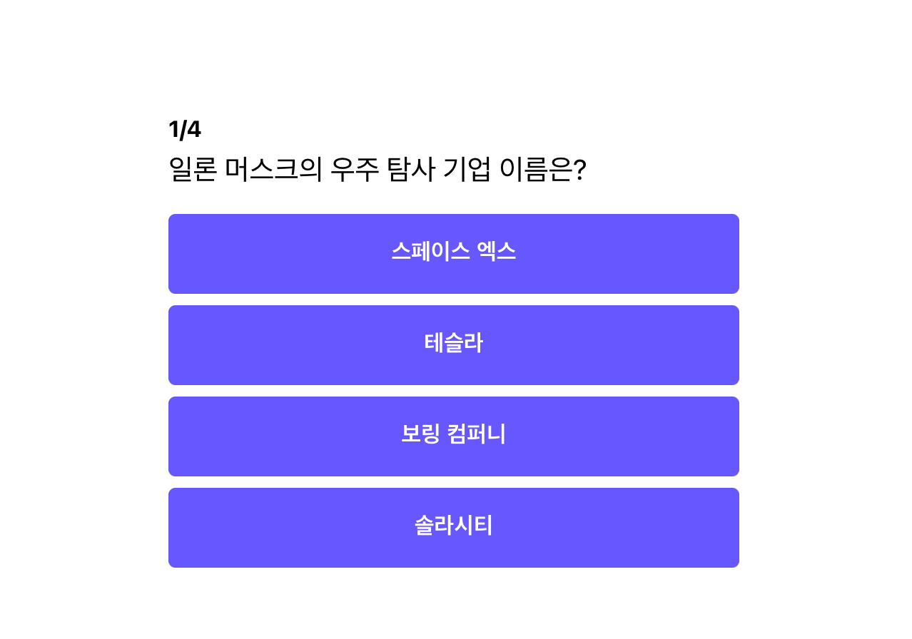
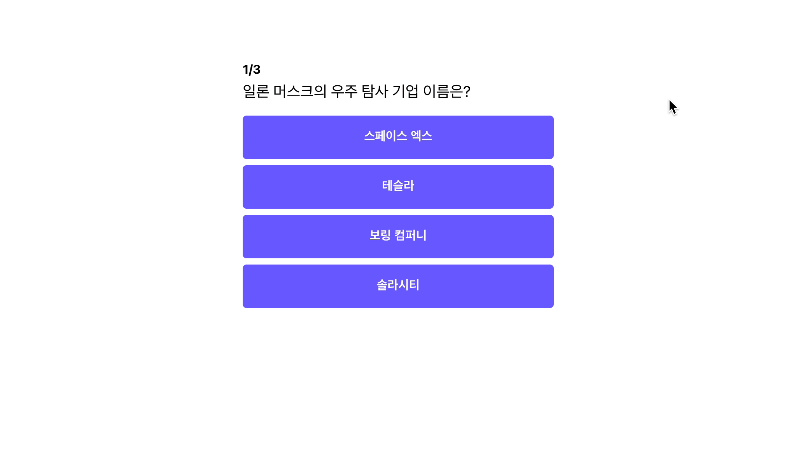

지금은 문제가 하나 밖에 없었는데, 이제 문제를 여러개로 추가해보도록 하겠습니다.

```jsx
// App.js
...
const quizzes = [{
		id: 1,
		question: "일론 머스크의 우주 탐사 기업 이름은?",
		answers: [
			{ text: "스페이스 엑스", isCorrect: true },
			{ text: "테슬라", isCorrect: false },
			{ text: "보링 컴퍼니", isCorrect: false },
			{ text: "솔라시티", isCorrect: false },
		],
	},
	{
		id: 2,
		question: "일론 머스크의 고향은 어디일까요?",
		answers: [
			{ text: "미국 캘리포니아", isCorrect: false },
			{ text: "남아프리카 공화국 프리토리아", isCorrect: true },
			{ text: "캐나다 벤쿠버", isCorrect: false },
			{ text: "호주 시드니", isCorrect: false },
		],
	},
	{
		id: 3,
		question: "일론 머스크가 창업한 페이팔 전신 기업의 이름은?",
		answers: [
			{ text: "Zip2 Corporation", isCorrect: false },
			{ text: "Alpha Exploration co.", isCorrect: false },
			{ text: "X.com", isCorrect: true },
			{ text: "Everything CO.", isCorrect: false },
		],
	}
]
...
function App(){
	...
}
...
```

위와 같이 `quizzes` 변수에 여러 퀴즈가 담긴 `list`를 저장해주었습니다. 추가로 현재 문제가 몇 번인지 확인하기 위해 `id` 값도 순서대로 넣어주었습니다.

## 여러 퀴즈 랜더링하기

기존에 사용하던 `quiz` 변수가 없어지고, `quizzes` 변수가 생겼으므로, 아래와 같이 코드를 변경해주었습니다. 뿐만 아니라 퀴즈 제목에 있던 숫자도 퀴즈에 따라 변경되도록 바꾸어 주었습니다.

```jsx
// app.js
function App(){
	...
	<span>{quizzes[0].id}</span>/{quizzes.length}
	...

	...
	<div className="question-text">{quizzes[0].question}</div>
	...

	...
	{quizzes[0].answers.map((answer) => (
							<button
								value={answer.text}
								onClick={() => handleClick(answer.isCorrect)}
							>
								{answer.text}
							</button>
	))}
	...
}
```

여기서 `quizzes` 값의 `index`를 0이 아닌, 1 혹은 2를 넣으면 어떻게 될까요?



1번을 넣었더니, 위와 같이 새로운 문제가 나온 것을 알 수 있습니다. 즉, 버튼을 클릭하면 `quizzes` 의 `index` 값만 변경해주면 쉽게 해결 될 것 같습니다.

## index 값을 변수로 관리해볼까?

```jsx
// app.js
function App(){
	let currentNo = 0;

	...
	const handleClick = (isCorrect) => {
			if (isCorrect) {
				alert("정답 👏👏👏");
			} else {
				alert("오답 😣😣😣");
			}
			currentNo = currentNo + 1;
		};
	...

  ...
	<div className="container">
		<div className="app">
			<div className="question-section">
				<h1 className="question-header">
					<span>{quizzes[currentNo].id}</span>/{quizzes.length}
				</h1>
				<div className="question-text">{quizzes[currentNo].question}</div>
			</div>
			<div className="answer-section">
				{quizzes[currentNo].answers.map((answer) => (
					<button
						value={answer.text}
						onClick={() => handleClick(answer.isCorrect)}
					>
						{answer.text}
					</button>
				))}
			</div>
		</div>
	</div>
  ...
}
```

위 코드처럼 `currentNo` 변수를 하나 만들었습니다. 그리고 버튼을 클릭할 때 `currentNo`에 1을 더해주었습니다. 이렇게 되면 버튼을 클릭하면 `currentNo`가 변경되므로, 다음 문제로 넘어갈 것 같습니다. 한 번 실행해보도록 하겠습니다.



**아쉽게도 아무런 일도 일어나지 않았습니다... 😔😔**

기존과 동일합니다. 왜 일까요?

`currentNo` 의 값이 바뀌긴 하였지만, `React`가 컴포넌트를 다시 렌더링 해주어야 하는데 해주지 않기 때문입니다. 그럼 내가 원하는 값이 변경되었을 때 컴포넌트를 다시 렌더링 시켜주려면 어떻게 해야 할까요?? 이 때 사용하는 것이 바로 state입니다.

## 컴포넌트 내부에서 관리하는 변수 (state)

state는 컴포넌트 내부에서만 관리되고, 컴포넌트 렌더링에 영향을 미치는 객체입니다. 즉, **state가 변경되면 state가 속한 컴포넌트가 다시 렌더링**됩니다.

### state 사용하기 (useState hooks)

`state`를 사용하기 위해서 `useState` 함수를 사용해야 합니다. 이번에는 `useState`를 활용해서 `currentNo` 를 다뤄보도록 하겠습니다.

```jsx
const state = useState(0);
const currentNo = state[0];
const setCurrentNo = state[1];
```

`useState`는 인자로 `state`의 초기값을 받습니다. 지금 `currentNo`의 초기 값은 0 이므로 `useState`에 0을 넣어 주었습니다. 그리고 `useState`는 결과 값으로 `state` 변수와 `state`를 갱신할 수 있는 함수를 리스트에 담아서 반환해 줍니다.

위 코드를 배열 구조 분해 할당으로 아래처럼 간단하게 사용할 수도 있습니다.

```jsx
const [currentNo, setCurrentNo] = useState(0);
```

이 방법이 훨씬 간결하므로 앞으로는 위 방식처럼 사용하도록 하겠습니다.

### state 사용 시, 주의사항

- 직접 `state`를 수정하지 마세요.
  - 직접 `state`를 수정하는 경우, `React`가 변경을 인지하지 못해 `rendering`이 되지 않습니다.
- 독립적인 `state`가 있다면 되도록이면 분리하여 사용하세요.
  - 여러 개의 `state`가 있어도 상관 없습니다. 독립적인 값들일 경우, 분리하는 것이 추후 관리에 유리합니다. [리액트 공식 페이지 설명 읽어보기](https://ko.reactjs.org/docs/hooks-state.html#tip-using-multiple-state-variables)

## state를 활용하여 퀴즈를 다시 렌더링 시키기

이제 위에서 값을 변경했지만 렌더링이 안되서 다음 문제로 넘어가지 않던 문제를 해결해 보도록하겠습니다.

```jsx
// app.js
// useState 함수 import 하기
import React, {useState} from "react";

function App(){
	// currentNo 셋팅하기
	...
	const [currentNo, setCurrentNo] = useState(0);
	...

	...
	const handleClick = (isCorrect) => {
			if (isCorrect) {
				alert("정답 👏👏👏");
			} else {
				alert("오답 😣😣😣");
			}
			setCurrentNo(currentNo + 1);
	};
	...

	...
	<div className="container">
		<div className="app">
			<div className="question-section">
				<h1 className="question-header">
					<span>{quizzes[currentNo].id}</span>/{quizzes.length}
				</h1>
				<div className="question-text">{quizzes[currentNo].question}</div>
			</div>
			<div className="answer-section">
				{quizzes[currentNo].answers.map((answer) => (
					<button
						value={answer.text}
						onClick={() => handleClick(answer.isCorrect)}
					>
						{answer.text}
					</button>
				))}
			</div>
		</div>
	</div>
	...
}
```

위와 같이 코드를 바꾸고 실행해보도록 하겠습니다.


정상적으로 퀴즈가 잘 넘어가는 것을 볼 수 있습니다!!

그런데 아쉽게도 마지막 문제에서 다음 문제가 없기 때문에 에러가 발생하는데 다음 파트에서는 이 문제를 해결 해보도록 하겠습니다.

### useState의 함수형 업데이트

그리고 한 가지 다루지 않은 부분이 있는데, 기존의 값에서 업데이트를 할 때는 아래와 같이 함수형으로 업데이트를 할 수 있습니다. 함수형으로 쓰는 이유는 `useState`의 비동기적 특성으로 인해 비효율이 발생하는데, 함수형으로 사용하게 되면 그 것을 회피할 수 있기 때문입니다. 지금 다루기에는 조금 어려운 내용이기에 6주차에 최적화 부분에서 다시 한 번 설명하고 넘어가도록 하겠습니다.

```jsx
// app.js
const handleClick = (isCorrect) => {
	if (isCorrect) {
		alert("정답 👏👏👏");
	} else {
		alert("오답 😣😣😣");
	}
	setCurrentNo((currentNo) => currentNo + 1);
};
```

## 전체 코드 살펴보기‌

- 깃허브에서 전체 코드 보기 -> [바로가기](https://github.com/CodePotStudio/starter-quiz-app/tree/week02-4)

## Somthing More!!!

반드시 공부해야 하는 건 아니지만, 도움이 될 만한 자료들을 공유하고 있습니다.

- setState의 비동기 동작 방식이 궁금하다면?
  - [React의 setState() 제대로 사용하기](https://leehwarang.github.io/2020/07/28/setState.html)
  - [useState의 비동기적 속성, 함수형 업데이트](https://velog.io/@suyeonme/react-useState%EC%9D%98-%EB%B9%84%EB%8F%99%EA%B8%B0%EC%A0%81-%EC%86%8D%EC%84%B1-%ED%95%A8%EC%88%98%ED%98%95-%EC%97%85%EB%8D%B0%EC%9D%B4%ED%8A%B8)
