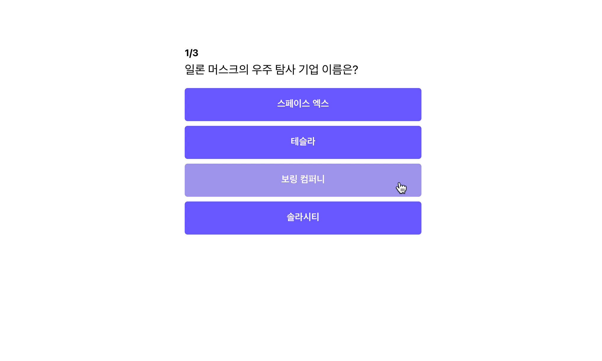
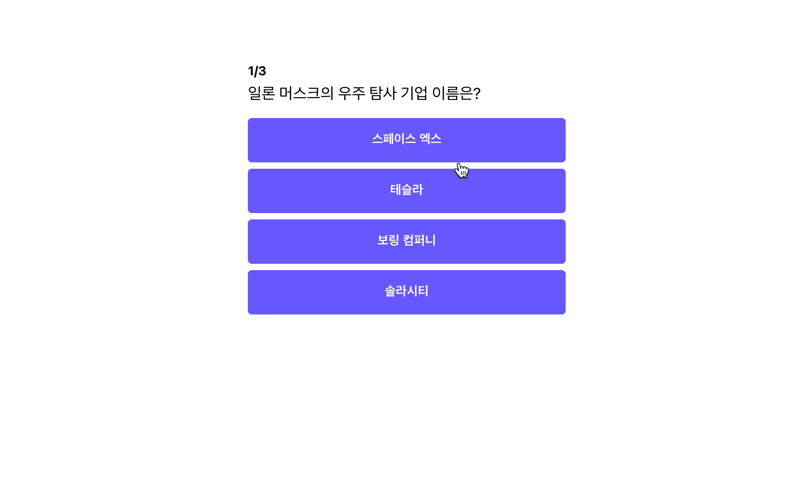

이 전 파트에서 위 화면처럼 마지막 퀴즈에서 다음 퀴즈가 없기 때문에 위와 같은 에러 화면이 떴습니다. 그래서 이제 이 문제를 해결해 보도록 하겠습니다.

## 결과 페이지 만들기

```jsx
// App.js
...
function App(){
	...
	const [showResult, setShowResult] = useState(false);
	...
}
```

위와 같이 결과 페이지를 보여줄지를 판단하는 `showResult` `state`를 하나 만들도록 하겠습니다. 초기값으로는 최초 페이지에 접근하였을 때는 퀴즈를 보여줘야 하므로, `false`로 설정합니다.

이제 마지막 퀴즈의 버튼을 클릭하였을 때, `showResult`의 값을 `true`로 바꿔주는 코드를 작성해보도록 하겠습니다.

```jsx
// App.js
function App(){
	...
	const handleClick = (isCorrect) => {
			if (isCorrect) {
				alert("정답 👏👏👏");
			} else {
				alert("오답 😣😣😣");
			}
			// 마지막 퀴즈인지 체크하기
			if (currentNo === quizzes.length - 1) {
				setShowResult(true);
			} else {
				setCurrentNo((currentNo) => currentNo + 1);
			}
	};
	...
}
```

위와 같이 마지막 페이지일 때, `setShowResult` 를 호출하여 `showResult` 값을 `true`로 변경해 주었습니다.

마지막으로 `showResult` 값을 체크하여 선택적으로 컴포넌트를 렌더링하는 코드를 만들어 보도록 하겠습니다.

```jsx
// App.js
function App(){
	...
	return <div className="container">
			{showResult ? (
				<div className="app">
					<h1>퀴즈가 끝났습니다.</h1>
				</div>
			) : (
				<div className="app">
					<div className="question-section">
						<h1 className="question-header">
							<span>{quizzes[currentNo].id}</span>/{quizzes.length}
						</h1>
						<div className="question-text">{quizzes[currentNo].question}</div>
					</div>
					<div className="answer-section">
						{quizzes[currentNo].answers.map((answer) => (
							<button
								value={answer.text}
								onClick={() => handleClick(answer.isCorrect)}
							>
								{answer.text}
							</button>
						))}
					</div>
				</div>
			)}
		</div>
}
```

삼항 연산자를 활용하여 `showResult`가 `true`인 경우 "퀴즈가 끝났습니다"를 포함하고 있는 `div` 태그를 노출하도록 코드를 수정하였습니다.

코드를 실행해 보도록 하겠습니다.


정상적으로 결과 페이지가 나오는 것을 알 수 있습니다.

## 결과 페이지에 점수 표시하기

결과 페이지에 점수를 표현하기 위해 점수를 기록할 `state`를 하나 만들어 주도록 하겠습니다.

```jsx
//app.js
function App(){
	...
	const [score, setScore] = useState(0);
	...
}
```

최초의 점수는 0점이므로, 0으로 `state` 값을 초기화 합니다.

이제 정답 혹은 오답을 클릭했을 때, `score`를 업데이트 해주도록 하겠습니다.

```jsx
// App.js
function App(){
	...
	const handleClick = (isCorrect) => {
			if (isCorrect) {
				setScore(score => score+1)
			}
			// 마지막 퀴즈인지 체크하기
			if (currentNo === quizzes.length - 1) {
				setShowResult(true);
			} else {
				setCurrentNo((currentNo) => currentNo + 1);
			}
	};
	...
}
```

오답일 경우에는 값을 `score`를 업데이트 할 필요가 없기 때문에, 정답일 경우에만 `setScore`를 통해 `score`를 업데이트 해줍니다.

마지막으로 결과 페이지에서 현재 점수를 노출해 주도록 하겠습니다.

```jsx
// App.js
function App(){
	const convertedScore = Math.floor((score / quizzes.length) * 100);
	...
	return <div className="container">
			{showResult ? (
				<div className="app">
					<h1 className="result-header">당신의 점수는?</h1>
					<p className="result-score">{convertedScore}</p>
				</div>
			) : (
				<div className="app">
					<div className="question-section">
						<h1 className="question-header">
							<span>{quizzes[currentNo].id}</span>/{quizzes.length}
						</h1>
						<div className="question-text">{quizzes[currentNo].question}</div>
					</div>
					<div className="answer-section">
						{quizzes[currentNo].answers.map((answer) => (
							<button
								value={answer.text}
								onClick={() => handleClick(answer.isCorrect)}
							>
								{answer.text}
							</button>
						))}
					</div>
				</div>
			)}
		</div>
}
```

```jsx
App.css
...
.result-header {
	font-size: 64px;
	font-weight: bold;
	margin-bottom: 8px;
	text-align: center;
}

.result-score {
	font-size: 192px;
	margin: 40px;
	text-align: center;
	color: rgb(115, 98, 255);
}
...
```

0~100점으로 스코어를 표현하기 위해 `Math.floor` 를 활용하여 소수점 이하 자리를 버려주었습니다. 그리고 결과를 보여주는 자리에 변환된 점수(`convertedScore`)를 추가해 주었습니다. 뿐만 아니라 결과 페이지에 스타일을 조금 추가하였습니다.

그럼 실행해 보도록 하겠습니다.


위와 같이 결과 페이지도 성공적으로 나오는 것을 알 수 있습니다

다음 페이지에서는 이제 이 코드를 실제로 배포해보도록 하겠습니다.

## 전체 코드 살펴보기‌

- 깃허브에서 전체 코드 보기 -> [바로가기](https://github.com/CodePotStudio/starter-quiz-app/tree/week02-5)
