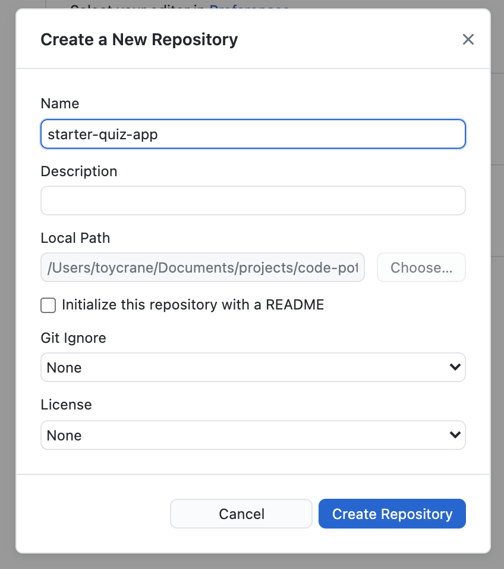

지금까지 만든 코드를 배포해보도록 하겠습니다.

지금까지 `git`을 사용해서 코드를 관리하지 않았는데, 우선 `git`부터 셋팅해보도록 하겠습니다.

## 프로젝트 git 초기화하기

우선 github desktop을 열어 주세요.

우측 상단의 File을 클릭하고, `Add Local Repository`를 클릭해주세요.

그리고 `Choose` 버튼을 눌러 현재 우리가 작성하고 있는 `React` 앱의 폴더를 찾아 주세요.

그리고 나면 위와 같이 "선택한 폴더에 Git Repository가 없다고 뜨며, Git Repository를 만들래?" 라고 뜨는데 `create a repository` 를 클릭해 주세요.

위와 같이 레포지터리를 만드는 화면이 뜹니다. 여기서 `create Repository` 버튼을 클릭해주세요.

조금의 로딩시간이 지나면 위와 같은 화면이 뜬 것을 알 수 있습니다. 이는 정상적으로 내 컴퓨터에서 `git` 셋팅이 끝난 것을 의미하며, `vs-code`로 돌아가보면 `.git`, `.gitignore` 파일이 생긴 것을 알 수 있습니다.

:::note 터미널에서는 git repository 초기화를 할 수는 없나요?
`git init` 명령어를 통해서 할 수 있습니다. 궁금하신 분들은 터미널에서 `git init`을 쳐보세요.
:::

.`git`, `.gitignore`는 무엇인가요?
.`git`은 로컬에서 사용하는 `git`의 설정파일들이 담겨 있는 폴더 입니다.
.`gitignore`는 `git`에서 관리하지 않을 파일들을 넣어두는 곳입니다. 주로 `javscript`에서는 설정 파일과 라이브러리가 있는 폴더(`node_modules`)를 추가 해두고 사용합니다.

## github에 프로젝트 올리기

다시 github-desktop으로 돌아가 보겠습니다.

github-desktop으로 돌아가면 git 프로젝트 초기화로 `.gitignore` 파일이 생겼으니, 아래와 같이 커밋을 해달라는 화면이 나올 것입니다.

코드에 변경된 사항이 있는게 맞으므로, `Commit to Main` 버튼을 클릭해 줍니다.

그리고 나서 github로 나의 프로젝트를 업로드 하겠다는 `Publish repository` 버튼을 클릭해 줍니다.

**!!! `Keep this code private`를 꼭 해제하고, `Publish Repository` 버튼을 클릭합니다.**

`View on Github` 버튼을 클릭하여 `github`로 이동하고, 정상적으로 코드가 올라왔는지 확인합니다.

위와 같이 뜬다면 정상적으로 `github`에 프로젝트가 정상적으로 업로드가 된 것입니다. 👏👏👏
