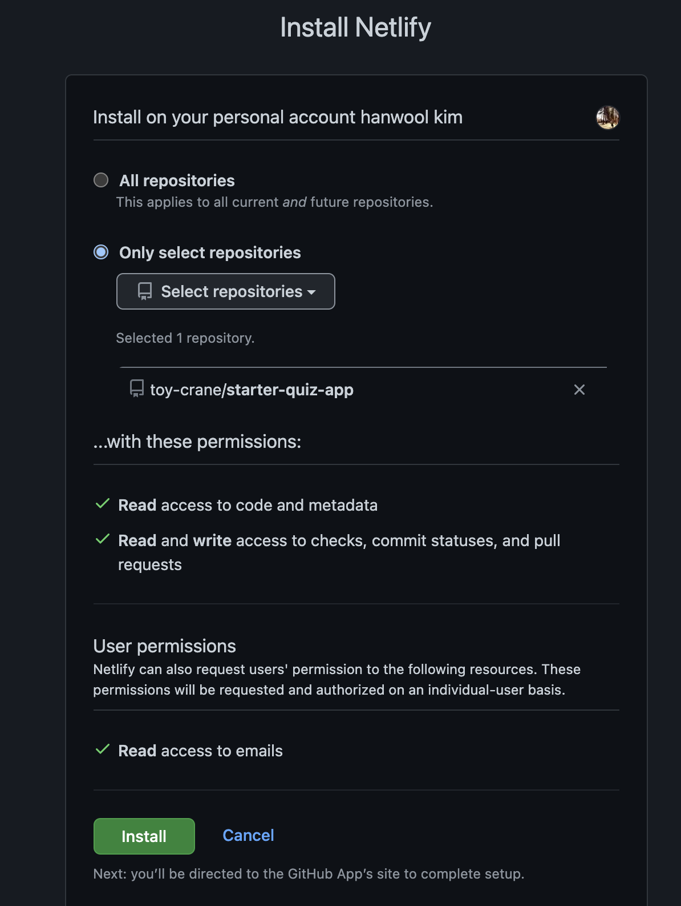

## JAM stack

`JAM Stack`은 `JavaScript`와 `Markup`에 해당하는 HTML, CSS 과 API를 활용하여 웹 애플리케이션을 구성하고, 그리고 이 정적 리소스들을 정해진 `CDN(Content Delivery Network)`에 배포하여 관리하는 스택입니다.

### 전통적인 Web과 다른 점

- 웹 서버를 관리할 필요가 없다.

  전통적인 웹에서는 `HTML`, `CSS`을 제공하기 위해선 `AWS`나 자체 구축된 내부 서버에 `Web` 서버과 `WAS` 서버를 구성하여 `HTML`, `CSS`를 내려주어야 했습니다. 그런데 `JAM Stack`을 사용하면 `Netlify`나 `Surge` 같은 서비스에 `github`에 있는 코드를 기준으로 전세계 `CDN`에 배포하여 관리 하므로 관리 포인트가 많이 줄어드는 장점이 있습니다.

- 프론트엔드와 백엔드가 분리됩니다.

  전통적인 `SSR`에서는 서버에서 `html`을 제공하고, `API`를 제공했기 때문에 서로 간에 영향을 많이 받았습니다. 그럼에 따라 프론트엔드의 자유도가 많이 늘어났으며, 좀 더 빠르게 배포가 가능해 졌습니다.

## netlify

앞에서 이야기한 `HTML`, `CSS`, `Javascript`를 배포하는 용도로 사용하는 서비스입니다. `Github`와의 연동, 손쉬운 배포, 손쉬운 HTTPS 설정들 많은 기능들을 클릭 하나만으로도 쉽게 사용할 수 있는 아주 이로운 서비스입니다. 비슷한 용도의 서비스로 `surge`, `vercel`이 있습니다.

## netlity로 배포하기

### 회원 가입

([링크](https://app.netlify.com/signup))로 이동하여 회원 가입을 합니다. github와 연동을 해야 하므로, 되도록이면 github 계정으로 회원 가입하도록 하겠습니다.

### github와 연동하기

중간에 있는 `New site from git` 버튼을 클릭합니다.

우리는 `GitHub`와 연결할 것이므로, `GitHub` 버튼을 클릭합니다.

:::note **Continuous Deployment(지속적 배포)**가 뭔가요?
소프트웨어를 더 빠르고, 더 주기적으로 빌드하고, 테스트하고, 출시하는 것을 의미합니다. 이로써 한 번에 코드가 배포됨에 따라 생기는 위험들을 효과적으로 줄일 수 있으며, 뿐만 아니라 소요되는 시간, 비용들을 효과적으로 관리할 수 있게 됩니다.
자세한 내용은 → https://ko.wikipedia.org/wiki/%EC%A7%80%EC%86%8D%EC%A0%81_%EB%B0%B0%ED%8F%AC
:::

### github repository 설정하기

`configure Netlify on GitHub` 버튼을 클릭합니다.

`Only Select Repository`를 선택하고, 전 파트에서 올렸던 `repository`를 클릭합니다.

그리고 `Install` 버튼을 클릭합니다.

위와 같이 우리가 선택한 `repository`가 화면에 나오는 것을 볼 수 있습니다. `github` 아이콘을 클릭해주세요.

### 브랜치 및 빌드 설정하기

`git`에서 따로 브랜치를 설정해 준 것이 없기 때문에 `main`을 배포할 브랜치로 설정합니다. 그리고 `build`의 경우에도 따로 `build` 명령어를 만들어 준 것이 없기 때문에 기본 명령어인 `build`로 설정합니다.

`yarn build`는 무엇인가요?
`React` 코드를 브라우저가 이해할 수 있는 `javascript` 코드로 변환해 주는 것을 의미합니다. `CRA(create react app)`에 포함되어 있는 기능입니다. `yarn build` 명령어를 실행하면 `build` 폴더가 생기며 그 곳에 `css`와 변환된 `js` 파일이 있습니다.

그리고 나서 `Deploy site` 버튼을 클릭합니다.

상단에 보면 `Site deploy in progress` 를 보여주며, 배포 중인 것을 알 수 있습니다.

배포가 끝나면 위와 같이 도메인이 하나 생깁니다. 저는 [https://sleepy-pasteur-edc725.netlify.app](https://sleepy-pasteur-edc725.netlify.app/) 의 도메인으로 배포가 되었고, 해당 사이트로 들어가보도록 하겠습니다.

정상적으로 배포가 잘 된 것을 확인 할 수 있습니다 👏👏👏

:::note 혹시 과금이 되나요?
한달에 빌드 시간이 300분 이상, 월 트래픽 100G 이상이 되어야 과금이 됩니다. 그런데 저희 앱 같은 경우 한 번 빌드를 하는데, 2분 정도가 소요되니 배포는 무려 150번 정도 무료로 사용이 가능합니다.
:::

### custom 도메인과 https 설정

지금은 `*.netlify.app`과 같은 도메인으로 배포가 되는데 custom 도메인도 쉽게 바꿀 수 있습니다. 그리고 https 설정도 클릭 한번에 쉽게 할 수 있습니다. 이 것은 후반부에 실제 프로젝트를 진행할 때 마저 진행 해보도록 하겠습니다.

## Somthing More!!!

반드시 공부해야 하는 건 아니지만, 도움이 될 만한 자료들을 공유하고 있습니다.

- [CDN이란?](https://ko.wikipedia.org/wiki/%EC%BD%98%ED%85%90%EC%B8%A0_%EC%A0%84%EC%86%A1_%EB%84%A4%ED%8A%B8%EC%9B%8C%ED%81%AC)
- [JAM 스택 개념 정리하기](https://pks2974.medium.com/jam-stack-%EA%B0%9C%EB%85%90-%EC%A0%95%EB%A6%AC%ED%95%98%EA%B8%B0-17dd5c34edf7)
- [Netlify에서 사용자 정의 도메인 설정](https://serverless-stack.com/chapters/ko/custom-domain-in-netlify.html)
- [서버리스는 서버가 없는걸까? 8분 개념 설명!](https://www.youtube.com/watch?v=ufLmReluPww)
