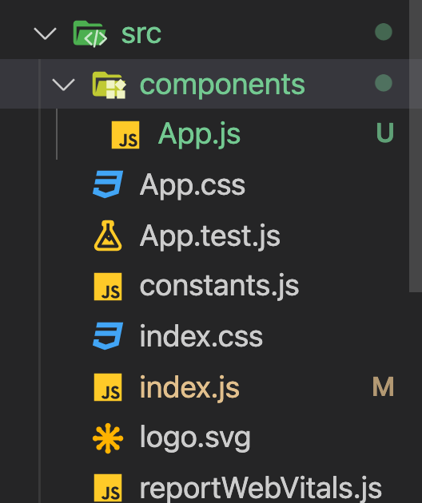
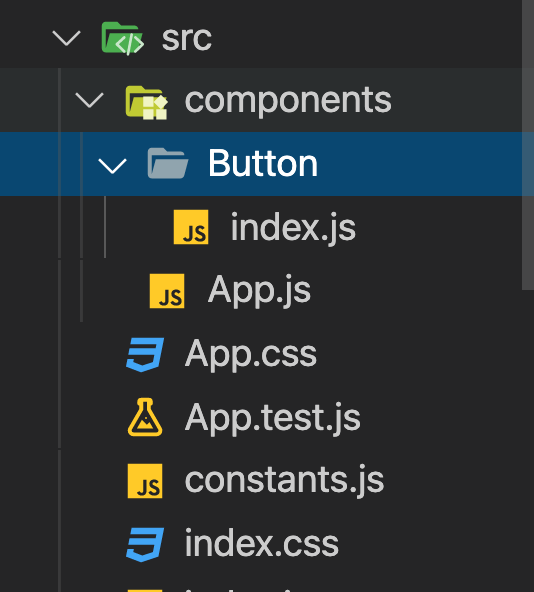
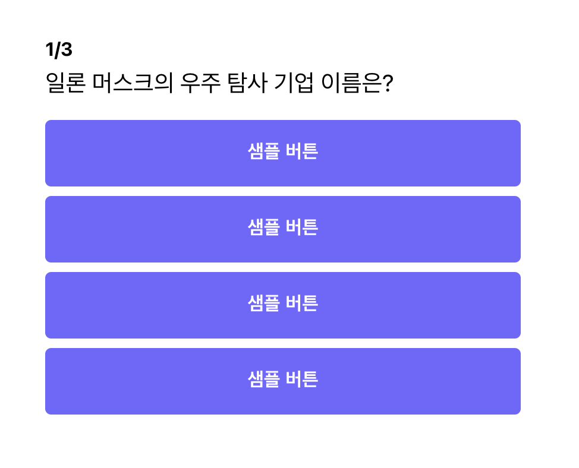
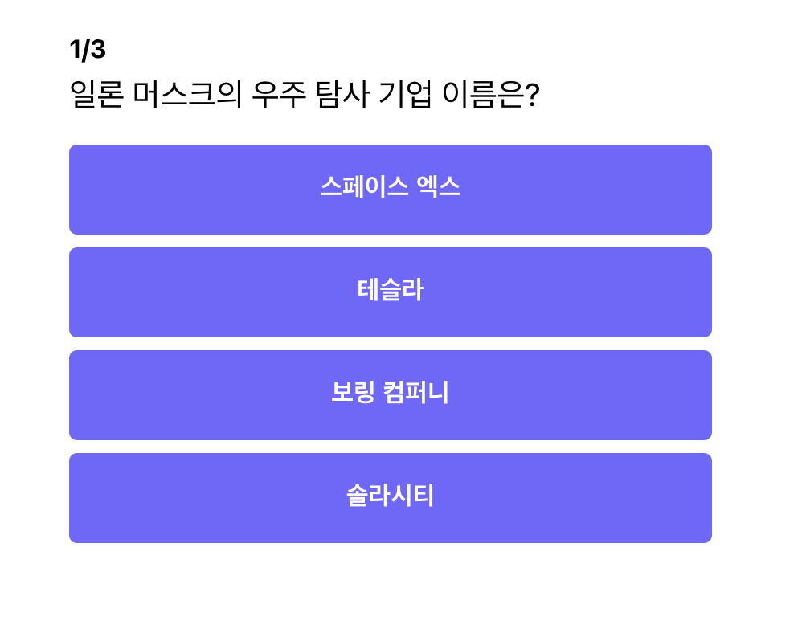
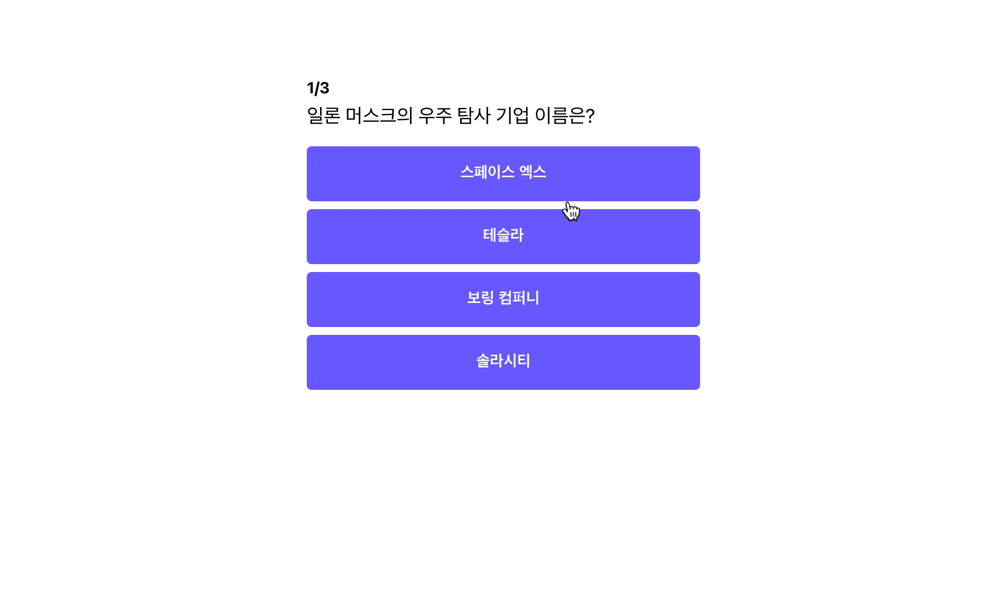

이제 `import`와 `export`도 배웠으니, `button` 컴포넌트를 분리해 보도록 하겠습니다.

## 폴더 추가하기

우선 앞으로 컴포넌트는 `components` 폴더 내에서 작성을 할 것이기 때문에, `components` 폴더를 `src` 내부에 하나 만들어 주도록 하겠습니다. 그리고 `App.js` 파일을 드래그하여 `components` 안으로 옮겨주세요.


`App.js`의 경로가 이전 됨에 따라 `App.js` 내에서 사용하던 모듈 혹은 `App.js`를 호출하는 모듈의 경로를 바꿔 주어야 합니다.

```jsx
// App.js
// 상위 폴더에 App.css가 존재하므로 .를 하나 더 추가
import "../App.css";
...
```

```jsx
// index.js
// components 폴더 안에 App이 존재하므로 /components/를 추가
import App from './components/App';
...
```

위와 같이 바꿔 주도록 합니다. 그리고 재 실행하여 정상적으로 작동하는지 확인 합니다.

## Button 컴포넌트 만들기

그럼 이제 본격적으로 `Button` 컴포넌트를 만들어 보도록 하겠습니다. `component` 폴더 안에 `Button` 폴더를 하나 만들고, `index.js` 파일을 하나 생성합니다. ( **`React`가 대문자만 `JSX`로 인식하기 때문에 반드시 파일 이름은 대문자로 작성해 주셔야 합니다**)



```jsx
// components/Button/index.js
import React from "react";

const Button = () => {
	return <button>샘플 버튼</button>;
};
export default Button;
```

위와 같이 `Button` `JSX` 함수를 하나 만들고, `return`에 `<button>`태그를 반환하도록 코드를 추가합니다.

이제 우리가 만든 `Button` 컴포넌트를 `App.js`에서 `import`하여 사용해 보도록 하겠습니다.

```jsx
// App.js
...
import Button from "./Button";
...

// 기존에 있던 button 컴포넌트를 우리가 만든 Button 컴포넌트로 교체
...
<div className="answer-section">
						{QUIZZES[currentNo].answers.map((answer) => (
							<Button
								value={answer.text}
								onClick={() => handleClick(answer.isCorrect)}
							>
								{answer.text}
							</Button>
						))}
</div>
...
```

:::note `import Button from "./Button"` 에서 `index`는 빼도 되나요?
`ES6`에서는 폴더에 `index.js` 파일이 있으면 `import`문에 `index.js`를 지정하지 않고 폴더에서 암묵적으로 가져오기를 수행할 수 있습니다.
:::

위와 같이 교체를 하고 재실행을 해보도록 하겠습니다.



실행을 하면 위와 같은 화면이 나올 것입니다. 이유는 우리가 만든 `Button` 컴포넌트에 변수를 처리하는 기능을 넣지 않았기 때문입니다.

## Props (컴포넌트에서 속성 가져다 쓰기)

`props`는 `property`의 줄임말로 컴포넌트에 넘겨줄 속성을 의미합니다. 우리가 만들었던 `button` 컴포넌트로 돌아가 보도록 하겠습니다. 아래와 같이 `Button` 컴포넌트에 `text` 속성을 넘겨주려면 어떻게 해야 할까요?

```jsx
// app.js
...
import Button from "./Button";
return (
	<Button text="일론 머스크" />
)
...
```

```jsx
// components/Button/index.js
import React from "react";

const Button = (props) => {
	return <button>{props.text}</button>;
};
export default Button;
```

`Button` 컴포넌트에 속성으로 넘겨준 값들은 모두 `props` 안에 보관됩니다. 위와 같이 `Button` 컴포넌트 사용할 때 `name`을 넣어 주었으므로, `props`에서 해당하는 속성(`name`)을 불러와 추가해 주었습니다.

그럼 다시 `App.js`를 수정해 보도록 하겠습니다.

```jsx
// App.js
...
import Button from "./Button";
...

// 기존에 있던 button 컴포넌트를 우리가 만든 Button 컴포넌트로 교체
...
<div className="answer-section">
						{QUIZZES[currentNo].answers.map((answer) => (
							<Button
								text={answer.text}
							>
							</Button>
						))}
</div>
...
```

코드를 변경하고 다시 실행해 해보겠습니다.


위와 같이 정상적으로 버튼이 노출되는 것을 알 수 있습니다.

하지만 버튼을 클릭하면 다음 페이지로 넘어가지 않습니다 😂😂😂

왜냐하면 `Button` 컴포넌트에 이벤트 핸들링 함수(`handleClick`)를 넘겨주지 않았고, 거기에 맞는 처리도 안해주었기 때문입니다.

```jsx
...
import Button from "./Button";
...

// onClick Props에 event handling 함수 전달
...
<div className="answer-section">
						{QUIZZES[currentNo].answers.map((answer) => (
							<Button
								text={answer.text}
                onClick={() => handleClick(answer.isCorrect)}
							>
							</Button>
						))}
</div>
...
```

위에 코드처럼 `Button` 컴포넌트의 `onClick` `props`로 `event handling` 함수를 전달 해줍니다.

```jsx
// components/Button/index.js
import React from "react";

// props를 통해 받은 event handling 함수를 클릭 이벤트에 매핑(바인딩)
const Button = (props) => <button onClick={props.onClick}>{props.text}</button>;
export default Button;
```

그리고 `Button` 컴포넌트 내부에서 `html`의 `button` 태그 클릭 이벤트에 우리가 `props`로 받은 `onClick event handling` 함수를 매핑 시켜 줍니다. (이를 javascript 용어로 바인딩이라고 합니다)

다시 실행 해보도록 하겠습니다.


정상적으로 잘 동작하는 것을 알 수 있습니다. 이로써 `Button` 컴포넌트 로직을 분리해보았습니다. 다음 파트에서는 `Button` 컴포넌트의 `CSS`도 분리해 보도록 하겠습니다.

## 전체 코드 살펴보기

- 깃허브에서 전체 코드 보기 -> [바로가기](https://github.com/CodePotStudio/starter-quiz-app/tree/week03-02)

## Somthing More!!!

반드시 공부해야 하는 건 아니지만, 도움이 될 만한 자료들을 공유하고 있습니다.

- index.js 왜 쓸까?에 대해 좀 더 알아보기 ([링크](https://ko.javascript.info/import-export#ref-157))
