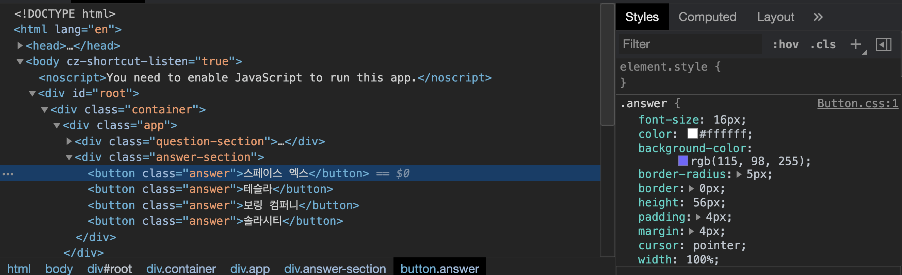
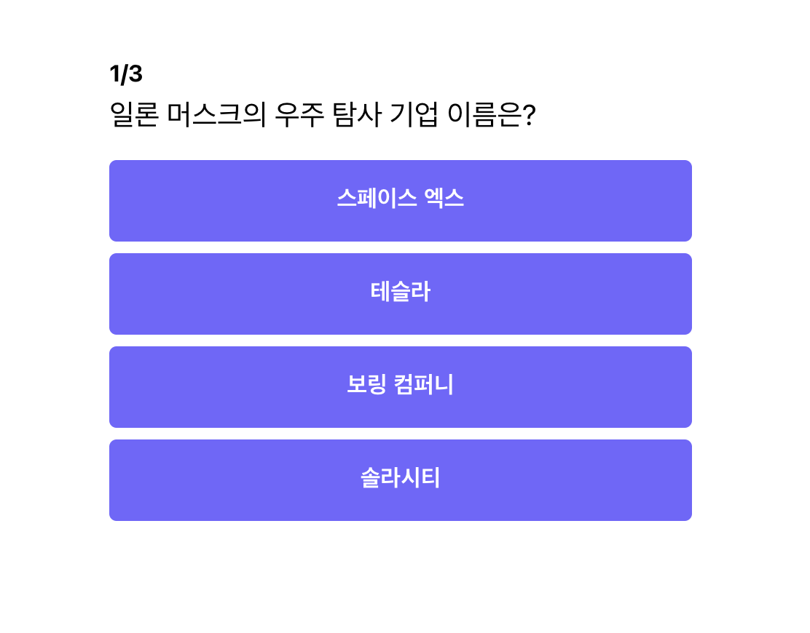
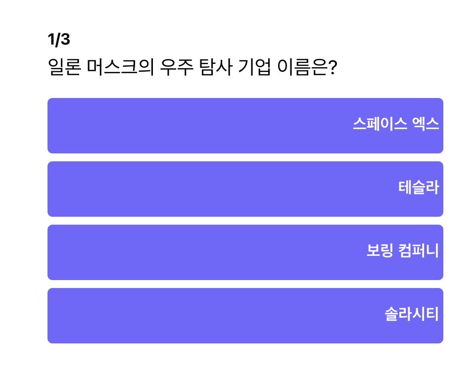
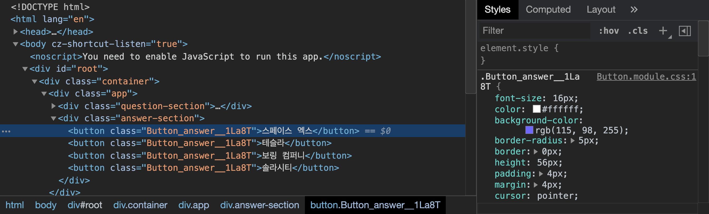
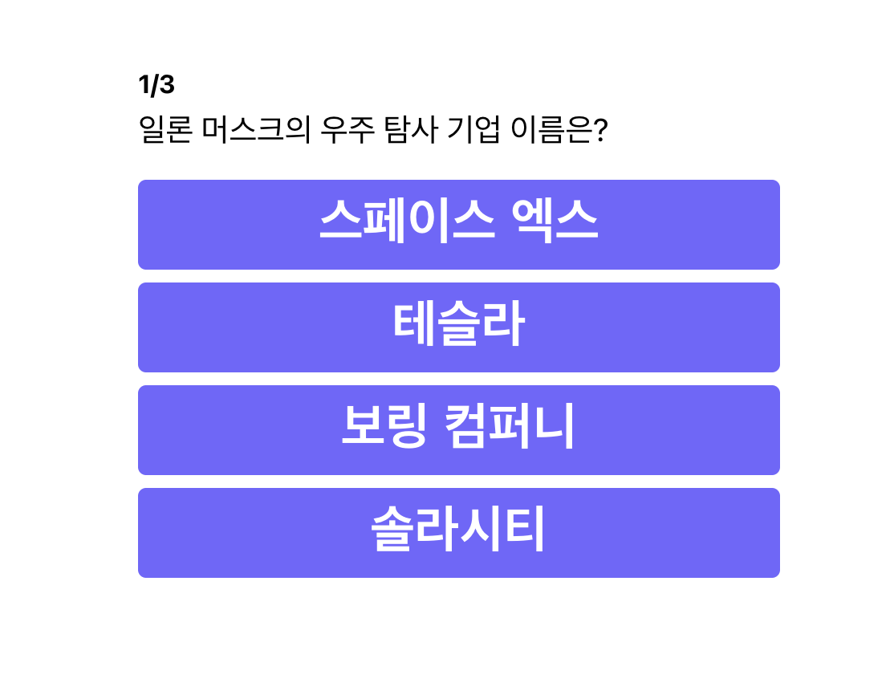

`Button` 컴포넌트를 성공적으로 분리했으므로, 이제 해당 컴포넌트에 스타일도 같이 옮겨 보도록 하겠습니다.

## CSS에 class btn 추가하기

지금까지는 `button` 태그에 바로 스타일을 적용해서 사용했는데, 이는 다른 곳에서 `button` 태그를 사용할 경우 같은 디자인으로만 사용해야 하는 문제점이 있습니다. 그래서 `class`를 통해서 스타일을 관리하는 형태로 먼저 바꿔 보도록 하겠습니다. 뿐만 아니라 `.answer:hover`로 분리되어 있던 hover style도 `&` 연산자를 활용하여 `.answer` 선택자 안으로 넣어 주었습니다.

```jsx
// App.css
// button -> .answer (answer 클래스를 가진 태그에만 적용되도록 CSS 변경)
...
.answer {
	font-size: 16px;
	color: #ffffff;
	background-color: #7362ff;
	border-radius: 5px;
	border: 0px;
	height: 56px;
	padding: 4px;
	margin: 4px;
	cursor: pointer;
	width: 100%;
	outline: none;
	font-weight: 700;
	&:hover {
		background-color: #a99fee;
	}
}
...
```

```jsx
// Components/Button/index.js
import React from "react";
import "./Button.css";

const Button = (props) => (
	<button className="answer-btn" onClick={props.onClick}>
		{props.text}
	</button>
);
export default Button;
```

다시 실행해 보도록 하겠습니다.

실행을 하고 콘솔 창을 켜 코드를 보면 아래와 같이 `answer` 클래스가 `button` 태그에 적용된 것을 볼 수 있습니다.



## Button 컴포넌트에 CSS 파일 적용하기

우선 `Button.css` 파일을 하나 생성합니다.

이 곳에 `App.css`에서 `Button`에 해당하는 CSS 코드들을 가져와 붙여 넣기합니다.

그리고 `App.css`에서는 해당 코드들을 지워 줍니다.

```jsx
// components/Button/Button.css

.answer {
	font-size: 16px;
	color: #ffffff;
	background-color: #7362ff;
	border-radius: 5px;
	border: 0px;
	height: 56px;
	padding: 4px;
	margin: 4px;
	cursor: pointer;
	width: 100%;
	outline: none;
	font-weight: 700;
	&:hover {
		background-color: #a99fee;
	}
}
```

```jsx
// App.css
body {
	font-family: -apple-system, BlinkMacSystemFont, "Segoe UI", "Roboto", "Oxygen",
		"Ubuntu", "Cantarell", "Fira Sans", "Droid Sans", "Helvetica Neue",
		sans-serif;
}

.container {
	display: flex;
	justify-content: center;
	align-items: center;
}

.app {
	width: 400px;
	margin-top: 72px;
}

.result-header {
	font-size: 64px;
	font-weight: bold;
	margin-bottom: 8px;
	text-align: center;
}

.result-score {
	font-size: 192px;
	margin: 40px;
	text-align: center;
	color: #7362ff;
}

.question-section {
	margin-bottom: 16px;
}

.question-header {
	font-size: 16px;
	font-weight: bold;
	margin-bottom: 8px;
}

.question-text {
	font-size: 20px;
	margin-bottom: 8px;
}

.answer-section {
	display: flex;
	flex-direction: column;
	justify-content: center;
	align-items: center;
	margin-bottom: 8px;
}
```

그리고 Button 컴포넌트에서 Button.css 파일을 import 해줍니다.

```jsx
// components/Button/index.js

import React from "react";
import "./Button.css";

const Button = (props) => (
	<button className="answer" onClick={props.onClick}>
		{props.text}
	</button>
);
export default Button;
```

그리고 재실행 해보도록 하겠습니다.



정상적으로 화면이 잘 나오고, 클래스와 `CSS`도 잘 적용된 것을 알 수 있습니다.

그런데 여기에는 문제가 하나 있습니다. 컴포넌트 별로 클래스 이름이 고유하지 않기 때문에 다른 컴포넌트에서 `.answer`에 적용될 스타일을 마음대로 변경할 수 있습니다.

```jsx
// App.css
.answer {
	text-align: right;
}
```

예를 들어, 누군가가 실수를 하여 `App.css`에서 `.answer`에 위와 같은 `style`을 적용하면 `Button` 컴포넌트도 그대로 영향을 받아 아래와 같이 스타일이 변경됩니다.



이는 코드가 많아지고, 협업 하는 사람이 많으면 많을수록 문제가 될 수 있습니다. 이러한 문제를 해결하기 위해 `BEM Convention` 같은 것을 만들어 지키려고 하지만 사람의 모든 실수를 막기는 어렵습니다.

## CSS Module (Class 이름을 유일하게 만들기)

아까의 문제는 `class` 이름이 범용적이라 겹치는 이름이 생겨서 생기는 문제였습니다. 그렇다면 `class` 이름을 고유하게 만들면 문제가 해결되지 않을까요?

그러한 컨셉으로 나온 것이 바로 `CSS Module` 입니다.

사용하는 방법은 `CSS` 파일 이름 앞에 `module`을 붙여주면 됩니다.

아까 `Button.css` 파일을 `Button.module.css`로 이름을 바꿔 보도록 하겠습니다.

```jsx
// components/Button/Button.module.css
.answer {
	font-size: 16px;
	color: #ffffff;
	background-color: #7362ff;
	border-radius: 5px;
	border: 0px;
	height: 56px;
	padding: 4px;
	margin: 4px;
	cursor: pointer;
	width: 100%;
	outline: none;
	font-weight: 700;
	&:hover {
		background-color: #a99fee;
	}
}
```

```jsx
// components/Button/index.js

import React from "react";
import styles from "./Button.module.css";

const Button = (props) => (
	<button className={styles.answer} onClick={props.onClick}>
		{props.text}
	</button>
);
export default Button;
```

몇 가지 바뀐 점이 있는데 `css.module`을 사용할 때는 `CSS`를 `import`하여 그곳에 있는 class를 직접 입력해 주어야 한다는 것입니다. 위에 코드를 보면 `import styles from "./Button.module.css";` 로 `css`를 `import` 해온 뒤, `className={styles.answer}` 클래스에 적용한 것을 볼 수 있습니다.

위와 같이 코드를 바꾸고 재실행 해보도록 하겠습니다.



위의 화면 처럼 class에 `Button_answer__1La8T` 처럼 고유한 `hash` 값이 `class`마다 붙은 것을 알 수 있습니다. 이로 인해 다른 곳에서 다른 곳에서 동일한 이름으로 사용할 수 없게 됩니다. 👏👏👏

## CSS in Javascript (Props로 CSS 관리하기)

`CSS Module` 의 경우, 몇 가지 단점이 있습니다. 모든 컴포넌트에 변수를 공유하기가 어렵습니다. 예를 들어 웹 페이지의 컬러의 경우 어느 컴포넌트에서나 사용되어야 하는 속성이기에 모든 컴포넌트가 공유할 수 있어야 합니다. 그런데 `CSS module` 단독으로는 어렵습니다. 그래서 이 단점을 극복하기 위해 `Sass`, `Scss` 같은 기술을 사용합니다.

또한 `css`로 원하는 속성를 넘겨주기가 번거롭습니다. 즉 컴포넌트의 속성에 따라 동적으로 `style`을 변경시키기에 어려움이 있습니다.

이를 손쉽게 해결하기 위해 나온 것이 `CSS in Javascript` 입니다. 대표적인 것으로 `styled-component,` `emotion`이 있으며, 저희는 `styled-component`를 활용해서 `Button` 컴포넌트를 리팩토링 해보도록 하겠습니다.

### 패키지 설치하기

터미널을 열고 아래 코드를 복사 붙여넣기하여 패키지를 설치합니다.

```jsx
npm install styled-components
```

### 스타일이 입혀진 Button 만들기

```jsx
// components/Button/index.js
import styled from "styled-components";

const StyledButton = styled.button`
  font-size: 16px;
	color: #ffffff;
	background-color: #7362ff;
	border-radius: 5px;
	border: 0px;
	height: 56px;
	padding: 4px;
	margin: 4px;
	cursor: pointer;
	width: 100%;
	outline: none;
	font-weight: 700;
	&:hover {
	  background-color: #a99fee;
	}
}`;
```

우선 `styled Components` 패키지에서 `styled`를 `import` 합니다. `styled` 안에는 `HTML` 태그들이 포함되어 있는데, 저희는 `button` 태그를 꾸며줄 것이기 때문에 `styled.button`로 버튼 태그만 가져옵니다. 그리고 불러온 엘리먼트 뒤에 ````을 붙여 줍니다. 그 곳에는 우리가 원하는 스타일을 넣어 줍니다. 위에 적용된`style`은 기존에 `Button`컴포넌트에 적용하던`CSS`입니다.

### 우리만의 Button으로 만들기

```jsx
// components/Button/index.js

const StyledButton = styled.button`
  font-size: 16px;
	color: #ffffff;
	background-color: #7362ff;
	border-radius: 5px;
	border: 0px;
	height: 56px;
	padding: 4px;
	margin: 4px;
	cursor: pointer;
	width: 100%;
	outline: none;
	font-weight: 700;
	&:hover {
	  background-color: #a99fee;
	}
}`;

const Button = (props) => (
	<StyledButton onClick={props.onClick}>{props.text}</StyledButton>
);

export default Button;
```

`style`을 적용시킨 `StyledButton` 컴포넌트를 가져와 기존에 있던 `props(onClick, text)`를 넣어 줍니다.

`Styled Component`로 리팩토링을 끝냈으니, 다시 실행을 해보도록 하겠습니다.


정상적으로 잘 나오는 것을 알 수 있습니다!!

### CSS에서 변수 사용하기

아래와 같이 컴포넌트에서 속성으로 `fontSize`를 받고, 그에 따라 폰트 사이즈를 변경 시켜 보도록 하겠습니다. (big ⇒ 32px, default ⇒ 16px)

```jsx
// components/Button/index.js
...
<StyledButton onClick={props.onClick} fontSize="big">{props.text}</StyledButton>
...
```

속성을 추가해 주었으니, `Styled Component`에서 해당 속성을 보고, 속성에 맞추어 `CSS`를 변경해주어야 합니다. 이럴 때는 아래와 같이 `template literal`을 활용하여 값으로 함수를 넣어 줍니다.

함수의 매개변수로 `props`를 받아 오고, `props`의 `fontSize`에 따라서 `32px` 혹은 `16px`을 보여 주도록 코드를 추가 하였습니다.

```jsx
// components/Button/index.js
...
const StyledButton = styled.button`
  font-size: ${(props) => (props.fonSize === "big" ? "32px" : "16px")};
}
`;
...
```

**전체 코드**

```jsx
// components/Button/index.js

import React from "react";
import styled from "styled-components";

const StyledButton = styled.button`
  font-size: ${(props) => (props.fontSize === "big" ? "32px" : "16px")};
	color: #ffffff;
	background-color: #7362ff;
	border-radius: 5px;
	border: 0px;
	height: 56px;
	padding: 4px;
	margin: 4px;
	cursor: pointer;
	width: 100%;
	outline: none;
	font-weight: 700;
	&:hover {
	  background-color: #a99fee;
	}
}
`;

const Button = (props) => (
	<StyledButton onClick={props.onClick} size="big">
		{props.text}
	</StyledButton>
);
export default Button;
```

그럼 다시 실행해 보도록 하겠습니다.



위 화면같이 버튼 폰트 사이즈가 커진 것을 확인 할 수 있습니다.

그리고 `StyledButton`에서 `size` 속성을 지우고, 다시 실행하면 원래 대로 돌아 오는 것을 알 수 있습니다.

```jsx
// components/Button/index.js

const Button = (props) => (
	<StyledButton onClick={props.onClick}>{props.text}</StyledButton>
);
```

다시 실행하면, 아래와 같이 예전의 모습으로 돌아 옵니다.


이처럼 `props`와 `styled-component`를 조합하면 다양한 사이즈, `primary`, `secondary` 버튼 등 다양하게 사용할 수 있습니다.

### Theming (컴포넌트들 간에 값 공유하기)

`Theming`은 다양한 컴포넌트에서 `style` 관련된 값들을 공유할 수 있도록 만든 기능입니다. 우선 공유할 값부터 정해보도록 하겠습니다.

```jsx
// theme.js
const theme = {
	primaryColor100: "#7362ff",
	primaryColor80: "#a99fee",
};

export default theme;
```

위와 같이 버튼의 보라색을 `primaryColor100`에, 마우스 호버 시에 나오는 옅은 보라색을 `primaryColor80`에 저장한 `theme` 객체와 파일을 하나 만들어 주었습니다.

그리고 전체 `App`에서 공유하기 위해 `App Component`에서 모든 컴포넌트를 `ThemeProvider`로 감싸 줍니다. 뿐만 아니라 `ThemeProvider`의 속성에 우리가 만든 `theme`를 값으로 넣어 줍니다.

```jsx
// components/App.js
...
import { ThemeProvider } from "styled-components";
import theme from "../theme";

function App() {
	...
	return (
		<ThemeProvider theme={theme}>
			<div className="container">
				...
			</div>
		</ThemeProvider>
	);
}

export default App;
```

이제 만든 `theme` 적용이 끝났고, `Button` 컴포넌트에서 `theme`에 있는 값들을 가져와 사용해 보도록 하겠습니다.

```jsx
// components/Button/index.js
import React from "react";
import styled from "styled-components";

const StyledButton = styled.button`
  ...
	background-color: ${(props) => props.theme.primaryColor100};
	...
	&:hover {
	  background-color: ${(props) => props.theme.primaryColor80};
	}
}
`;

const Button = (props) => (
	<StyledButton onClick={props.onClick}>{props.text}</StyledButton>
);
export default Button;
```

`ThemeProvider`에서의 `theme Props`는 `ThemeProvider` 아래의 모든 컴포넌트에서 `props.theme` 로 사용할 수 있습니다.

그래서 위 코드처럼 각 상황에 맞추어 `primaryColor100`, `primaryColor80`으로 스타일을 적용해 주었습니다.

그럼 마찬가지로 다시 코드를 실행해 보도록 하겠습니다.


정상적으로 잘 나오는 것을 알 수 있습니다.

`CSS in Javascript`이 좋으냐, `SASS`와 같은 `CSS in CSS` 방식이 좋으냐에 대해서는 아직도 여러 논의들이 있습니다. 저희 과정에서는 `Styled-Component`를 사용하지만 여러 기술들을 사용해 보시고, 본인에 가장 편한 방식으로 쓰는 것을 추천 드립니다.

## 전체 코드 살펴보기

- 깃허브에서 전체 코드 보기 -> [바로가기](https://github.com/CodePotStudio/starter-quiz-app/tree/week03-03)

## Somthing More!!!

반드시 공부해야 하는 건 아니지만, 도움이 될 만한 자료들을 공유하고 있습니다.

- BEM Convention에 대해서 더 알아보기 ([링크](https://medium.com/witinweb/css-%EB%B0%A9%EB%B2%95%EB%A1%A0-1-bem-block-element-modifier-1c03034e65a1))
- Javascript template literal에 대해서 더 알아보기 ([링크](https://developer.mozilla.org/ko/docs/Web/JavaScript/Reference/Template_literals))
- CSS-in-JS, CSS-in-CSS에 대해서 더 알아보기 ([링크](https://blueshw.github.io/2020/09/14/why-css-in-css/))
