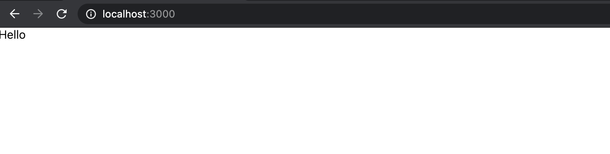
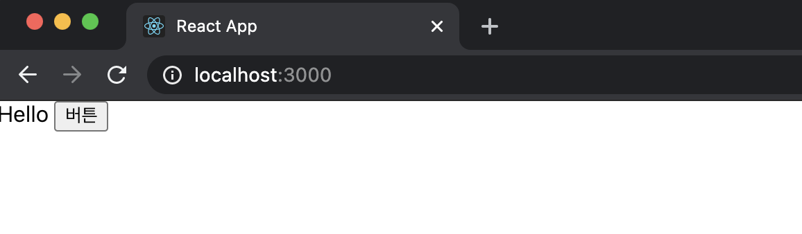
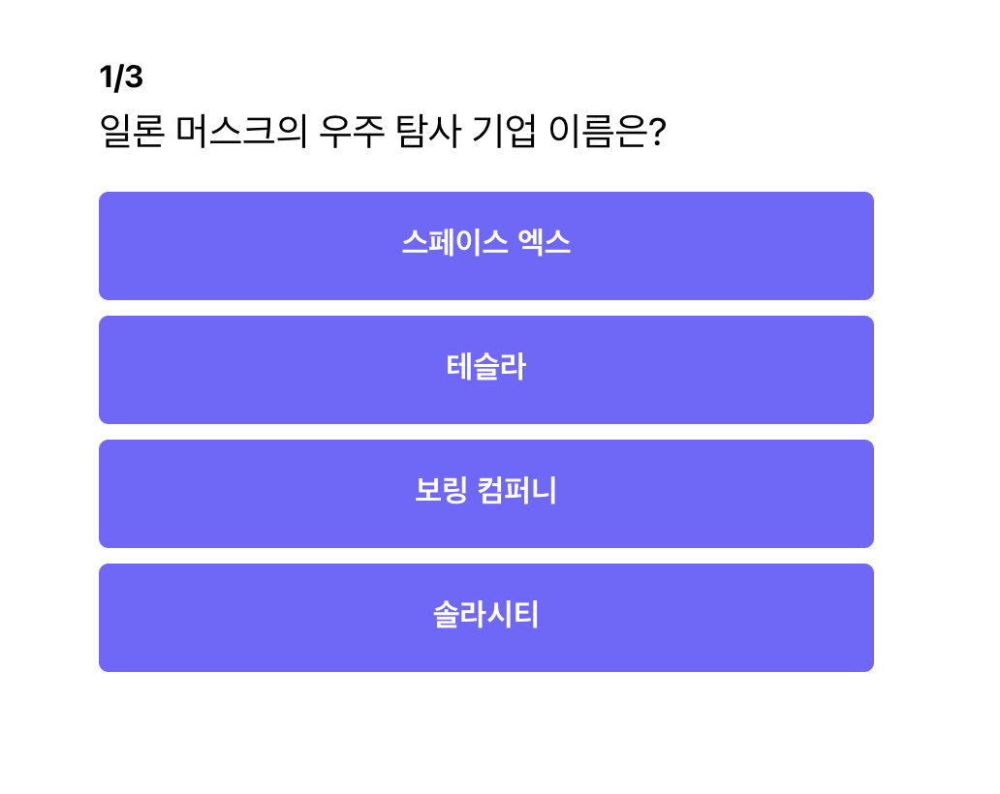

이제 컴포넌트를 분리하는 방법을 배웠으니, 좀 더 적극적으로 컴포넌트를 분리해보도록 하겠습니다.

```jsx
// App.js

function App() {
	...
	return (
		<ThemeProvider theme={theme}>
			<div className="container">
				{showResult ? (
					<div className="app">
						...
					</div>
				) : (
					<div className="app">
						...
					</div>
				)}
			</div>
		</ThemeProvider>
	);
}

export default App;
```

`App` 컴포넌트에 보면 `<div className="container">`와 `<div className="App">` 이 반복적으로 사용되는 것을 알 수 있습니다. 뿐만 아니라 앞으로 페이지가 추가되면 위 코드들은 또 사용될 것이기 때문에 분리하는 것이 효과적인 것 같습니다.

## Container 컴포넌트 만들기

아래와 같이 `Container` 폴더를 만들고, 그 안에 `index.js`를 아래와 같이 작성합니다.

```jsx
// components/Container/index.js
import React from "react";
import styled from "styled-components";

// App.css에서 container class에 적용되던 CSS 가져옴
const FlexBox = styled.div`
	display: flex;
	justify-content: center;
	align-items: center;
`;

// App.css에서 app class에 적용되던 CSS 가져옴
const ContainerWrapper = styled.div`
	width: 400px;
	margin-top: 72px;
`;

const Container = (props) => (
	<FlexBox>
		<ContainerWrapper>{props.children}</ContainerWrapper>
	</FlexBox>
);
export default Container;
```

여기서 `props.children`은 처음 보는 코드인데 어떤 의미인지 알아보도록 하겠습니다.

### props.children

예를 들어 `Box` 컴포넌트를 하나 만들었다고 생각해보겠습니다.

```jsx
// Box Component를 만듬.
const Box = () => <div>Hello!</div>;
```

만든 컴포넌트를 `App` 컴포넌트에서 써보도록 하겠습니다. 게다가 `Box` 컴포넌트 안에는 `button` 컴포넌트도 하나 추가하였습니다.

```jsx
const App = () => {
	return (
				<Box>
					<button>버튼</button>
				</Box>
	}
}
```

그런데 이것을 실행하면 어떻게 될까요? `Hello`만 화면에 나오고 `Button`은 나오지 않습니다.

무엇 때문 일까요??


왜냐하면 `Box` 컴포넌트는 `<div></div>` 렌더링하는 것으로 약속되어 있지 내부에 있는 컴포넌트까지 렌더링하도록 약속이 되어 있지 않기 때문입니다. 그래서 이렇게 내부의 있는 컴포넌트까지 렌더링할 때 사용하는 것이 `props.children` 입니다.

다시 `Box` 컴포넌트를 수정하면 아래와 같이 해야 합니다.

```jsx
// Box Component 안에 children 컴포넌트를 렌더링 시킴.
const Box = (props) => <div>Hello {props.children}</div>;
```

위와 같이 코드를 수정하면 정삭적으로 `Hello`와 더불어 버튼까지 같이 렌더링되는 것을 볼 수 있습니다.



### App 컴포넌트에 Container 컴포넌트 적용하기

아래와 같이 코드를 변경합니다.

```jsx
// App.js
...
import Container from "./Container";

function App() {
	...
	return (
		<ThemeProvider theme={theme}>
			{showResult ? (
				<Container>
					<h1 className="result-header">당신의 점수는?</h1>
					<p className="result-score">{convertedScore}</p>
				</Container>
			) : (
				<Container>
					<div className="question-section">
						<h1 className="question-header">
							<span>{QUIZZES[currentNo].id}</span>/{QUIZZES.length}
						</h1>
						<div className="question-text">{QUIZZES[currentNo].question}</div>
					</div>
					<div className="answer-section">
						{QUIZZES[currentNo].answers.map((answer) => (
							<Button
								text={answer.text}
								onClick={() => handleClick(answer.isCorrect)}
							></Button>
						))}
					</div>
				</Container>
			)}
		</ThemeProvider>
	);
}

export default App;
```

각 퀴즈, 결과 섹션 별로 컨테이너가 적용되었고, 재시작을 해보도록 하겠습니다.



정상적으로 잘 작동하는 것을 알 수 있습니다.

## answerGroup 컴포넌트 만들기

아래와 같이 `AnswerGroup` 폴더를 하나 만들고 `index.js`를 아래와 같이 하나 만듭니다.

```jsx
// components/AnswerGroup/index.js

import React from "react";
import styled from "styled-components";
// QUIZZES를 사용하기 위해 import 해왔습니다.
import { QUIZZES } from "../../constants";
import Button from "../Button";

// answer-section에 해당하는 스타일을 가져옴
const AnswerGroupWrapper = styled.div`
	display: flex;
	flex-direction: column;
	justify-content: center;
	align-items: center;
	margin-bottom: 8px;
`;

// 비구조 할당으로 currentNo, handleClick 꺼내기
const AnswerGroup = ({ currentNo, handleClick }) => (
	<AnswerGroupWrapper>
		{QUIZZES[currentNo].answers.map((answer) => (
			<Button
				text={answer.text}
				onClick={() => handleClick(answer.isCorrect)}
			></Button>
		))}
	</AnswerGroupWrapper>
);
export default AnswerGroup;
```

```jsx
//App.js
...
import AnswerGroup from "./AnswerGroup";

function App() {
	...
	return (
		<ThemeProvider theme={theme}>
			{showResult ? (
				<Container>
					<h1 className="result-header">당신의 점수는?</h1>
					<p className="result-score">{convertedScore}</p>
				</Container>
			) : (
				<Container>
					...
					<AnswerGroup currentNo={currentNo} handleClick={handleClick} />
				</Container>
			)}
		</ThemeProvider>
	);
}

export default App;
```

`App.css`에서 `answer-section` 클래스에 적용되던 CSS를 가져와 `AnswerGroupWrapper` 컴포넌트에 적용해 주었습니다. 그리고 `AnswerGroup`의 경우, `currentNo`와 `handleClick`이 없기 때문에 `props`를 통해서 받는 형태로 추가하였습니다.

이로써 `AnswerGroup` 컴포넌트를 만들었고, 재시작을 해보도록 하겠습니다.


정상적으로 잘 작동하는 것을 알 수 있습니다.

## QuestionSection 컴포넌트 만들기

아래와 같이 `QuestionSection` 폴더를 하나 만들고 `index.js`를 아래와 같이 하나 만듭니다.

```jsx
// components/QuestionSection/index.js

import React from "react";
import styled from "styled-components";
import { QUIZZES } from "../../constants";

// .question-section에 해당하는 CSS를 가져옴
const QuestionSectionWrapper = styled.div`
	margin-bottom: 16px;
`;

// .question-header에 해당하는 CSS를 가져옴
const PageLabel = styled.h1`
	font-size: 16px;
	font-weight: bold;
	margin-bottom: 8px;
`;

// .question-text에 해당하는 CSS를 가져옴
const QuestionTitle = styled.div`
	font-size: 20px;
	margin-bottom: 8px;
`;

const QuestionSection = ({ currentNo }) => (
	<QuestionSectionWrapper>
		<PageLabel>
			<span>{QUIZZES[currentNo].id}</span>/{QUIZZES.length}
		</PageLabel>
		<QuestionTitle>{QUIZZES[currentNo].question}</QuestionTitle>
	</QuestionSectionWrapper>
);
export default QuestionSection;
```

`QuestionSectionWrapper`, `PageLabel`, `QuestionTitle` 컴포넌트를 styled component로 새로이 만들어 주었습니다. 뿐만 아니라 `currentNo` 값이 필요하기 때문에 `props`를 통해 `currentNo`를 받도록 코드를 추가하였습니다.

```jsx
// App.js
import React, { useState } from "react";
import { QUIZZES } from "../constants";
import { ThemeProvider } from "styled-components";
import theme from "../theme";
import Container from "./Container";
import AnswerGroup from "./AnswerGroup";
import QuestionSection from "./QuestionSection";
import "../App.css";

function App() {
	const [currentNo, setCurrentNo] = useState(0);
	const [showResult, setShowResult] = useState(false);
	const [score, setScore] = useState(0);

	const handleClick = (isCorrect) => {
		if (isCorrect) {
			setScore((score) => score + 1);
		}
		// 마지막 퀴즈인지 체크하기
		if (currentNo === QUIZZES.length - 1) {
			setShowResult(true);
		} else {
			setCurrentNo((currentNo) => currentNo + 1);
		}
	};
	const convertedScore = Math.floor((score / QUIZZES.length) * 100);

	return (
		<ThemeProvider theme={theme}>
			{showResult ? (
				<Container>
					<h1 className="result-header">당신의 점수는?</h1>
					<p className="result-score">{convertedScore}</p>
				</Container>
			) : (
				<Container>
					<QuestionSection currentNo={currentNo} />
					<AnswerGroup currentNo={currentNo} handleClick={handleClick} />
				</Container>
			)}
		</ThemeProvider>
	);
}

export default App;
```

`App.js` 에서는 기존의 코드를 `QuestionSection` 컴포넌트로 변경해 주었습니다.

## ResultSection 컴포넌트 만들기

아래와 같이 `ResultSection` 폴더를 하나 만들고 `index.js`를 아래와 같이 하나 만듭니다.

```jsx
import React from "react";
import styled from "styled-components";

const Title = styled.h1`
	font-size: 64px;
	font-weight: bold;
	margin-bottom: 8px;
	text-align: center;
`;

const Score = styled.p`
	font-size: 192px;
	margin: 40px;
	text-align: center;
	color: ${(props) => props.theme.primaryColor100};
`;

const ResultSection = ({ convertedScore }) => (
	<>
		<ResultTitle>당신의 점수는?</ResultTitle>
		<Score>{convertedScore}</Score>
	</>
);
export default ResultSection;
```

앞에서 해왔던 방식과 비슷하게 진행하였고, 특이한 점은 `color`의 경우 `Button` 컴포넌트를 만들 때처럼 `theme`에서 컬러를 받아왔다는 점입니다.

```jsx
// App.js
import React, { useState } from "react";
import { QUIZZES } from "../constants";
import "../App.css";
import { ThemeProvider } from "styled-components";
import theme from "../theme";
import Container from "./Container";
import AnswerGroup from "./AnswerGroup";
import QuestionSection from "./QuestionSection";
import ResultSection from "./ResultSection";

function App() {
	const [currentNo, setCurrentNo] = useState(0);
	const [showResult, setShowResult] = useState(false);
	const [score, setScore] = useState(0);

	const handleClick = (isCorrect) => {
		if (isCorrect) {
			setScore((score) => score + 1);
		}
		// 마지막 퀴즈인지 체크하기
		if (currentNo === QUIZZES.length - 1) {
			setShowResult(true);
		} else {
			setCurrentNo((currentNo) => currentNo + 1);
		}
	};
	const convertedScore = Math.floor((score / QUIZZES.length) * 100);

	return (
		<ThemeProvider theme={theme}>
			{showResult ? (
				<Container>
					<ResultSection convertedScore={convertedScore}></ResultSection>
				</Container>
			) : (
				<Container>
					<QuestionSection currentNo={currentNo} />
					<AnswerGroup currentNo={currentNo} handleClick={handleClick} />
				</Container>
			)}
		</ThemeProvider>
	);
}

export default App;
```

`App.js` 에서는 기존의 코드를 `ResultSection` 컴포넌트로 변경해 주었습니다.

## App.css 삭제하기

모든 컴포넌트를 다 분리했기 때문에 이제는 더이상 `App.css` 의 스타일이 필요 없습니다.

그래서 다 지우려고 했는데, 전체 `body` 태그에 걸려있는 폰트가 하나 남았습니다.

```jsx
// App.css
body {
	font-family: -apple-system, BlinkMacSystemFont, "Segoe UI", "Roboto", "Oxygen",
		"Ubuntu", "Cantarell", "Fira Sans", "Droid Sans", "Helvetica Neue",
		sans-serif;
}
```

그럴 때는 `styled component`의 `globalStyle`을 활용하면 됩니다.

### globalStyle 적용하기

src 아래에 `globalStyle` 파일을 하나 생성합니다.

```jsx
//globalStyle.js

import { createGlobalStyle } from "styled-components";

const GlobalStyle = createGlobalStyle`
  body {
    font-family: -apple-system, BlinkMacSystemFont, "Segoe UI", "Roboto", "Oxygen",
		"Ubuntu", "Cantarell", "Fira Sans", "Droid Sans", "Helvetica Neue",
		sans-serif;
  }
`;

export default GlobalStyle;
```

`createGlobalStyle` 안에 우리가 적용하고자 하는 `style`을 추가해 줍니다. 그렇게 만든 `GlobalStyle`을 외부로 내보내 줍니다.

```jsx
// App.js
...
import GlobalStyle from "../globalStyle";

function App() {
	...
	return (
		<ThemeProvider theme={theme}>
			<GlobalStyle />
			...
		</ThemeProvider>
	);
}

export default App;
```

그리고 `GlobalStyle` 컴포넌트를 `import`하고, `ThemeProvider` 안쪽에서 컴포넌트를 추가 해줍니다.

이제 모든 CSS 스타일을 다 옮겼으니, `App.css` 파일도 삭제하고, `App.css` `import` 코드도 마찬가지로 삭제합니다. 그리고 `App`을 재시작합니다.


정상적으로 코드가 작동하는 것을 알 수 있습니다!!

이로써 CSS에서 styled-component로의 기나긴 여정이 끝났습니다 👏👏👏👏

## 전체 코드 살펴보기

- 깃허브에서 전체 코드 보기 -> [바로가기](https://github.com/CodePotStudio/starter-quiz-app/tree/week03-04)

## Somthing More!!!

반드시 공부해야 하는 건 아니지만, 도움이 될 만한 자료들을 공유하고 있습니다.

- Atomic Design으로 컴포넌트 구성하기 ([링크](https://ui.toast.com/weekly-pick/ko_20200213))
- Atomic Design으로 Todo List 만들기 ([링크](https://velog.io/@thsoon/%EC%93%B8%EB%95%8C%EC%97%86%EC%9D%B4-%EA%B3%A0%ED%80%84%EC%9D%B8-%ED%88%AC%EB%91%90%EB%A6%AC%EC%8A%A4%ED%8A%B8-%EB%A7%8C%EB%93%A4%EA%B8%B0-FE-2.-%EB%B7%B0-%EC%84%A4%EA%B3%84))
