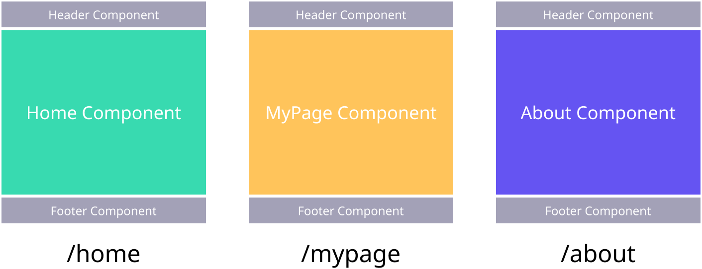

## SPA에서 Routing?

1주차에 이야기 했던 SPA에 대해서 다시 한 번 이야기 해보도록 하겠습니다.


전통적인 웹페이지의 경우, 각 URL로 HTML을 요청하면 각 **URL에 맞추어 새로운 HTML을 내려주고, 브라우저가 렌더링**합니다.

이에 반해 SPA(Single Page Application)의 경우, **최초 페이지로 접근할 때 모든 HTML, CSS, Javascript를 받아오고, SPA 프레임워크가 각 URL에 따라 필요한 부분만 업데이트** 하는 구조라고 이야기를 했었습니다.


위와 같이 정해진 url에 접근하면 url에 맞는 컴포넌트로 갈아 끼워 웹페이지를 재구성합니다. 이러한 기능을 라우팅이라고 하는데, React에는 이 기능을 따로 제공하지 않습니다. 그래서 우리는 React에서 라우팅을 할 때 가장 많이 사용하는 라이브러리 React Router를 활용하여 라우팅을 구현해 보도록 하겠습니다.

## React Router 설치하기

```jsx
npm install react-router-dom
```

## React Router 핵심 컴포넌트 3가지

### Router 컴포넌트

`Router` 컴포넌트는 앞으로 나올 `Link`, `Route` 컴포넌트를 동작하기 위해 반드시 필요한 컴포넌트입니다. `Link`, `Route` 컴포넌트는 반드시 `Router`를 상위 컴포넌트로 갖고 있어야 정상적으로 동작합니다. `Router` 컴포넌트에는 여러 종류가 있는데 저희는 가장 많이 사용하는 `BrowserRouter`를 사용할 것입니다.

```jsx
import { BrowserRouter as Router, Route, Link } from "react-router-dom";

// Router 컴포넌트 사용 예시
<Router>
	<Link to="/">Home</Link>
	<Link to="mypage">Mypage</Link>
</Router>

// Router 컴포넌트 사용 예시
<Router>
	<Route path="/" component={Home} />
	<Route path="mypage" component={MyPage} />
</Router>
```

이러한 이유로 프로젝트 최상단 컴포넌트를 감싸는 방식으로 많이 사용합니다.

### Route 컴포넌트

`Route` 컴포넌트 사용법에 대해 좀 더 자세히 알아보도록 하겠습니다.

Route 컴포넌트는 정해진 URL로 고객이 접근하였을 때, 약속된 컴포넌트를 렌더링하는 기능을 제공합니다.

`Route` 컴포넌트는 아래와 같이 생겼습니다. `path`에는 컴포넌트를 렌더링할 url을, `component`에는 `path`에 약속된 url로 접근했을 때 렌더링할 컴포넌트를 입력합니다.

```jsx
// Route 컴포넌트 예시
<Route path="url 경로" component={렌더링할 컴포넌트} />

// 이렇게도 사용할 수 있습니다.
<Route path="url 경로">
	<렌더링할 컴포넌트 />
</Route>
```

이제 실제 App 컴포넌트에 적용하여 사용해 보도록 하겠습니다.

```jsx
import React from "react";
import { BrowserRouter as Router, Route } from "react-router-dom";

// Home, MyPage, About 컴포넌트 생성
const Home = () => <div>Home</div>;
const MyPage = () => <div>MyPage</div>;
const About = () => <div>About</div>;

// 각 URL로 보여줄 컴포넌트 매칭
const App = () => {
	return (
		<Router>
			<Route path="/mypage" component={MyPage} />
			<Route path="/about" component={About} />
			<Route path="/" exact component={Home} />
		</Router>
	);
};

export default App;
```

마지막 `Route`에는 props로 `exact`를 넣어주었는데 이유는 `/mypage`, `/about`에도 `/`가 포함되어 있기 때문에 `Home` 컴포넌트가 렌더링이 됩니다. 그래서 이 문제를 해결하기 위해 정확히 path가 `/` 일 때만 `Home` 컴포넌트를 렌더링하도록 옵션을 넣어주었습니다.

실행하여 `localhost:3000/mypage`, `localhost:3000/about`, `localhost:3000/` 으로 접속해보세요.

정상적으로 동작하는 것을 확인하셨나요?

이제 `Link` 컴포넌트에 대해 알아보도록 하겠습니다.

### Link 컴포넌트

Link 컴포넌트는 HTML에서 사용하는 a태그와 기능이 비슷합니다. 즉, 해당 태그를 클릭하면 정해진 URL로 페이지를 이동시켜 줍니다.

a 태그와 Link 태그의 차이는 무엇인가요?
a태그의 기본적인 속성은 **페이지를 이동시키면서 페이지 전부를 새로 불러옵니다.** 이로 인해 컴포넌트가 가지고 있는 모든 상태가 초기화됩니다.
이에 반해 **Link 태그는 브라우저의 URL만 바꾸고, 필요한 컴포넌트만 업데이트 하기 때문에 a태그와 같은 문제가 발생**하지 않습니다.

`Link` 태그는 아래와 같이 생겼습니다. `a`태그와는 달리 `href` 대신 `to`를 활용하여 url을 이동 시킵니다.

```jsx
<Link to="이동할 URL">링크 이름</Link>
```

이제 실제 `App`에서 적용해 보도록 하겠습니다.

```jsx
import React from "react";
import { BrowserRouter as Router, Route } from "react-router-dom";

// Home, MyPage, About 컴포넌트 생성
const Home = () => <div>Home</div>;
const MyPage = () => <div>MyPage</div>;
const About = () => <div>About</div>;

// 각 URL로 보여줄 컴포넌트 매칭
const App = () => {
	return (
		<Router>
			<ul>
				<li>
					<Link to="/">Home</Link>
				</li>
				<li>
					<Link to="/mypage">MyPage</Link>
				</li>
				<li>
					<Link to="/about">About</Link>
				</li>
			</ul>
			<Route path="/mypage" component={MyPage} />
			<Route path="/about" component={About} />
			<Route path="/" exact component={Home} />
		</Router>
	);
};

export default App;
```

코드를 실행해보면 아래와 같이 링크를 클릭해보면 URL에 맞추어 컴포넌트를 렌더링 해주는 것을 볼 수 있습니다.


## 전체 코드 살펴보기

- 깃허브에서 전체 코드 보기 -> [바로가기](https://github.com/CodePotStudio/starter-quiz-app/tree/week04-01)

## Somthing More!!!

반드시 공부해야 하는 건 아니지만, 도움이 될 만한 자료들을 공유하고 있습니다.

- [React Hash Router](https://reactrouter.com/web/api/HashRouter)
