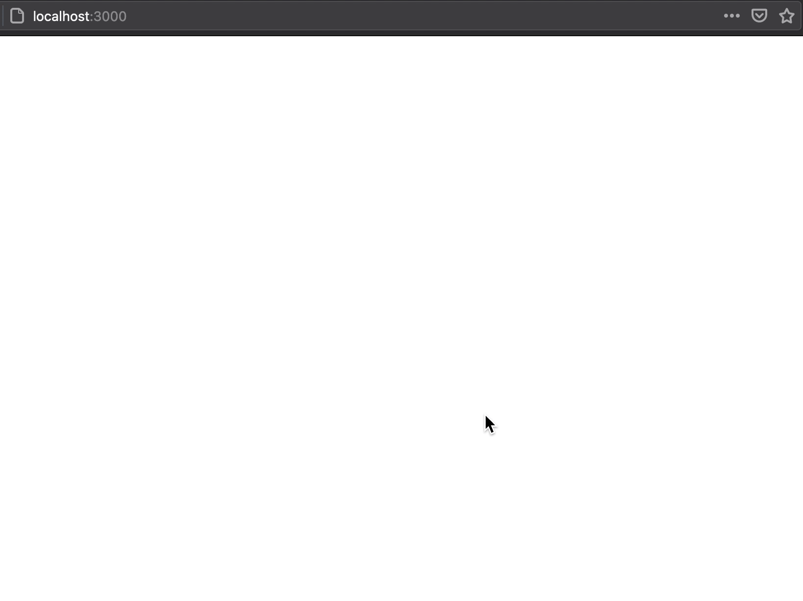

이제 URL 별로 라우팅 하는 방법을 배웠으니, URL에 맞추어 페이지를 만들고, 라우팅 해보도록 하겠습니다.

## Quiz 페이지 만들기

페이지를 나눠야 하므로, 현재 퀴즈가 보이는 페이지를 컴포넌트로 분리해보도록 하겠습니다.

### Quiz 컴포넌트 만들기

아래와 같이 `pages` , `Quiz` 폴더, `index` 파일를 만들고, `Quiz` 컴포넌트를 만들어 줍니다.

현재 `App`에서 사용하는 모든 state와 event handler는 퀴즈에만 해당되는 것이므로 아래에 있는 것처럼 퀴즈에 해당하는 코드를 전부 다 옮겨 줍니다.

```jsx
// pages/Quiz/index.js
import { useState } from "react";
import AnswerGroup from "../components/AnswerGroup";
import Container from "../components/Container";
import QuestionSection from "../components/QuestionSection";
import ResultSection from "../components/ResultSection";
import { QUIZZES } from "../constants";

const Quiz = () => {
	const [currentNo, setCurrentNo] = useState(0);
	const [showResult, setShowResult] = useState(false);
	const [score, setScore] = useState(0);

	const handleClick = (isCorrect) => {
		if (isCorrect) {
			setScore((score) => score + 1);
		}
		// 마지막 퀴즈인지 체크하기
		if (currentNo === QUIZZES.length - 1) {
			setShowResult(true);
		} else {
			setCurrentNo((currentNo) => currentNo + 1);
		}
	};
	const convertedScore = Math.floor((score / QUIZZES.length) * 100);

	return showResult ? (
		<Container>
			<ResultSection convertedScore={convertedScore}></ResultSection>
		</Container>
	) : (
		<Container>
			<QuestionSection currentNo={currentNo} />
			<AnswerGroup currentNo={currentNo} handleClick={handleClick} />
		</Container>
	);
};
export default Quiz;
```

### Routing 설정하기

이제 `Quiz` 컴포넌트를 만들었으니, `/quiz` url로 접속하였을 때만 `Quiz` 컴포넌트를 렌더링하도록 구현해 보도록 하겠습니다.

```jsx
import React from "react";
import { ThemeProvider } from "styled-components";
import theme from "../theme";
import GlobalStyle from "../globalStyle";
import { BrowserRouter as Router, Route } from "react-router-dom";
import Quiz from "../pages/Quiz";

function App() {
	return (
		<ThemeProvider theme={theme}>
			<GlobalStyle />
			<Router>
				<Route path="/quiz" component={Quiz} />
			</Router>
		</ThemeProvider>
	);
}

export default App;
```

바로 전 파트에서 배운 Router와 Route를 이용하여 `/quiz` url로 접근 시에 `Quiz` 컴포넌트를 렌더링하도록 코드를 추가해주었습니다.

그럼 실행하여 테스트 해보도록 하겠습니다.



`localhost:3000` 로 접속하면 아무것도 나오지 않고, `localhost:3000/quiz` 로 접속하면 정상적으로 `Quiz` 컴포넌트가 정상적으로 나오는 것을 볼 수 있습니다.

## 전체 코드 살펴보기

- 깃허브에서 전체 코드 보기 -> [바로가기](https://github.com/CodePotStudio/starter-quiz-app/tree/week04-02)

## Somthing More!!!

반드시 공부해야 하는 건 아니지만, 도움이 될 만한 자료들을 공유하고 있습니다.
