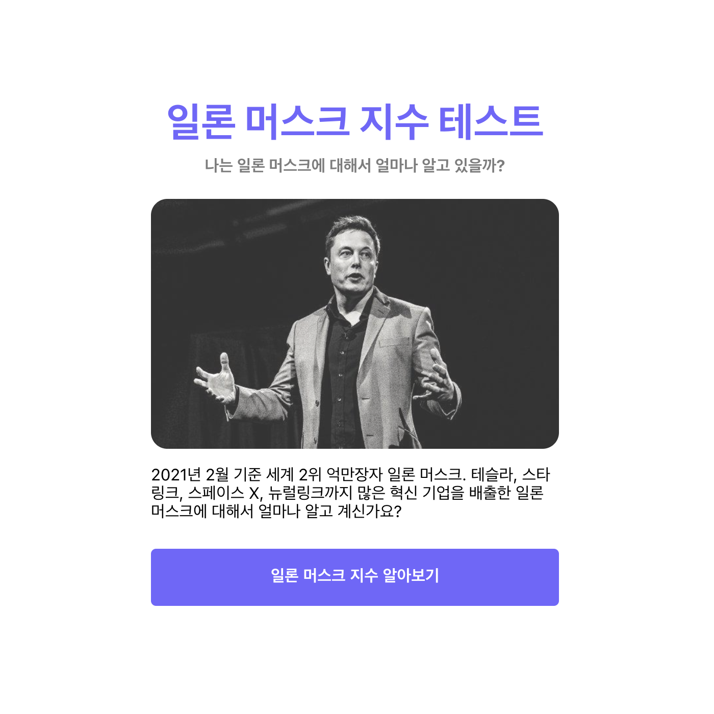

이제 위와 같은 렌딩 페이지를 만들어 보도록 하겠습니다.

우선 사전에 알아야하는 지식 몇 가지만 알고 넘어가도록 하겠습니다.

## React 이미지 태그 다루기

React에서는 이미지 태그를 다룰 때, `src` 속성에 `HTML`에서 사용하듯 일반적인 파일 경로를 넣으면 작동을 하지 않습니다.

```jsx

```

React에서는 아래와 같이 사용해야 합니다.

```jsx
import cover from "이미지 경로/cover.jpg";

;
```

## Landing 컴포넌트 만들기

`assets` 폴더 안에 `images` 폴더를 하나 만들고 아래 배경 사진 다운 받아 추가합니다.


그리고 `Pages` 폴더 내에 `Landing` 폴더와 `index.js` 파일을 하나 생성합니다.

```jsx
// Pages/Landing/index
import Container from "../../components/Container";
import styled from "styled-components";
import cover from "../../assets/images/cover.jpg";
import Button from "../../components/Button";
import { Link } from "react-router-dom";

const Title = styled.h1`
	font-size: 40px;
	font-weight: bold;
	margin-bottom: 8px;
	text-align: center;
	color: ${(props) => props.theme.primaryColor100};
`;

const SubTitle = styled.h1`
	font-size: 16px;
	font-weight: bold;
	margin-bottom: 24px;
	text-align: center;
	color: ${(props) => props.theme.gray80};
`;

const StyledImage = styled.img`
	border-radius: 16px;
	opacity: 80%;
	margin-bottom: 16px;
	max-width: 100%;
	display: block;
`;

const Text = styled.p`
	font-size: 16px;
	margin-bottom: 24px;
`;

const Landing = () => (
	<Container>
		<Title>일론 머스크 지수 테스트</Title>
		<SubTitle>나는 일론 머스크에 대해서 얼마나 알고 있을까?</SubTitle>
		<StyledImage src={cover} alt="cover"></StyledImage>
		<Text>
			2021년 2월 기준 세계 2위 억만장자 일론 머스크. 테슬라, 스타링크, 스페이스
			X, 뉴럴링크까지 많은 혁신 기업을 배출한 일론 머스크에 대해서 얼마나 알고
			계신가요?
		</Text>
		<Link to="/quiz">
			<Button text="일론 머스크 지수 알아보기"></Button>
		</Link>
	</Container>
);

export default Landing;
```

앞으로 계속해서 회색 컬러를 사용할 것이기 때문에 `theme.js`에도 `gray80` 컬러를 추가해 줍니다.

```jsx
// theme.js
const theme = {
	primaryColor100: "#7362ff",
	primaryColor80: "#a99fee",
	gray80: "#7D7D7D",
};

export default theme;
```

## Quiz 컴포넌트 Routing 하기

그리고 마지막으로 `App` 컴포넌트에서 `/` 경로로 접속했을 때, `Quiz` 컴포넌트를 렌더링 하도록 바꿔 줍니다.

```jsx
// App.js
...
function App() {
	return (
		<ThemeProvider theme={theme}>
			<GlobalStyle />
			<Router>
				<Route path="/quiz" component={Quiz} />
				<Route path="/" exact component={Landing} />
			</Router>
		</ThemeProvider>
	);
}
...
export default App;
```

## 전체 코드 살펴보기

- 깃허브에서 전체 코드 보기 -> [바로가기](https://github.com/CodePotStudio/starter-quiz-app/tree/week04-03)

## Somthing More!!!

반드시 공부해야 하는 건 아니지만, 도움이 될 만한 자료들을 공유하고 있습니다.
