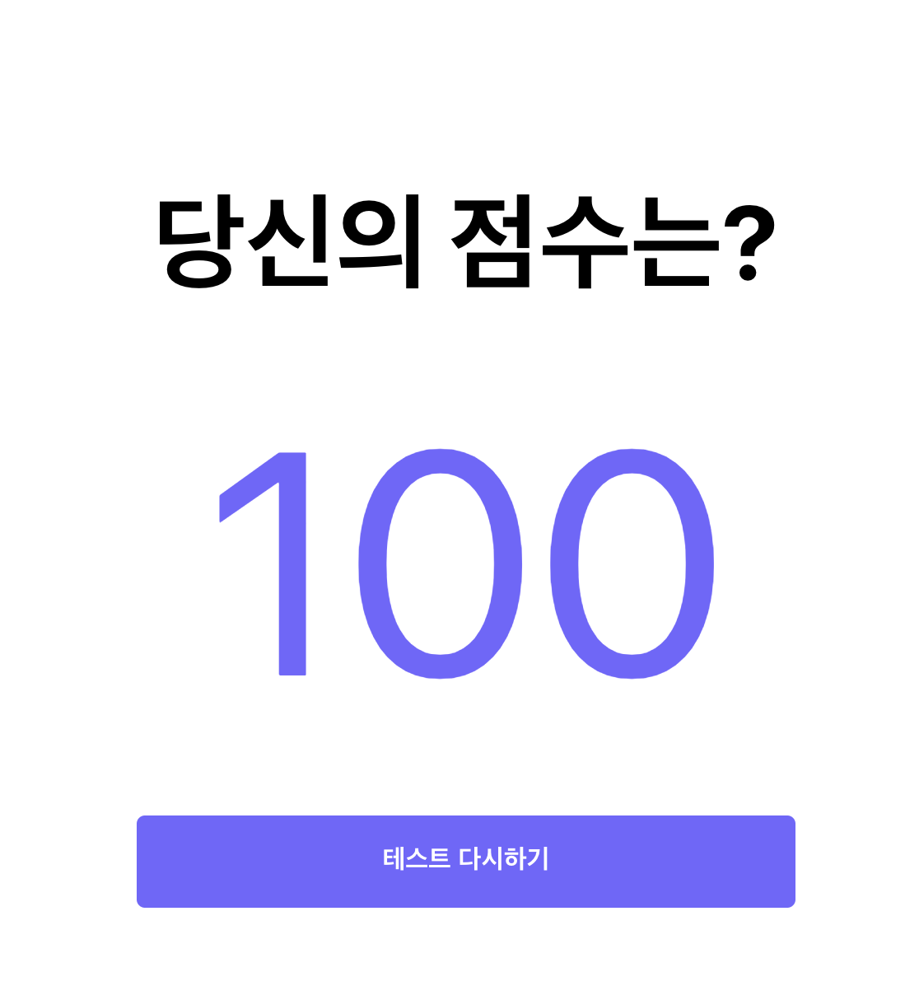

지금은 결과 페이지가 `Quiz` 컴포넌트에 붙어 있는데, 이 것을 분리하여 `/result`로 접근하였을 때 결과 페이지가 노출 되도록 만들어 보겠습니다.



## Quiz 컴포넌트 살펴보기

```jsx
// Page/Quiz/index.js
...
return showResult ? (
		<Container>
			<ResultSection convertedScore={convertedScore}></ResultSection>
		</Container>
	) : (
		<Container>
			<QuestionSection currentNo={currentNo} />
			<AnswerGroup currentNo={currentNo} handleClick={handleClick} />
		</Container>
	);
```

여기서 결과 페이지에 해당하는 부분은 아래와 같습니다.

```jsx
<Container>
	<ResultSection convertedScore={convertedScore}></ResultSection>
</Container>
```

이 부분을 `Result` Component로 옮겨 보도록 하겠습니다.

Quiz 컴포넌트를 아래와 같이 변경 해주세요.

```jsx
// page/Quiz/index.js
import { useState } from "react";
import AnswerGroup from "../../components/AnswerGroup";
import Container from "../../components/Container";
import QuestionSection from "../../components/QuestionSection";
import { QUIZZES } from "../../constants";

const Quiz = () => {
	const [currentNo, setCurrentNo] = useState(0);
	const [score, setScore] = useState(0);

	const handleClick = (isCorrect) => {
		if (isCorrect) {
			setScore((score) => score + 1);
		}
		// 마지막 퀴즈인지 체크하기
		if (currentNo === QUIZZES.length - 1) {
		} else {
			setCurrentNo((currentNo) => currentNo + 1);
		}
	};

	return (
		<Container>
			<QuestionSection currentNo={currentNo} />
			<AnswerGroup currentNo={currentNo} handleClick={handleClick} />
		</Container>
	);
};
export default Quiz;
```

- `App.js` 변경된 내용
  - Result 컴포넌트에 해당하는 코드 지우기

## Result 컴포넌트 만들기

`Pages` 폴더 내에 `Result` 폴더를 만들고, `index.js`를 아래와 같이 만들어 줍니다.

```jsx
import Container from "../../components/Container";
import ResultSection from "../../components/ResultSection";
import Button from "../../components/Button";
import { Link } from "react-router-dom";

const Result = () => (
	<Container>
		<ResultSection convertedScore={100}></ResultSection>
		<Link to="/">
			<Button text="테스트 다시하기"></Button>
		</Link>
	</Container>
);

export default Result;
```

`convertedScore` 값이 있어야 하나 아직 없기 때문에 우선 100으로 하드코딩을 해줍니다.

그리고 랜딩 페이지로 이동하는 테스트 다시하기 버튼을 추가해 줍니다.

## Result Page Routing하기

```jsx
// App.js

import Result from "../pages/Result";

function App() {
	return (
		<ThemeProvider theme={theme}>
			<GlobalStyle />
			<Router>
				<Route path="/result" component={Result} />
				<Route path="/quiz" component={Quiz} />
				<Route path="/" exact component={Landing} />
			</Router>
		</ThemeProvider>
	);
}

export default App;
```

`/result`로 접근했을 때 `Result` 컴포넌트를 보여주도록 위와 같이 `Route` 코드를 추가 해줍니다.

그리고 다시 실행하여 `/result` 페이지로 접근해 보도록 하겠습니다.


정상적으로 렌더링이 되는 것을 확인 할 수 있습니다!!

## 전체 코드 살펴보기

- 깃허브에서 전체 코드 보기 -> [바로가기](https://github.com/CodePotStudio/starter-quiz-app/tree/week04-04)
