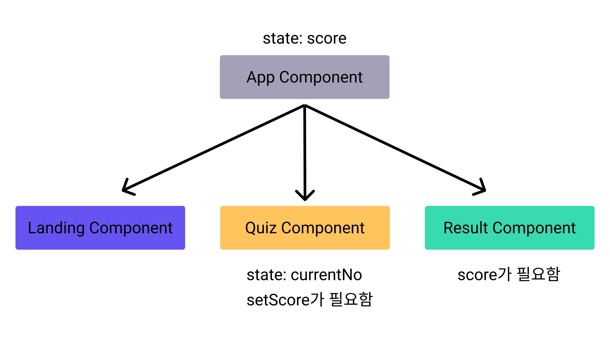

페이지를 분리하는 바람에 Quiz 페이지에서 Result 페이지로 화면이 더 이상 넘어가지 않습니다. 이제 이 문제를 해결 해보도록 하겠습니다.

## 현재 컴포넌트의 구조


지금의 구조를 보면, App 컴포넌트 아래에 큰 3개의 컴포넌트가 붙어 있는 것을 알 수 있습니다. 그리고 `Quiz Component`만 유일하게 `state`를 가지고 있습니다. 그런데 이 `state`중에 `Score`는 `Result Component`에서도 필요한 `state`입니다.

컴포넌트 트리 상에서 동등한 위치에 있는 컴포넌트 간에는 state 값을 공유하기가 어렵습니다. (향후 사용할 Context, Redux 제외)

그래서 아래와 같이 score state를 `App Component`에서 관리하도록 변경해 보겠습니다.



그리고 각 컴포넌트에서 필요한 state나 state를 변경해 주는 함수는 컴포넌트의 Props로 자식 컴포넌트에 넘겨 주도록 하겠습니다.

```jsx
// App.js
import React, { useState } from "react";
import { ThemeProvider } from "styled-components";
import theme from "../theme";
import GlobalStyle from "../globalStyle";
import { BrowserRouter as Router, Route } from "react-router-dom";
import Quiz from "../pages/Quiz";
import Landing from "../pages/Landing";
import Result from "../pages/Result";

function App() {
	// score state 추가
	const [score, setScore] = useState(0);

	// Result 컴포넌트에 score props 추가
	// Quiz 컴포넌트에 setScore props 추가
	return (
		<ThemeProvider theme={theme}>
			<GlobalStyle />
			<Router>
				<Route path="/result">
					<Result score={score} />
				</Route>
				<Route path="/quiz">
					<Quiz setScore={setScore} />
				</Route>
				<Route path="/" exact>
					<Landing />
				</Route>
			</Router>
		</ThemeProvider>
	);
}

export default App;
```

- `App.js` 변경된 내용
  - `score` `state`를 추가했습니다.
  - `Result` 컴포넌트에 `score props` 추가하여 `Result` 컴포넌트에서 `score`를 사용할 수 있게 되었습니다.
  - `Quiz` 컴포넌트에 `setScore props` 추가하여 `Quiz` 컴포넌트에서 `setScore`를 사용할 수 있게 되었습니다.

```jsx
// Page/Quiz/index.js

import { useState } from "react";
import AnswerGroup from "../../components/AnswerGroup";
import Container from "../../components/Container";
import QuestionSection from "../../components/QuestionSection";
import { QUIZZES } from "../../constants";

const Quiz = ({ setScore }) => {
	const [currentNo, setCurrentNo] = useState(0);

	const handleClick = (isCorrect) => {
		if (isCorrect) {
			setScore((score) => score + 1);
		}
		// 마지막 퀴즈인지 체크하기
		if (currentNo === QUIZZES.length - 1) {
			// 페이지 이동
		} else {
			setCurrentNo((currentNo) => currentNo + 1);
		}
	};

	return (
		<Container>
			<QuestionSection currentNo={currentNo} />
			<AnswerGroup currentNo={currentNo} handleClick={handleClick} />
		</Container>
	);
};
export default Quiz;
```

- `Quiz` 컴포넌트에서 변경된 내용
  - `props`에서 `setScore`를 받아와 `score`를 업데이트 하는 곳에 사용하였습니다.
  - `showResult state`가 필요 없어졌으므로 삭제하였습니다.
  - `convertedScore`도 `Quiz` 컴포넌트에 필요 없기 때문에 `Result` 컴포넌트로 옮겨주었습니다.

```jsx
// Page/Result/index.js

import Container from "../../components/Container";
import ResultSection from "../../components/ResultSection";
import Button from "../../components/Button";
import { Link } from "react-router-dom";
import { QUIZZES } from "../../constants";

const Result = ({ score }) => {
	const convertedScore = Math.floor((score / QUIZZES.length) * 100);
	return (
		<Container>
			<ResultSection convertedScore={convertedScore}></ResultSection>
			<Link to="/">
				<Button text="테스트 다시하기"></Button>
			</Link>
		</Container>
	);
};

export default Result;
```

- `Result` 컴포넌트에서 변경된 내용
  - `props`에서 `score`를 받아왔습니다.
  - `convertedScore` 를 `Quiz` 컴포넌트에서 `Result` 컴포넌트로 옮겼습니다.

이제 다시 실행해 보도록 하겠습니다


하지만 위와 같이 여전히 마지막 페이지로 넘어가지 않는 것을 알 수 있습니다 이유는 마지막 퀴즈에서 버튼을 클릭했을 때 `/result`로 페이지를 전환해주어야 하는데, 아직 그 처리를 하지 않았습니다.

다음 파트에서 React Router의 `useHistory`를 활용하여 마지막 페이지에서 결과 페이지로 넘기는 것을 해보도록 하겠습니다.

## 전체 코드 살펴보기

- 깃허브에서 전체 코드 보기 -> [바로가기](https://github.com/CodePotStudio/starter-quiz-app/tree/week04-05)

## Somthing More!!!

반드시 공부해야 하는 건 아니지만, 도움이 될 만한 자료들을 공유하고 있습니다.
