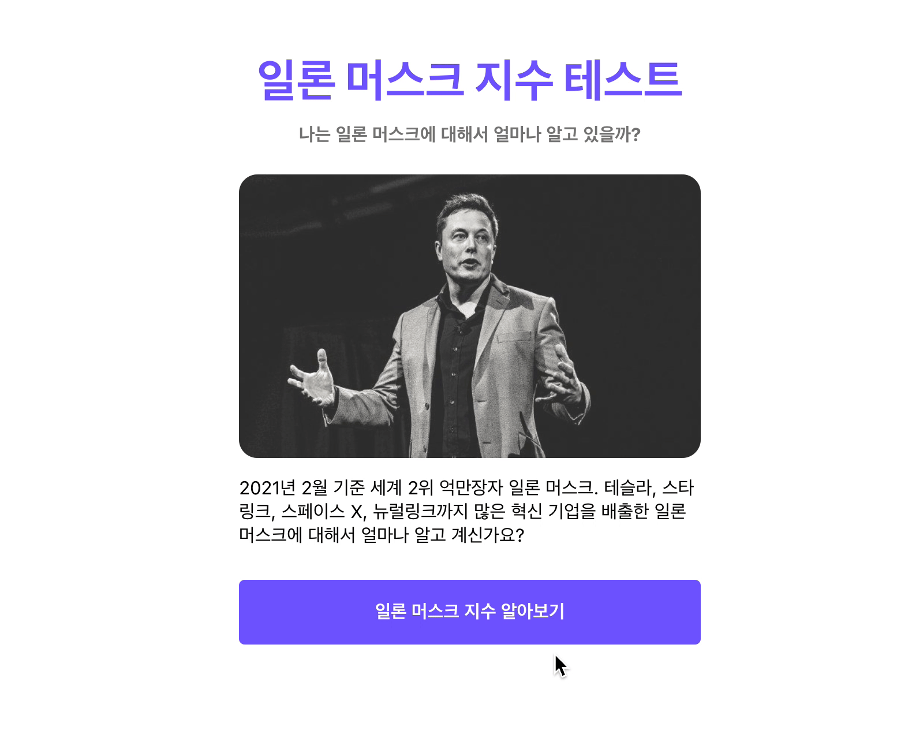

이제 마지막 퀴즈의 버튼을 클릭하였을 때, 다른 결과 페이지로 보내는 코드를 작성해보도록 하겠습니다.

그 전에 history 객체에 대해서 간단히 알아보고 가겠습니다.

## window.history

`HTML`의 `window` 객체에는 `history` 객체가 있습니다. 여기에는 브라우저에서 유저가 이 곳 저 곳을 다녔던 기록이 남아 있는 객체입니다. 뿐만 아니라

```jsx
// 뒤로가기
window.histroy.back();

// 앞으로가기
window.histroy.forward();

// 특정 위치로 가기
window.history.go(-1);
```

## React Router의 useHistory hooks

`React`에서는 `history` 객체를 사용하기 위해선 `window` 객체에 직접 접근해서 사용하는 방법도 있지만 주로 `React-Router`가 제공하는 `useHistory hook`을 사용합니다.

```jsx
import { useHistory } from "react-router-dom";

let history = useHistory();

// 특정 페이지 이동 시키기
history.push("/mypage");

// 뒤로 이동 시키기
history.goBack();

// 앞으로 이동 시키기
history.goForward();
```

이제 이 내용을 바탕으로 실제 `Quiz` 컴포넌트에 적용시켜 보도록 하겠습니다.

## Quiz 컴포넌트에서 Result로 이동하기

```jsx
// Page/Quiz/index.js

import { useEffect, useState } from "react";
import { useHistory } from "react-router";
import AnswerGroup from "../../components/AnswerGroup";
import Container from "../../components/Container";
import QuestionSection from "../../components/QuestionSection";
import { QUIZZES } from "../../constants";

const Quiz = ({ setScore }) => {
	const [currentNo, setCurrentNo] = useState(0);
	let history = useHistory();

	const handleClick = (isCorrect) => {
		if (isCorrect) {
			setScore((score) => score + 1);
		}
		if (currentNo === QUIZZES.length - 1) {
			history.push("/result");
		} else {
			setCurrentNo((currentNo) => currentNo + 1);
		}
	};

	return (
		<Container>
			<QuestionSection currentNo={currentNo} />
			<AnswerGroup currentNo={currentNo} handleClick={handleClick} />
		</Container>
	);
};
export default Quiz;
```

- `Quiz` 컴포넌트에서 변경된 내용
  - 현재 퀴즈 인덱스가 마지막 인덱스 일 경우, `history.push("/result")` 를 통해서 `Result` 컴포넌트로 이동 시켜줬습니다.

이제 다시 실행시켜 보도록 하겠습니다.



정상적으로 페이지가 잘 이동 되는 것을 확인할 수 있습니다 👏👏👏

그런데 문제가 하나 보입니다. 테스트 다시하기를 눌렀을 때 점수가 초기화 되지 않고, 이 전 점수가 그대로 남아 있는 것을 알 수 있습니다.

다음 파트에서는 이 부분을 수정해 보도록 하겠습니다.

## 전체 코드 살펴보기

- 깃허브에서 전체 코드 보기 -> [바로가기](https://github.com/CodePotStudio/starter-quiz-app/tree/week04-06)

## Somthing More!!!

반드시 공부해야 하는 건 아니지만, 도움이 될 만한 자료들을 공유하고 있습니다.

- [브라우저의 이해 #2 히스토리 그리고 history API](https://falsy.me/%EB%B8%8C%EB%9D%BC%EC%9A%B0%EC%A0%80%EC%9D%98-%EC%9D%B4%ED%95%B4-2-%ED%9E%88%EC%8A%A4%ED%86%A0%EB%A6%AC-%EA%B7%B8%EB%A6%AC%EA%B3%A0-history-api/)
