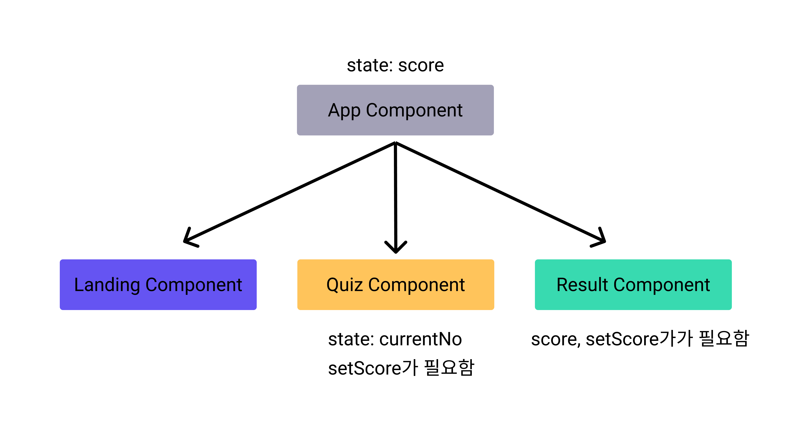
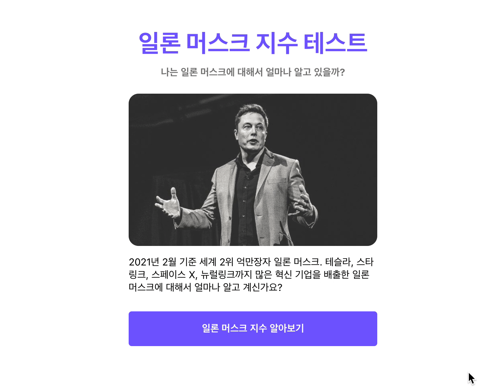

## 버튼 클릭 시 결과 초기화하기

유저가 버튼을 클릭하면, `App` 컴포넌트에 있는 `setScore`를 내려 받아 0으로 강제 초기화를 하면 될 것 같습니다.

```jsx
// App.js
import React, { useState } from "react";
import { ThemeProvider } from "styled-components";
import theme from "../theme";
import GlobalStyle from "../globalStyle";
import { BrowserRouter as Router, Route } from "react-router-dom";
import Quiz from "../pages/Quiz";
import Landing from "../pages/Landing";
import Result from "../pages/Result";

function App() {
	const [score, setScore] = useState(0);

	return (
		<ThemeProvider theme={theme}>
			<GlobalStyle />
			<Router>
				<Route path="/result">
					<Result score={score} setScore={setScore} />
				</Route>
				<Route path="/quiz">
					<Quiz setScore={setScore} />
				</Route>
				<Route path="/" exact>
					<Landing />
				</Route>
			</Router>
		</ThemeProvider>
	);
}

export default App;
```

- `App.js` 변경된 내용
  - `Result` 컴포넌트에 `setScore props` 추가하여 `Result` 컴포넌트에서 `setScore`를 사용할 수 있게 되었습니다.

```jsx
// Page/Result/index.js
import Container from "../../components/Container";
import ResultSection from "../../components/ResultSection";
import Button from "../../components/Button";
import { Link } from "react-router-dom";
import { QUIZZES } from "../../constants";

const Result = ({ score, setScore }) => {
	const convertedScore = Math.floor((score / QUIZZES.length) * 100);
	return (
		<Container>
			<ResultSection convertedScore={convertedScore}></ResultSection>
			<Link to="/">
				<Button text="테스트 다시하기" onClick={() => setScore(0)}></Button>
			</Link>
		</Container>
	);
};

export default Result;
```

- `Result.js` 변경된 내용
  - `props`에서 `setScore` 함수를 받아 옵니다.
  - `Button` 컴포넌트에 `onClick` 함수를 추가하고, `setScore`를 활용하여 `score`를 초기화 해줍니다.

위와 같이 코드를 수정하고 다시 한 번 실행해보도록 하겠습니다.

드디어 정상적으로 모든 코드가 작동하는 것을 알 수 있습니다



## 전체 코드 살펴보기

- 깃허브에서 전체 코드 보기 -> [바로가기](https://github.com/CodePotStudio/starter-quiz-app/tree/week04-07)
