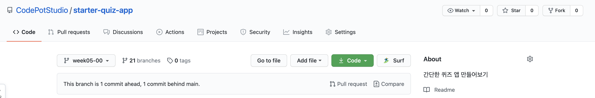
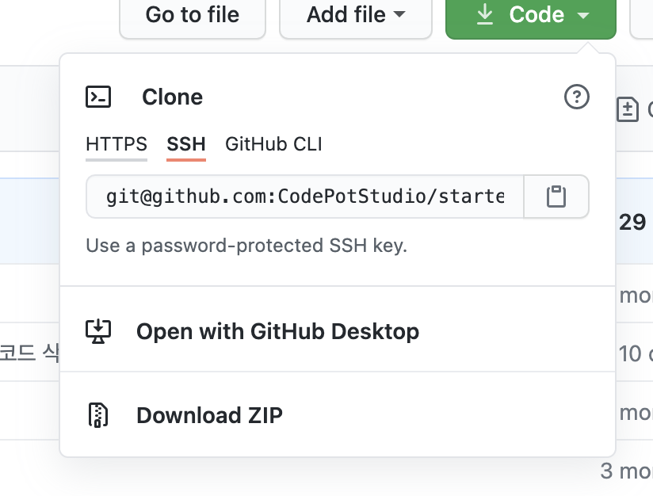
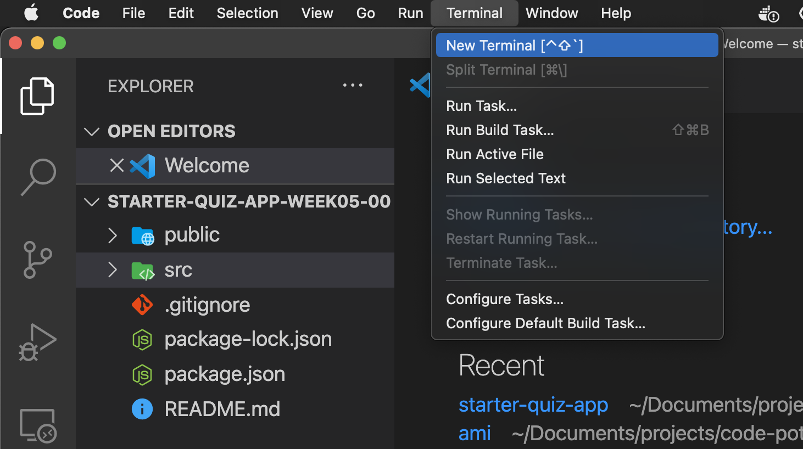
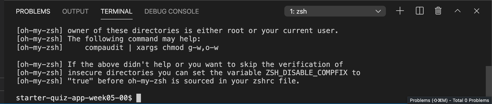
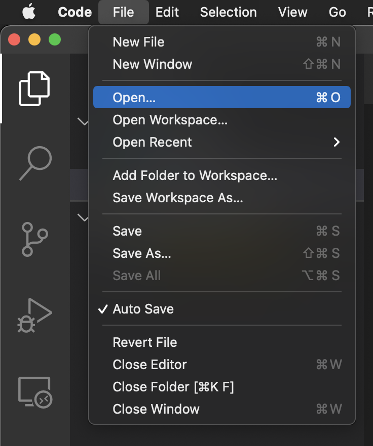

## 5주차 코드 다운로드 받기

5주차 코드 깃헙 주소 ([링크](https://github.com/CodePotStudio/starter-quiz-app/tree/week05-00))로 접속해 주세요.



우측 상단에 Code 초록색 버튼을 클릭합니다.



다운로드 방법은 크게 두가지입니다.

### 터미널 사용에 익숙하다면?

- 터미널을 켜고, 코드를 다운 받을 곳으로 이동해 주세요. (`cd` 명령어 활용)
- 원하는 위치로 이동했다면 git clone 명령어를 통해 내 컴퓨터로 코드를 다운 받습니다.

  ```jsx
  git clone git@github.com:CodePotStudio/starter-quiz-app.git
  ```

- 아래 명령어를 통해 다운로드 받은 폴더 안으로 이동합니다.

  ```jsx
  cd starter-quiz-app
  ```

- 처음에는 브랜치가 main으로 되어 있기 때문에, 5주차 수업자료 브랜치로 checkout 합니다

  ```jsx
  git checkout week05-00
  ```

- 현재 폴더 위치에서 VS code를 실행합니다.

  ```jsx
  code ./
  ```

- 패키지 설치하기

  우측 상단에 Terminal → New Terminal 버튼을 클릭하여 터미널 창을 엽니다.

  

  

  위와 같이 터미널 창이 열렸다면 아래 명령어를 통해 패키지를 설치합니다.

  ```jsx
  npm install
  ```

- React 실행하기

  패키지가 성공적으로 설치가 다 되었다면, 아래 명령어를 통해 React를 실행해 주세요.

  ```jsx
  npm start
  ```

### 아직 터미널 사용이 어렵다면?

- **Download ZIP** 버튼을 클릭하여, 코드를 다운받고 압축을 풉니다.
- VS Code를 켜고, 해당 경로에 상단 File → Open에서 압축을 푼 폴더를 엽니다.

  

- 패키지 설치하기

  우측 상단에 Terminal → New Terminal 버튼을 클릭하여 터미널 창을 엽니다.

  

  

  위와 같이 터미널 창이 열렸다면 아래 명령어를 통해 패키지를 설치합니다.

  ```jsx
  npm install
  ```

- React 실행하기

  패키지가 성공적으로 설치가 다 되었다면, 아래 명령어를 통해 React를 실행해 주세요.

  ```jsx
  npm start
  ```
