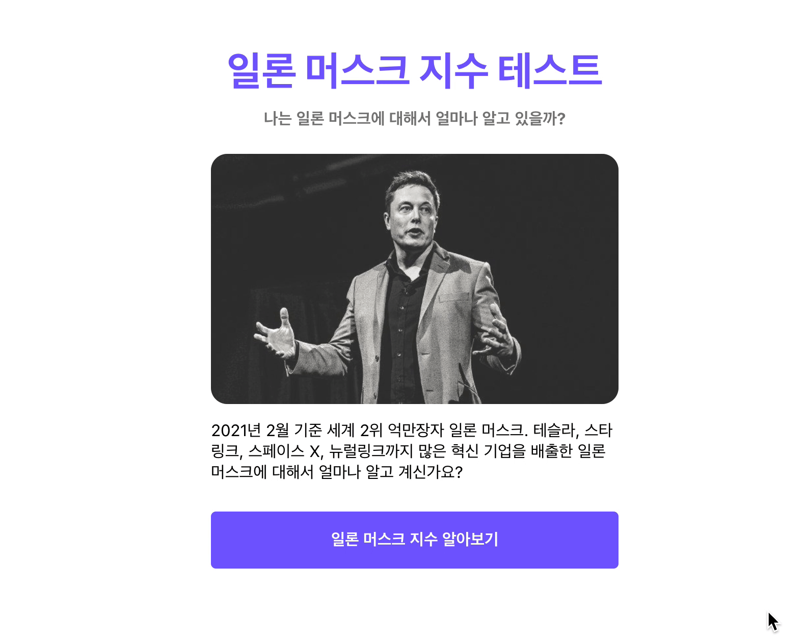

## Import 경로를 절대 경로로 바꾸기

```jsx
// Pages/Landing/index.js
import Container from "../../components/Container";
import styled from "styled-components";
import cover from "../../assets/images/cover.jpg";
import Button from "../../components/Button";
import { Link } from "react-router-dom";
...
```

위 파일을 보면 상대경로로 각 폴더에 접근함에 따라 코드가 지저분 해지는 것을 알 수 있습니다. 이를 좀 더 이쁘게 바꿔보도록 하겠습니다.

### jsconfig.json 파일 추가하기

최상위 root 경로에 `jsconfig.json` 파일을 아래와 같이 추가해 줍니다.

```jsx
// jsconfig.json
{
	"compilerOptions": {
		"baseUrl": "src"
	},
	"include": ["src"]
}
```

이 코드의 의미는 절대 경로의 시작을 `src` 폴더부터 시작하겠다는 의미입니다. 만약 절대경로와 상대경로에 대한 이해가 부족하시다면 Something More!!!을 참고해 주세요.

### 절대 경로로 import 경로 바꾸기

```jsx
// Pages/Landing/index.js
import Container from "components/Container";
import styled from "styled-components";
import cover from "assets/images/cover.jpg";
import Button from "components/Button";
import { Link } from "react-router-dom";

...
```

위와 같이 바꾸고 실행해 보면, 정상적으로 잘 나오는 것을 알 수 있습니다.

## import 좀 더 깔끔하게 만들기

```jsx
// Pages/Lading/index.js
import Container from "components/Container";
import Button from "components/Button";
```

지금은 이러한 구조로 코드를 가져오는데, 위 코드를 아래와 같이 좀 더 깔끔하게 만들어 보도록 하겠습니다.

```jsx
// Pages/Lading/index.js
import { Container, Button } from "components";
```

### component 내보내는 경로 수정하기

아래와 같이 `components` 폴더 내에 `index.js` 파일을 하나 생성합니다.

```jsx
// components/index.js
export { default as AnswerGroup } from "components/AnswerGroup";
export { default as Button } from "components/Button";
export { default as Container } from "components/Container";
export { default as QuestionSection } from "components/QuestionSection";
export { default as ResutSection } from "components/ResutSection";
```

위 코드는 `from`으로부터 `default` 값을 가져와 `as` 값으로 외부로 내보내는 코드입니다.

이를 통해 다른 곳에서 아래와 같은 코드가 사용 가능해 집니다.

```jsx
// Pages/Lading/index.js
import {Container, Button} from 'components';
...
```

### page 내보내는 경로 수정하기

아래와 같이 `pages` 폴더 내에 `index.js` 파일을 하나 생성합니다.

```jsx
// pages/index.js
export { default as Landing } from "pages/Landing";
export { default as Quiz } from "pages/Quiz";
export { default as Result } from "pages/Result";
```

마찬가지로 이를 통해서 pages내에 있던 컴포넌트를 사용하는 `App.js`에서 아래와 같이 코드가 사용이 가능합니다.

```jsx
// components/App.js
import React, { useState } from "react";
import { ThemeProvider } from "styled-components";
import { BrowserRouter as Router, Route } from "react-router-dom";

import theme from "theme";
import GlobalStyle from "globalStyle";
import { Quiz, Landing, Result } from "pages";

...
```

`import` 코드가 좀 더 깔끔해지신게 보이시나요?

위와 같이 리팩토링하는 과정은 필수는 아닙니다. 하지만 컴포넌트가 많아지다보면 `import` 코드도 알아보기 힘들기 때문에 위와 같이 리팩토링하는 것을 추천 드립니다.

## Button 컴포넌트 수정하기

Button 컴포넌트에 잘못된 부분이 있어 수정하고 가겠습니다.

```jsx
//components/Button/index.js
...
const Button = (props) => (
	<StyledButton onClick={props.onClick}>{props.text}</StyledButton>
);
export default Button;
...
```

현재 만들어진 Button 컴포넌트를 사용하려면 아래와 같이 사용해야 합니다.

```jsx
// 현재 사용 방식
<Button text="Hello"></Button>

// 일반적인 버튼 사용방식
<Button>Hello</Button>
```

현재 사용 방식은 일반적인 `Button`의 사용방식과 조금 다릅니다. 왜냐하면 `props`에서 `text`를 받아와 값을 채우기로 했기 때문입니다. 그래서 이 코드를 일반적인 버튼 방식으로 바꿔 보도록 하겠습니다.

```jsx
//components/Button/index.js
import React from "react";
import styled from "styled-components";

const StyledButton = styled.button`
  font-size: ${(props) => (props.fontSize === "big" ? "32px" : "16px")};
	color: #ffffff;
  background-color: ${(props) => props.theme.primaryColor100};
	border-radius: 5px;
	border: 0px;
	height: 56px;
	padding: 4px;
	margin: 4px 0px;
	cursor: pointer;
	width: 100%;
	outline: none;
	font-weight: 700;
	&:hover {
    background-color: ${(props) => props.theme.primaryColor80};
	}
}
`;

const Button = (props) => (
	<StyledButton onClick={props.onClick}>{props.children}</StyledButton>
);
export default Button;
```

Button의 내부 내용을 props의 `text`가 아닌 props의 `children`으로 변경하였습니다.

`Button` 컴포넌트를 수정하였으니, `Button` 컴포넌트를 사용하는 코드들도 바꿔 주도록 하겠습니다.

```jsx
//components/AnswerGroup/index.js

import React from "react";
import styled from "styled-components";
import { QUIZZES } from "../../constants";
import { Button } from "components";

const AnswerGroupWrapper = styled.div`
	display: flex;
	flex-direction: column;
	justify-content: center;
	align-items: center;
	margin-bottom: 8px;
`;

const AnswerGroup = ({ currentNo, handleClick }) => (
	<AnswerGroupWrapper>
		{QUIZZES[currentNo].answers.map((answer) => (
			<Button key={answer.text} onClick={() => handleClick(answer.isCorrect)}>
				{answer.text}
			</Button>
		))}
	</AnswerGroupWrapper>
);
export default AnswerGroup;
```

```jsx
// pages/Landing/index.js

import styled from "styled-components";
import cover from "assets/images/cover.jpg";
import { Container, Button } from "components";
import { Link } from "react-router-dom";

const Title = styled.h1`
	font-size: 40px;
	font-weight: bold;
	margin: 8px 0px;
	text-align: center;
	color: ${(props) => props.theme.primaryColor100};
`;

const SubTitle = styled.h1`
	font-size: 16px;
	font-weight: bold;
	margin-bottom: 24px;
	text-align: center;
	color: ${(props) => props.theme.gray80};
`;

const StyledImage = styled.img`
	border-radius: 16px;
	opacity: 80%;
	margin-bottom: 16px;
	max-width: 100%;
	display: block;
`;

const Text = styled.p`
	font-size: 16px;
	margin-bottom: 24px;
`;

const Landing = () => (
	<Container>
		<Title>일론 머스크 지수 테스트</Title>
		<SubTitle>나는 일론 머스크에 대해서 얼마나 알고 있을까?</SubTitle>
		<StyledImage src={cover} alt="cover"></StyledImage>
		<Text>
			2021년 2월 기준 세계 2위 억만장자 일론 머스크. 테슬라, 스타링크, 스페이스
			X, 뉴럴링크까지 많은 혁신 기업을 배출한 일론 머스크에 대해서 얼마나 알고
			계신가요?
		</Text>
		<Link to="/quiz">
			<Button>일론 머스크 지수 알아보기</Button>
		</Link>
	</Container>
);

export default Landing;
```

```jsx
// pages/Result/index.js

import { Link } from "react-router-dom";
import { QUIZZES } from "../../constants";
import { Button, ResultSection, Container } from "components";

const Result = ({ score, setScore }) => {
	const convertedScore = Math.floor((score / QUIZZES.length) * 100);
	return (
		<Container>
			<ResultSection convertedScore={convertedScore}></ResultSection>
			<Link to="/">
				<Button onClick={() => setScore(0)}>테스트 다시하기</Button>
			</Link>
		</Container>
	);
};

export default Result;
```

`text Props`를 삭제하고, `Button` 컴포넌트 태그 사이에 `{answer.text}`를 추가해주었습니다.

그럼 다시 실행 해보도록 하겠습니다.



정상적으로 `Button`에 `text`가 들어가 있는 것을 알 수 있습니다. 👏👏👏

## 전체 코드 살펴보기

- 깃허브에서 전체 코드 보기 -> [바로가기](https://github.com/CodePotStudio/starter-quiz-app/tree/week05-01)

## Somthing More!!!

반드시 공부해야 하는 건 아니지만, 도움이 될 만한 자료들을 공유하고 있습니다.

- 절대경로와 상대경로에 대해서 알아보기 ([링크](https://velog.io/@ikswary/%EC%A0%88%EB%8C%80-%EA%B2%BD%EB%A1%9C%EC%99%80-%EC%83%81%EB%8C%80-%EA%B2%BD%EB%A1%9C))
