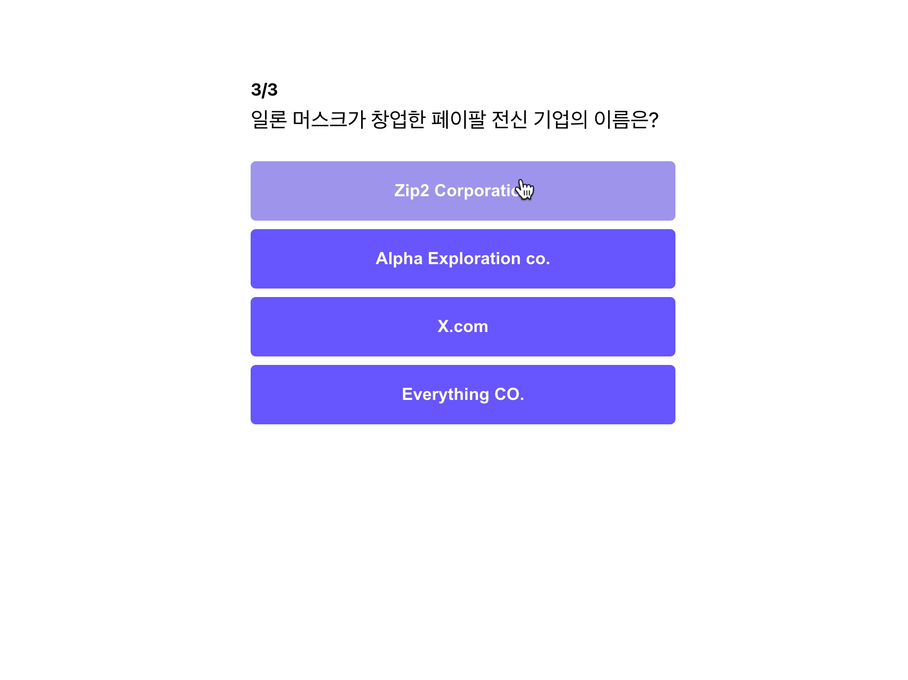
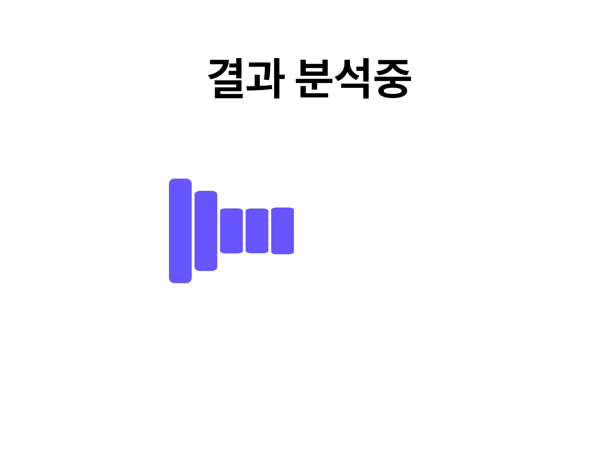
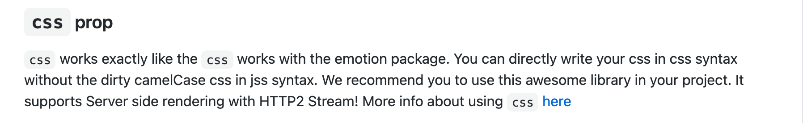
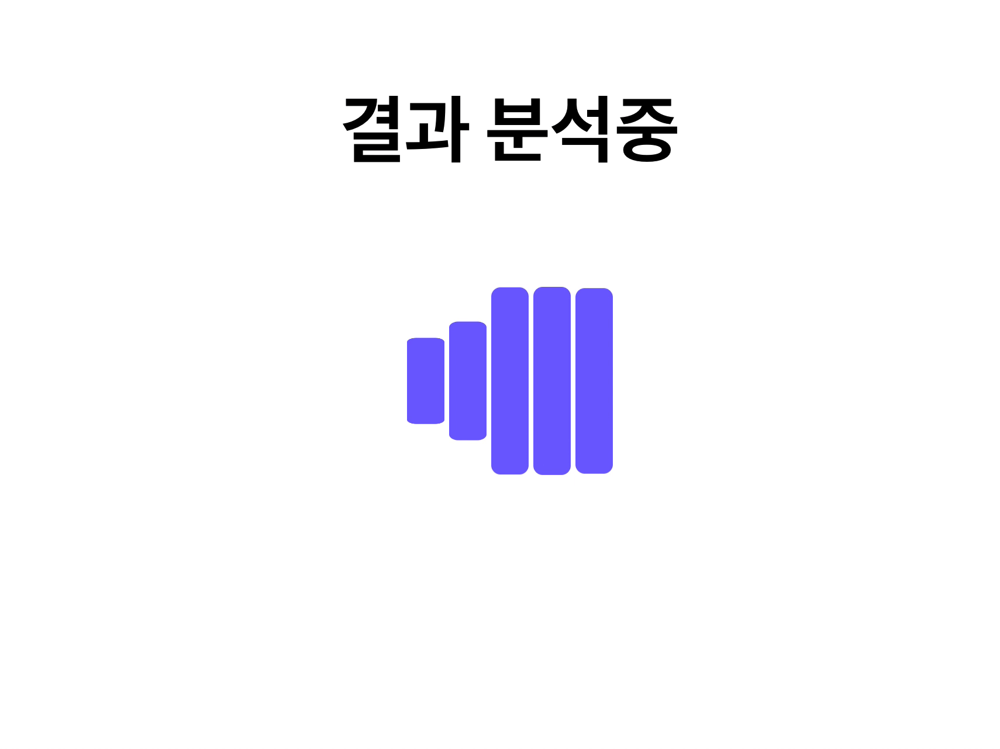

이제 결과 페이지로 가기 전에 Loading 페이지를 만들어 긴장감을 추가해 보도록 하겠습니다.

## Spinner 컴포넌트 만들기


spinner는 위의 이미지와 같이 Loading 중임을 알려주는 컴포넌트를 말합니다.

이 번 강의에서는 react-spinner 라이브러리를 사용해서 spinner를 구현할 예정입니다.

### react-spinner 설치하기

```jsx
npm install react-spinners
```

### 사용할 spinner 고르기

[링크](https://www.davidhu.io/react-spinners/)로 이동하여 원하는 `Spinner`를 고릅니다. 저는 `ScaleLoader`를 사용해서 `Loading` 페이지를 구현해 보도록 하겠습니다.

### react-spinners 사용 방법 알아보기

자체적으로 사이트를 만들어 사용방법을 가르쳐 주는 라이브러리(React, react-router)들도 있지만, 대부분의 라이브러리들은 github 페이지에 사용방법을 공지해 줍니다.

그럼 [github 페이지](https://github.com/davidhu2000/react-spinners)로 이동하여 사용방법을 알아보도록 하겠습니다.

Example을 보도록 하겠습니다.

```jsx
import { useState } from "react";
import { css } from "@emotion/react";
import ClipLoader from "react-spinners/ClipLoader";

// Can be a string as well. Need to ensure each key-value pair ends with ;
const override = css`
	display: block;
	margin: 0 auto;
	border-color: red;
`;

function App() {
	let [loading, setLoading] = useState(true);
	let [color, setColor] = useState("#ffffff");

	return (
		<div className="sweet-loading">
			<button onClick={() => setLoading(!loading)}>Toggle Loader</button>
			<input
				value={color}
				onChange={(input) => setColor(input.target.value)}
				placeholder="Color of the loader"
			/>

			<ClipLoader color={color} loading={loading} css={override} size={150} />
		</div>
	);
}
```

코드를 보아하니, 원하는 Spinner를 `import`하고, `color`, `loading`, `css`를 추가하는 방식으로 코드를 작성하면 되는 것 같습니다.

어느 정도 코드가 파악되었으니, 바로 `Spinner Component`를 만들어 보도록 하겠습니다.

### Spinner 컴포넌트 만들기

기존의 컴포넌트를 만들던 방식과 마찬가지로 `components` 폴더 안에 `spinner` 폴더를 하나 만들고, `index.js` 파일을 하나 작성합니다.

그리고 github 페이지 아래 쪽을 읽어보니, `height`, `width`, `radius`, `margin` 값 또한 추가해줄 수 있다고 합니다. 그래서 아래와 같이 원하는 값들을 추가해 주었습니다.

값의 변화에 따라 Spinner가 어떻게 변하는지는 [링크](https://www.davidhu.io/react-spinners/)에서 확인하실 수 있습니다.

```jsx
import ScaleLoader from "react-spinners/ScaleLoader";

const Spinner = () => {
	return (
		<ScaleLoader
			size={100}
			height="120"
			width="32"
			color="#6b5ce7"
			radius="8"
		/>
	);
};

export default Spinner;
```

```jsx
// components.index.js
...
export { default as Spinner } from "components/Spinner";
...
```

그리고 `components` 폴더 내 `index.js`에서 외부로 내보내는 것 잊지마세요!!

`spinner` 컴포넌트를 만들었으니, 이제 `Loading Page`를 만들어 보도록 하겠습니다.

### Loading Page 만들기



### Loading Page 뼈대 만들기

위와 같은 형태의 `Loading` 페이지를 만들어 보도록 하겠습니다.

```jsx
// pages/Loading.js
import { Container, Spinner } from "components";
import styled from "styled-components";

const Title = styled.h1`
	font-size: 64px;
	font-weight: bold;
	margin: 8px;
	margin-bottom: 96px;
	text-align: center;
`;

const Loading = () => {
	return (
		<Container>
			<Title>결과 분석중</Title>
			<Spinner></Spinner>
		</Container>
	);
};

export default Loading;
```

```jsx
// pages.index.js
export { default as Loading } from "pages/Loading";
```

코드를 보면 기존에 작성했던 `Container` 재활용 하였으며, `Title Component`를 만들어 결과 분석중 제목을 넣어 주었습니다. 그리고 `Page` 폴더 내의 `index.js`에서 새로 만든 `Loading` 페이지를 `export` 해주었습니다.

### App.js에서 Loading 페이지 연결하기

```jsx
import React, { useState } from "react";
import { ThemeProvider } from "styled-components";
import theme from "theme";
import GlobalStyle from "globalStyle";
import { BrowserRouter as Router, Route } from "react-router-dom";
import { Quiz, Landing, Result, Loading } from "pages";

function App() {
	const [score, setScore] = useState(0);

	return (
		<ThemeProvider theme={theme}>
			<GlobalStyle />
			<Router>
				...
				<Route path="/loading">
					<Loading />
				</Route>
				...
			</Router>
		</ThemeProvider>
	);
}

export default App;
```

Router 내부에 `<Route path="/loading">` 컴포넌트를 작성하여 `/loading`으로 접속 시에 `Loading` 컴포넌트를 노출하도록 추가 해 주었습니다.

이제 `/loading`으로 접속해 보도록 하겠습니다.



그림처럼 중앙에 배치가 안된 것을 알 수 있는데, style을 추가하여 중앙 배치시켜 보도록 하겠습니다.

### Spinner 중앙 배치 시키기



우리가 가져다 쓴 spinner에 CSS를 입혀 보려고 하는데, 아쉽지만 위와 같은 제약이 있습니다. styled-component는 지원이 되지 않고, emotion만 지원된다고 합니다.

저는 styled-component와 emotion을 혼합해서 사용하는 것은 안좋다고 생각하기에 아래와 같이 임시방편으로 `Flex Component`를 감싸 중앙 배열을 할 수 있도록 해주었습니다.

```jsx
// components/Spinner/index.js

import ScaleLoader from "react-spinners/ScaleLoader";
import styled from "styled-components";

const Flex = styled.div`
	display: flex;
	justify-content: center;
	align-items: center;
`;

const Spinner = () => {
	return (
		<Flex>
			<ScaleLoader
				size={100}
				height="160"
				width="32"
				color="#7362ff"
				radius="8"
			/>
		</Flex>
	);
};

export default Spinner;
```

이 방법이 마음에 들지 않으신다면, emotion 혹은 [링크](https://bit.dev/)에서 styled-component가 지원되는 컴포넌트를 사용해 보시는 것을 추천드립니다.

그럼 다시 한 번 실행해 보도록 하겠습니다.



위와 같이 정상적으로 중앙에 배치된 것을 알 수 있습니다.

### color theme에서 가져오기

```jsx
// components/Spinner/index.js
...
const Spinner = () => {
	return (
		<Flex>
			<ScaleLoader
				size={100}
				height="160"
				width="32"
				color="#7362ff"
				radius="8"
			/>
		</Flex>
	);
};
...
```

`Spinner`에서 한 가지 아쉬운 점이 있는데, `color`를 하드코딩해서 쓰고 있다는 점입니다. 그러므로 이제 `theme` 객체에서 `color`를 가져와 `Spinner`에 적용해 보도록 하겠습니다.

```jsx
// components/Spinner/index.js
import { useContext } from "react";
import { ThemeContext } from "styled-components";

...
const Spinner = () => {
	const themeContext = useContext(ThemeContext);
	const color = themeContext.primaryColor100;

	return (
		<Flex>
			<ScaleLoader
				...
				color={color}
				...
			/>
		</Flex>
	);
};

...
```

위와 같이 `styled-Component`에 있는 `ThemeContext`를 `useContext` 명령어로 가져오고, theme 객체 내에 있는 `primaryColor100`을 가져온 것을 알 수 있습니다.

위와 같이 코드를 바꾸고 재실행 해보도록 하겠습니다.


정상적으로 잘 실행되는 것을 알 수 있습니다.

그런데 아마 이런 의문이 들 것 같습니다.

```jsx
background-color: ${(props) => props.theme.primaryColor100};
```

`button` 컴포넌트에서는 `props`에서 `theme` 객체를 꺼내서 색깔을 적용했는데 왜 `Spinner`에서는 쓰지 않느냐라는 생각을 하실 수 있을 것 같습니다.

이유는 `Spinner` 컴포넌트의 경우, `styled-component`로 만들어진 `Component`가 아니기 때문에 `props` 내부에 `theme` 객체가 담겨져 있지 않습니다. 그러한 이유로 `useContext`를 명령어를 통해 현재 `App`에 사용되고 있는 `theme`를 불러와 `color`를 찾고, 컴포넌트 내부에 넣어 준 것 입니다.

다음 파트에서는 일정 시간이 지나면 페이지가 이동하는 기능을 추가해보도록 하겠습니다.

## 전체 코드 살펴보기

- 깃허브에서 전체 코드 보기 -> [바로가기](https://github.com/CodePotStudio/starter-quiz-app/tree/week05-03)

## Somthing More!!!

반드시 공부해야 하는 건 아니지만, 도움이 될 만한 자료들을 공유하고 있습니다.

- 다른 사람들이 만들어 놓은 컴포넌트 쉽게 사용하는 사이트 ([링크](https://bit.dev/))
