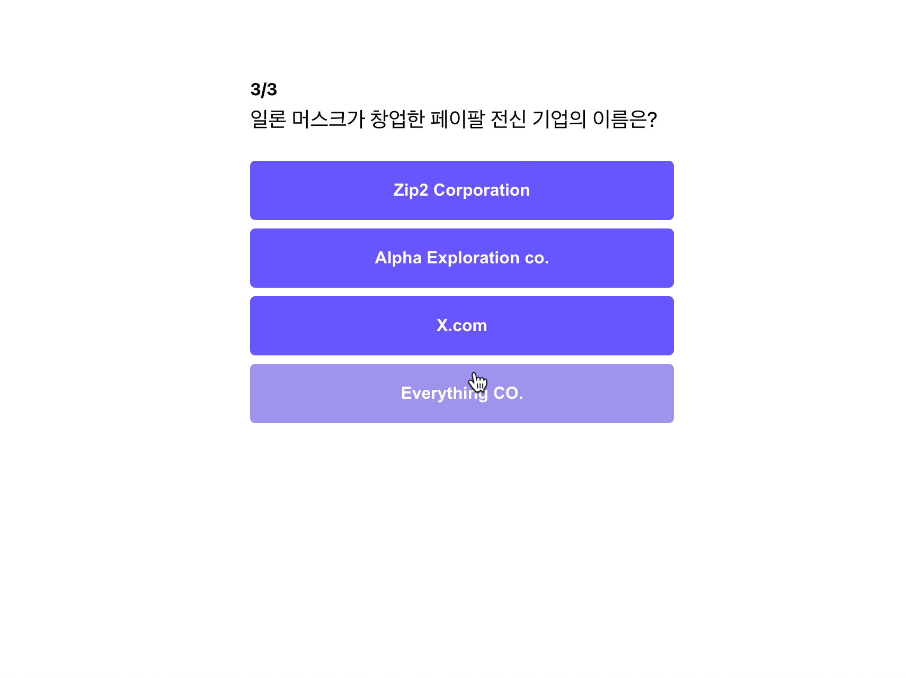
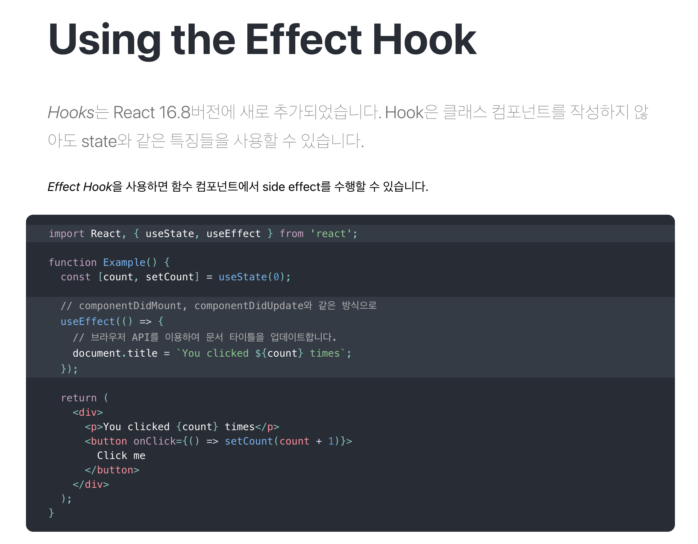
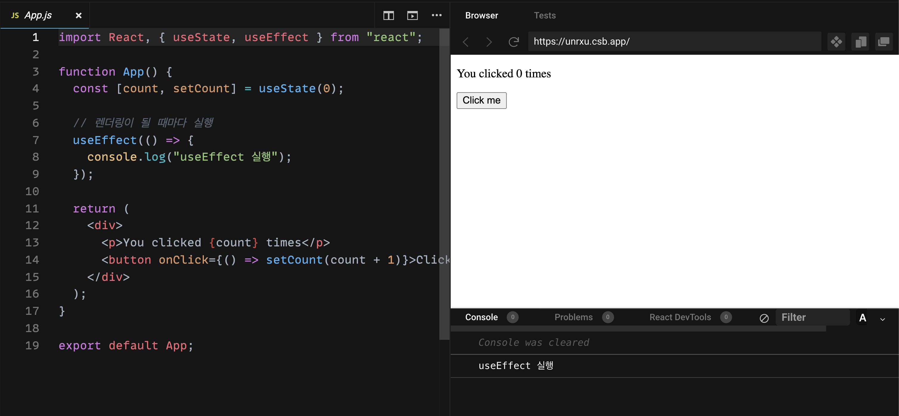
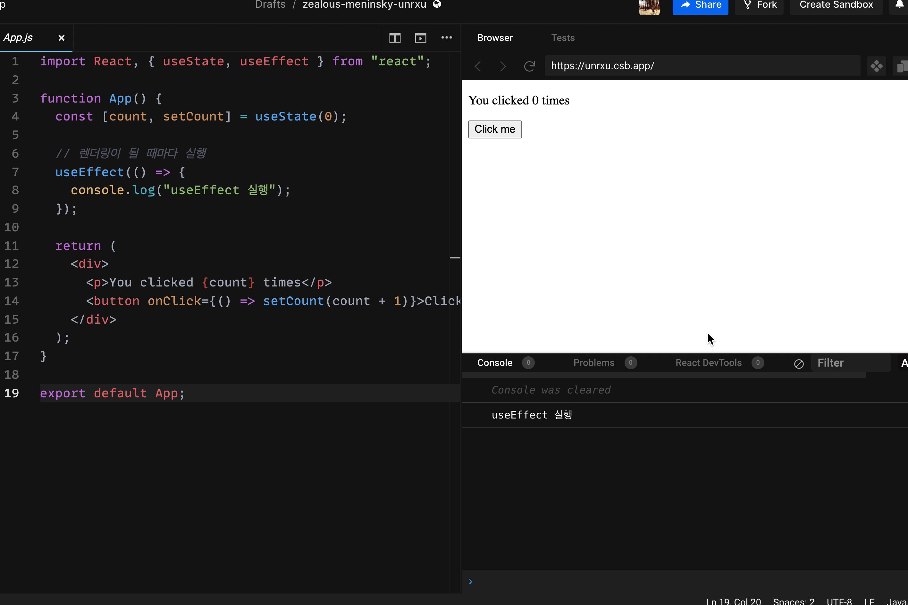
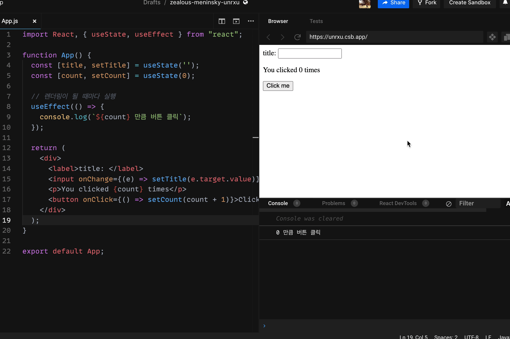
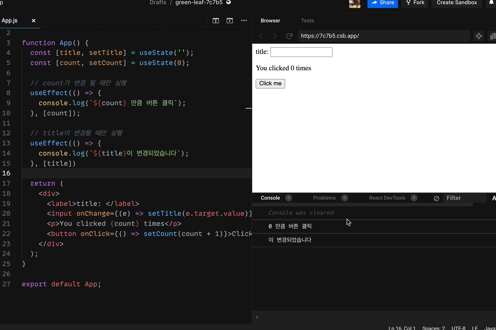

이제 위 이미지처럼 일정 시간이 지나면 자동으로 결과 페이지로 이동하는 기능을 만들어 보도록 하겠습니다.

## useEffect

페이지를 이동 시키기 전에 사전 지식으로 `useState` 다음으로 가장 많이 쓰이는 hook. `useEffect`에 대해서 알아보고 넘어가도록 하겠습니다.

우선 React 공식 홈페이지에 가서 `useEffect`를 어떻게 설명해 놓았는지 확인 해보도록 하겠습니다.

- React 공식 홈페이지 - useEffect 설명 ([링크](https://ko.reactjs.org/docs/hooks-effect.html))



Effect Hook을 사용하면 함수 컴포넌트에서 side Effect를 수행할 수 있다고 합니다.

아마 ?? 이런 생각이 들 것이라고 생각합니다. side Effect가 뭐지? 부작용 이런건가... 이런 생각이 드실텐데, side Effect가 무엇인지부터 정리하고 넘어가도록 하겠습니다.

### side effect

컴퓨터 용어에서 **`side effect`는 함수가 결과를 산출하는데 있어서 결과에 영향을 미치지 않는 모든 것이라고 할 수 있습니다.** 예를 들어, 위 예시를 보면, `Example function`(컴포넌트)가 산출하고자 하는 결과는 렌더링을 하는 것인데, `title`을 바꾼다거나 혹은 `log`를 남긴다거나 데이터를 가져오는 것은 모두 부수적인 일들 입니다.
즉, 최초 결과를 도출(렌더링)하는 과정에서 `side effect`들은 방해가 되면 안됩니다. 그래서 `react`에서는 `side effect`들을 따로 분리하여 관리하고 있습니다.

### useEffect 써보기

```jsx
useEffect(() => {
	// 렌더링 이외에 하고 싶은 일들 하기
});
```

useEffect는 기본적으로 위와 같이 생김새를 가졌습니다. **useEffect 내부에는 렌더링 이외의 side effect를 실행할 수 있습니다.** 주로 데이터 가져오기, 로그 남기기, timer 추가하기 등이 있습니다.

**useEffect는 기본적으로 첫 렌더링, 이후의 모든 업데이트에서 실행**이 됩니다. 추후에 나오겠지만 모든 업데이트에서 side effect를 실행하는 것은 효율적이지 않습니다. 그러한 이유로 조건을 추가해 줄 수도 있습니다.

```jsx
import React, { useState, useEffect } from "react";

function App() {
	const [count, setCount] = useState(0);

	// 렌더링이 될 때마다 실행
	useEffect(() => {
		console.log("useEffect 실행");
	});

	return (
		<div>
			<p>You clicked {count} times</p>
			<button onClick={() => setCount(count + 1)}>Click me</button>
		</div>
	);
}

export default App;
```

위 코드 간단한 Counter 기능이 있는 App 컴포넌트입니다. 실행해 보도록 하겠습니다.



아무런 행동을 하지 않았음에도 "useEffect 실행"이 콘솔 창에 찍혀있는 것을 알 수 있습니다. 이유는 `useEffect`가 컴포넌트가 렌더링되거나 업데이트 될 때 실행되기 때문입니다.
이제 버튼을 클릭해 보도록 하겠습니다.



위의 이미지처럼 버튼을 클릭할 때마다 "useEffect 실행"이 클릭하는 만큼 콘솔 창에 찍혀있는 것을 알 수 있습니다. 이유는 count state가 업데이트가 되면서 렌더링이 다시 되었고, 그에 따라 `useEffect`가 다시 실행되었기 때문입니다.

### 특정 조건에만 useEffect 함수 실행하기

```jsx
import React, { useState, useEffect } from "react";

function App() {
	const [title, setTitle] = useState("");
	const [count, setCount] = useState(0);

	// 렌더링이 될 때마다 실행
	useEffect(() => {
		console.log(`${count} 만큼 버튼 클릭`);
	});

	return (
		<div>
			<label>title: </label>
			<input onChange={(e) => setTitle(e.target.value)} value={title}></input>
			<p>You clicked {count} times</p>
			<button onClick={() => setCount(count + 1)}>Click me</button>
		</div>
	);
}

export default App;
```

위와 같은 코드가 있다고 생각해 보도록 하겠습니다.
기존 코드에서 추가된 내용은 useEffect 내부에서 count를 가져와 console 창에 찍어주었고, title을 입력받는 기능 또한 추가되었습니다.
실행을 해보도록 하겠습니다.



버튼을 클릭할 때마다 `count state`가 변경되니, 카운트가 올라가는 것을 알 수 있습니다. 뿐만 아니라 `title state`가 변경될 때도 `count` 값이 바뀌진 않지만 `console.log`가 찍히는 것을 알 수 있습니다.

**지금은 console.log라서 큰 문제가 되지 않지만 만약에 `count` 값을 서버에 업데이트하는 API가 useEffect 안에 있다면 불필요한 API 호출을 발생시키기 되고, 성능저하를 일으키게 됩니다.**

이제 특정 값이 변경되었을 때만, `useEffect`가 실행되도록 의존성 배열(dependancy array)를 추가해 보도록 하겠습니다.

`useEffect`는 첫번째 인자로 함수를 받고, 두번째 인자로 `list`를 받을 수 있습니다. `list` 안에는 `useEffect`가 실행되는 조건들이 들어 갑니다. 즉, `something` 변수를 의존성 배열에 넣으면 `something` 값이 변경될 때만 `useEffect`가 실행됩니다.

```jsx
// useEffect는 첫번째 인자로 함수를 받고, 두번째 인자로 list를 받을 수 있음.
useEffect(() => {
	// 렌더링 이외에 하고 싶은 일들 하기
}, [something, ....])
```

기존의 코드를 `count`가 변경될 때만 실행되도록 바꿔보도록 하겠습니다.

```jsx
import React, { useState, useEffect } from "react";

function App() {
	const [title, setTitle] = useState("");
	const [count, setCount] = useState(0);

	// 렌더링이 될 때마다 실행
	// 의존성 배열에 count를 추가
	useEffect(() => {
		console.log(`${count} 만큼 버튼 클릭`);
	}, [count]);

	return (
		<div>
			<label>title: </label>
			<input onChange={(e) => setTitle(e.target.value)} value={title}></input>
			<p>You clicked {count} times</p>
			<button onClick={() => setCount(count + 1)}>Click me</button>
		</div>
	);
}

export default App;
```

실행해보도록 하겠습니다.


이전과는 달리 버튼을 클릭 시에는 콘솔 창에 값이 찍히나, `input` 값의 변화에는 콘솔 창에 값이 찍히지 않는 것을 알 수 있습니다!!

### useEffect 여러 개로 분리하기

여기서 조건을 하나 더 넣어 보도록 하겠습니다.

`title`이 변경될 때마다 `title`을 콘솔 창에 찍어 보도록 하겠습니다.

```jsx
import React, { useState, useEffect } from "react";

function App() {
	const [title, setTitle] = useState("");
	const [count, setCount] = useState(0);

	// 렌더링이 될 때마다 실행
	useEffect(() => {
		console.log(`${count} 만큼 버튼 클릭`);
		console.log(`${title}이 변경되었습니다`);
	}, [count, title]);

	return (
		<div>
			<label>title: </label>
			<input onChange={(e) => setTitle(e.target.value)} value={title}></input>
			<p>You clicked {count} times</p>
			<button onClick={() => setCount(count + 1)}>Click me</button>
		</div>
	);
}

export default App;
```

위와 같이 `useEffect` 안에 `title`을 넣어주고, 의존성 배열에도 `title`을 추가해주었습니다.

그럼 이제 실행해 보도록 하겠습니다.


아쉽지만 의존성 배열에 `count`와 `title`을 같이 넣어주었기 때문에 둘 중에 하나가 변경되면 `useEffect`가 실행되게 됩니다. 그래서 우리가 원치않는 방향으로 작동하게 됩니다

이럴 땐 `useEffect`를 분리하면 됩니다.

```jsx
import React, { useState, useEffect } from "react";

function App() {
	const [title, setTitle] = useState("");
	const [count, setCount] = useState(0);

	// count가 변경 될 때만 실행
	useEffect(() => {
		console.log(`${count} 만큼 버튼 클릭`);
	}, [count]);

	// title이 변경될 때만 실행
	useEffect(() => {
		console.log(`${title}이 변경되었습니다`);
	}, [title]);

	return (
		<div>
			<label>title: </label>
			<input onChange={(e) => setTitle(e.target.value)} value={title}></input>
			<p>You clicked {count} times</p>
			<button onClick={() => setCount(count + 1)}>Click me</button>
		</div>
	);
}

export default App;
```

위와 같이 `useEffect` 함수를 두 개 만들고, `title` 또는 `count`이 변경될 때마다 각각의 `useEffect`가 실행되도록 만들었습니다.

실행해 보도록 하겠습니다.



최초 렌더링 때, 콘솔 창에 두 번 찍히고, 그 이후에는 각자 의존성 배열의 있는 값이 변경될 때만 업데이트 되는 것을 알 수 있습니다. 👏👏👏

다음 파트에서는 지금 배운 `useEffect`를 활용하여 `loading` 페이지를 만들어 보도록 하겠습니다.

## Somthing More!!!

반드시 공부해야 하는 건 아니지만, 도움이 될 만한 자료들을 공유하고 있습니다.

- useEffect의 이해하는 가장 좋은 필수 블로그 글 ([링크](https://rinae.dev/posts/a-complete-guide-to-useeffect-ko))
