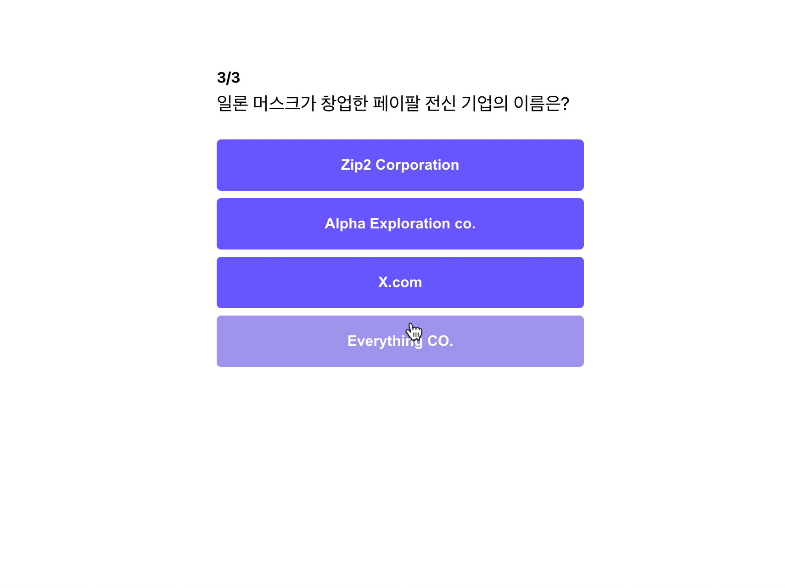
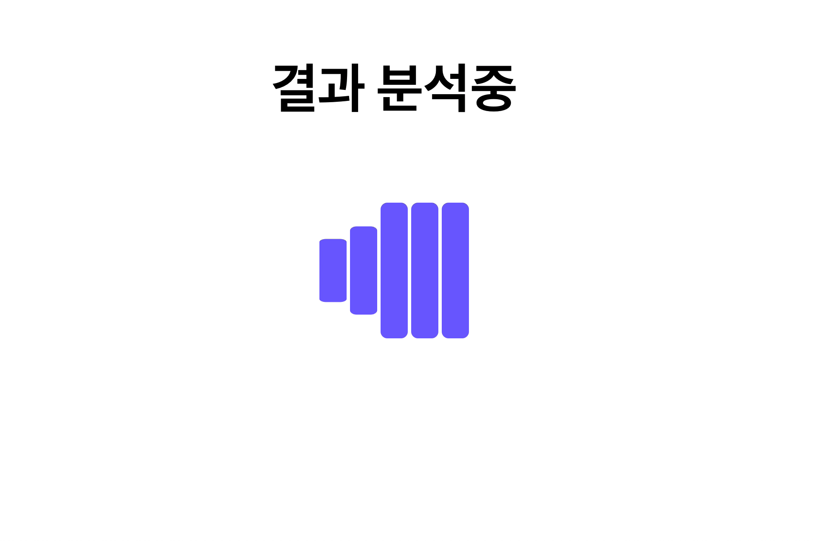
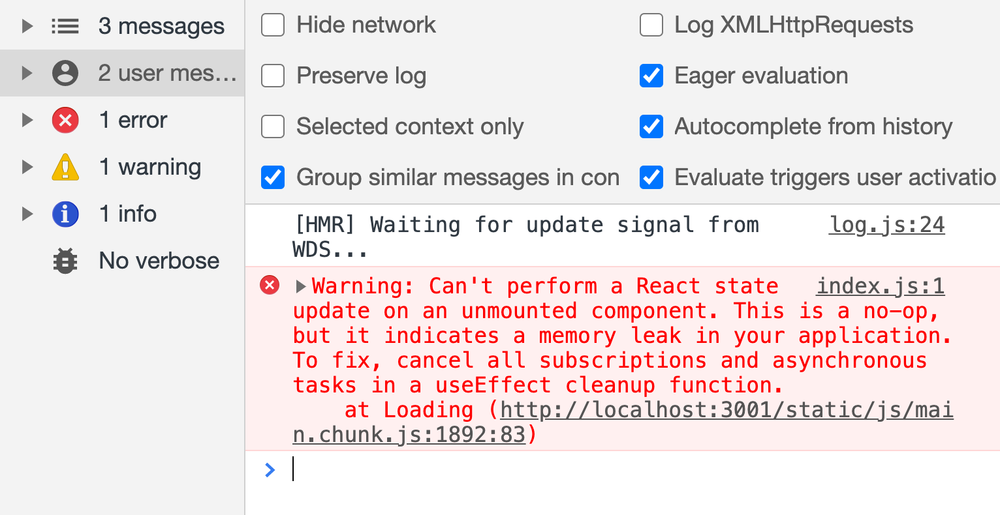
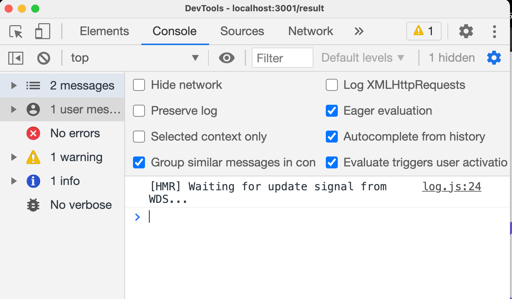

이제는 useEffect도 배웠으니, Loading 페이지를 완성해보도록 하겠습니다.

## 매초마다 제목 변경하기

0.7초마다 결과 분석중 제목에 .이 찍히는 효과부터 추가해 보도록 하겠습니다.

```jsx
// pages/Loading/index.js
...
import { useEffect, useState } from "react";
...

const Loading = () => {
	const [title, setTitle] = useState("결과 분석중");

	useEffect(() => {
		setTimeout(() => {
			setTitle((title) => title + ".");
		}, 700);
	}, [title]);

	return (
		<Container>
			<Title>{title}</Title>
			<Spinner></Spinner>
		</Container>
	);
};

export default Loading;
```

**변경된 코드 설명**

- `useState`로 `title` 을 관리합니다.
- `useEffect` 함수를 추가하여 주었습니다.
  - `useEffect` 함수의 의존성 배열에 `title`을 넣어, 최초 렌더링과 `title`이 변경될 때만 `useEffect`가 실행되도록 하였습니다.
  - `useEffect` 함수 안에는 `setTimeout` 함수가 있으며, 렌더링이 끝난 후 0.7초 후에 `setTitle` 함수를 호출하여 제목에 . 를 추가하여 줍니다.
- 렌더링 시에 엘리먼트에서 변경된 `title`을 가져올 수 있게 하기 위해 `{title}`로 변경해 주었습니다.

코드를 다 수정했으니, 실행해 보도록 하겠습니다.



정상적으로 잘 실행되는 것을 알 수 있습니다!!

## 정해진 시간이 지나면 페이지 이동 시키기

이제 `useEffect`와 `setTimeout`을 사용해 봤으니, 페이지 이동을 어떻게 해야할지 감이 잡히시나요?

이 번에는 2초 후에 결과 페이지로 이동하도록 코드를 작성해 보겠습니다.

```jsx
// pages/Loading/index.js
...
import { useHistory } from "react-router";
...

const Loading = () => {
	...
	let history = useHistory();
	...

	...
	useEffect(() => {
		setTimeout(() => history.push("/result"), 2000);
	}, [history]);
	...

};

```

**변경된 코드 설명**

- 페이지 변경을 하기 위해 `react-router`에서 `useHistory`를 `import` 하였습니다.
- useHistory hooks를 활용하여 history 객체를 얻었습니다.
- useEffect 함수를 추가해 주었습니다.
  - `useEffect` 함수의 의존성 배열에 `history`를 넣어, 최초 렌더링과 `history`가 변경될 때만 `useEffect`가 실행되도록 하였습니다.
  - `useEffect` 함수 안에는 `setTimeout` 함수가 있으며, 렌더링이 끝난 후 2초 후에 `history.push` 함수를 호출하여 `/result` 페이지로 이동합니다.

코드를 변경하였으니, 다시 실행해 보도록 하겠습니다.


정상적으로 잘 나오는 것을 알 수 있습니다!! 👏👏👏👏

## 컴포넌트가 사라질 때, timer가 살아 있는 문제

그런데 문제가 하나 있습니다.

개발자 도구를 열어보니, 아래와 같은 에러가 발생합니다.



해석을 해보면 언마운트 된 컴포넌트에는 `state` 업데이트가 불가능 하며, 이는 메모리 누수를 잃으킬 수 있다고 합니다. 이 것이 어떤 내용인지 자세히 알아 보도록 하겠습니다.

```jsx
// pages/Loading/index.js
...
useEffect(() => {
		setTimeout(() => {
			setTitle((title) => title + ".");
		}, 700);
	}, [title]);

useEffect(() => {
	setTimeout(() => history.push("/result"), 2000);
}, [history]);

...
```

위 코드가 작동하는 순서를 보도록 하겠습니다.

- 최초 렌더링이 진행 됩니다.
  - `useEffect` 실행되고, 0.7초 후에 `setTitle` 함수를 통해 `title`이 업데이트가 되는 것을 예약합니다.
  - `useEffect` 실행되고, 2초 후에 `history.push` 함수를 통해 페이지 이동 되는 것을 예약합니다.
- 0.7초가 지나, `setTitle` 함수가 실행되며 `title` 값이 변경됩니다.
- `title` 값이 변경되었으므로, `title`을 의존성 배열로 갖고 있는 `useEffect`가 실행됩니다.
  - 0.7초 후에 `setTitle` 함수를 통해 `title`이 업데이트가 되는 것을 예약합니다.
- 2초가 지나, `history.push` 함수가 실행되며 페이지가 이동됩니다.
  - `Loading` 컴포넌트는 언마운트(화면에서 없어짐) 됩니다.
- 0.7초가 지나, `setTitle` 함수를 실행합니다.
  - `Loading` 컴포넌트가 언마운트 되어 업데이트할 `state`가 없어져 에러가 발생합니다.

이해가 되셨나요?

결론만 요약하면 결국 컴포넌트가 없어졌는데 `timer`가 남아있기 때문에 생기는 문제입니다.

이럴 때는 `useEffect`의 `cleanup` 함수를 사용하면 쉽게 처리를 할 수 있습니다.

## useEffect cleanup 함수 사용하기

```jsx
useEffect(() => {
	// 의존성 배열에 따라 실행될 코드들
	something();

	return () => {
		// 컴포넌트가 언마운트될 때 실행될 코드
		something2();
}

}, [의존성 배열, ....])
```

다시 `useEffect` 함수의 구조를 보도록 하겠습니다.

이 전 파트에서 배우지 않은 부분이 있는데 그 것은 `useEffect` 함수가 `return` 하는 함수입니다. 이를 `useEffect`에서는 `cleanup` 함수라고 부릅니다.

`cleanup` 함수는 컴포넌트가 사라질 때(언마운트)될 때 실행됩니다.

그래서 이 곳에서는 주로 서버와의 커넥션을 끊는다거나, 타이머를 초기화하는 코드들이 주로 들어 갑니다.

이제 `cleanup` 함수를 배웠으니, 실제 사용해 보도록 하겠습니다.

```jsx
// pages/Loading/index.js
...
useEffect(() => {
		const id = setTimeout(() => {
			setTitle((title) => title + ".");
		}, 700);
		return () => clearTimeout(id);
}, [title]);
...
```

**변경된 코드 설명**

- `setTimeout` 함수는 실행되면 결과 값으로 `id`를 `return` 합니다. 해당 `id`를 `id` 변수에 담았습니다.
- `useEffect` `cleanup` 함수에서 `clearTimeout`에 id를 넣어 호출하였습니다.
  - `clearTimeout`은 예약되어 있던 작업을 취소하는 역할을 합니다.

코드를 변경하였으니, 다시 실행해 보도록 하겠습니다.




정상적으로 잘 나오는 것을 알 수 있습니다!! 👏👏👏👏

뿐만 아니라 더 이상 에러도 발생하지 않습니다!!

## 전체 코드 살펴보기

- 깃허브에서 전체 코드 보기 -> [바로가기](https://github.com/CodePotStudio/starter-quiz-app/tree/week05-05)

## Somthing More!!!

반드시 공부해야 하는 건 아니지만, 도움이 될 만한 자료들을 공유하고 있습니다.

- clean up을 필요로 하는 side Effect ([링크](https://ko.reactjs.org/docs/hooks-effect.html#effects-with-cleanup))
- javascript에서 timer 사용하기 ([링크](https://ko.javascript.info/settimeout-setinterval))
