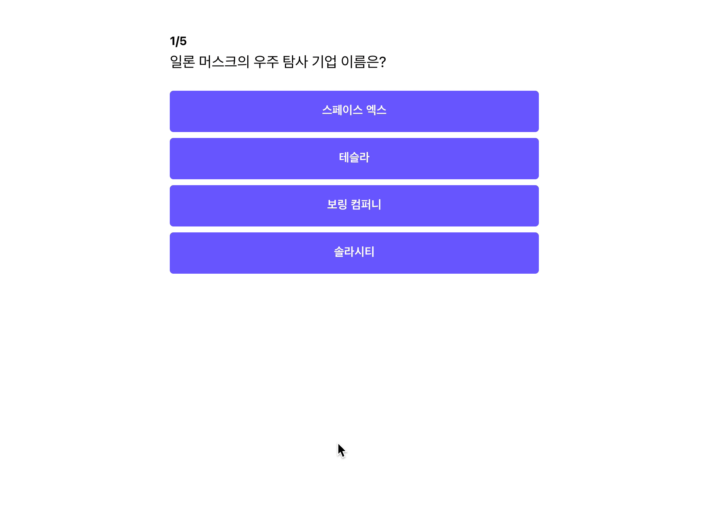
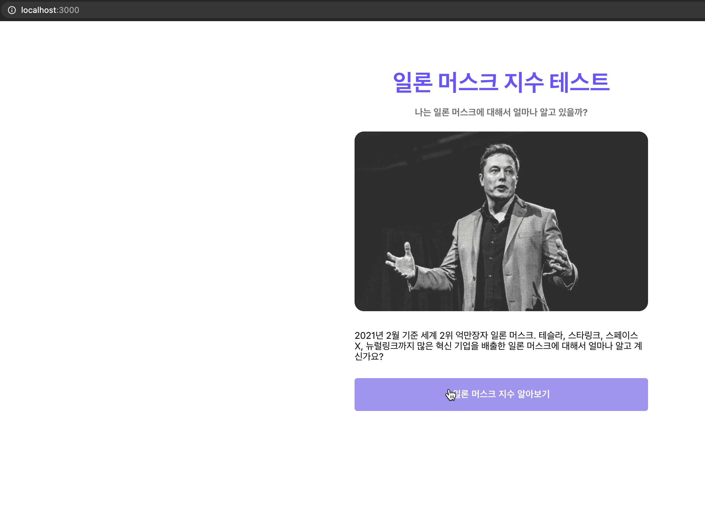

## 문제 개수 추가하기

현재 문제 개수가 적어 다양한 결과가 나오기 어려운데, 문제를 5개까지 추가해 보도록 하겠습니다.

```jsx
//constants.js
const QUIZZES = [
	{
		id: 1,
		question: "일론 머스크의 우주 탐사 기업 이름은?",
		answers: [
			{ text: "스페이스 엑스", isCorrect: true },
			{ text: "테슬라", isCorrect: false },
			{ text: "보링 컴퍼니", isCorrect: false },
			{ text: "솔라시티", isCorrect: false },
		],
	},
	{
		id: 2,
		question: "일론 머스크의 고향은 어디일까요?",
		answers: [
			{ text: "미국 캘리포니아", isCorrect: false },
			{ text: "남아프리카 공화국 프리토리아", isCorrect: true },
			{ text: "캐나다 벤쿠버", isCorrect: false },
			{ text: "호주 시드니", isCorrect: false },
		],
	},
	{
		id: 3,
		question: "일론 머스크가 창업한 페이팔 전신 기업의 이름은?",
		answers: [
			{ text: "Zip2 Corporation", isCorrect: false },
			{ text: "Alpha Exploration co.", isCorrect: false },
			{ text: "X.com", isCorrect: true },
			{ text: "Everything CO.", isCorrect: false },
		],
	},
	{
		id: 4,
		question: "일론 머스크가 테슬라 투자하고, 최대 주주로 등극한 시기는?",
		answers: [
			{ text: "2001년", isCorrect: false },
			{ text: "2002년", isCorrect: false },
			{ text: "2003년", isCorrect: false },
			{ text: "2004년", isCorrect: true },
		],
	},
	{
		id: 5,
		question: "테슬라 내에서 일론 머스크의 직함은?",
		answers: [
			{ text: "Master of coin", isCorrect: false },
			{ text: "Chairman", isCorrect: false },
			{ text: "CEO", isCorrect: false },
			{ text: "Technoking", isCorrect: true },
		],
	},
];

export { QUIZZES };
```

문제를 추가하였으니, 다시 실행해 보도록 하겠습니다.



정상적으로 잘 실행되는 것을 알 수 있습니다

## 캐릭터 코드 계산하기

이제 각 점수에 맞는 캐릭터 코드를 만들어 보도록 하겠습니다. 캐릭터 코드를 만드는 이유는 점수에 따라 다른 결과페이지를 보여주기 위함입니다.

```jsx
// Pages/Loading/index.js

const getCCode = (score) => {
	let cCode;
	if (score > 75) {
		cCode = "elon";
	} else if (score > 50) {
		cCode = "kimbal";
	} else if (score > 25) {
		cCode = "bezos";
	} else {
		cCode = "timemachine";
	}
	return cCode;
};
```

위와 같이 각 점수 구간별로 `cCode` 값을 구하는 `getcCode` 함수를 만들었습니다.

## 계산된 캐릭터 코드 URL로 이동시키기

### Loading 컴포넌트에 convertedScore 값 내려주기

`cCode`를 계산하려면 `convertedScore`가 필요한데 `Loading` 컴포넌트에는 `convertedScore props`가 없습니다. 그래서 `App` 컴포넌트에서 `convertedScore` 값을 `props`로 내려주도록 하겠습니다.

```jsx

// App.js
...
// QUIZZES 임포트 코드 추가
import { QUIZZES } from "../constants";

function App() {
	const [score, setScore] = useState(0);

	// Result Component에서 App 컴포넌트로 이동
	const convertedScore = Math.floor((score / QUIZZES.length) * 100);

	return (
		<ThemeProvider theme={theme}>
			...
				<Route path="/result">
					<Result convertedScore={convertedScore} setScore={setScore} />
				</Route>
				<Route path="/loading">
					<Loading convertedScore={convertedScore} />
				</Route>
			...
		</ThemeProvider>
	);
}
...
export default App;
```

```jsx
// Pages/Result/index.js
...
// Props에서 convertedScore 받도록 변경
const Result = ({ convertedScore, setScore }) => {
	return (
		<Container>
			<ResultSection convertedScore={convertedScore}></ResultSection>
			<Button onClick={() => setScore(0)} to="/">
				테스트 다시하기
			</Button>
		</Container>
	);
};

export default Result;
```

```jsx
// Pages/Loading/index.js
...
// props에서 convertedScore 추가
const Loading = ({ convertedScore }) => {
	...
};

export default Loading;
```

### Loading 컴포넌트에서 특정 캐릭터 코드 URL로 이동 시키기

```jsx
// Pages/Loading/index.js
...
// getCCode 함수 추가
const getCCode = (score) => {
	let cCode;
	if (score > 75) {
		cCode = "elon";
	} else if (score > 50) {
		cCode = "kimbal";
	} else if (score > 25) {
		cCode = "bezos";
	} else {
		cCode = "timemachine";
	}
	return cCode;
};

const Loading = ({ convertedScore }) => {
	...
	const cCode = getCCode(convertedScore);
	...
	// result url 뒤에 캐릭터 붙여주기
	useEffect(() => {
		setTimeout(() => history.push(`/result/${cCode}`), 2000);
	}, [history, cCode]);
	...
};

export default Loading;
```

페이지를 이동할 때, `/result` `url` 뒤에 `cCode`도 추가해 주었습니다. 페이지 이동 시에 `url`에 `cCode`를 정상적으로 달고 이동하는지 확인해 보도록 하겠습니다.



위와 같이 [localhost:3000/result/elon](http://localhost:3000/result/elon) 으로 이동한 것을 알 수 있습니다.

### URL에 캐릭터 코드를 넣는 이유

`state`의 경우, 화면을 새로고침하면 값이 초기화됩니다. 그러한 이유로 페이지를 외부에 공유 시에 초기화된 값을 보게 되는 문제가 발생합니다. 그래서 주로 `react`에서는 새로고침 시에도 데이터가 유지하는 방법으로 브라우저에 데이터를 저장하는 `local Storage`를 주로 사용합니다.

하지만 저희 같은 경우에는 다른 사람들에게도 결과가 공유가 되어야 하므로 브라우저에 데이터를 저장하는 것 만으론 문제가 해결되지 않습니다. 그래서 `url`에 캐릭터 코드를 추가하고 이에 따른 결과 값을 보여줄 수 있도록 구현하였습니다.

## 전체 코드 살펴보기

- 깃허브에서 전체 코드 보기 -> [바로가기](https://github.com/CodePotStudio/starter-quiz-app/tree/week06-01)

## Somthing More!!!

반드시 공부해야 하는 건 아니지만, 도움이 될 만한 자료들을 공유하고 있습니다.

- javascript에서 데이터 저장하는 방법 ([링크](https://www.daleseo.com/js-web-storage/))
