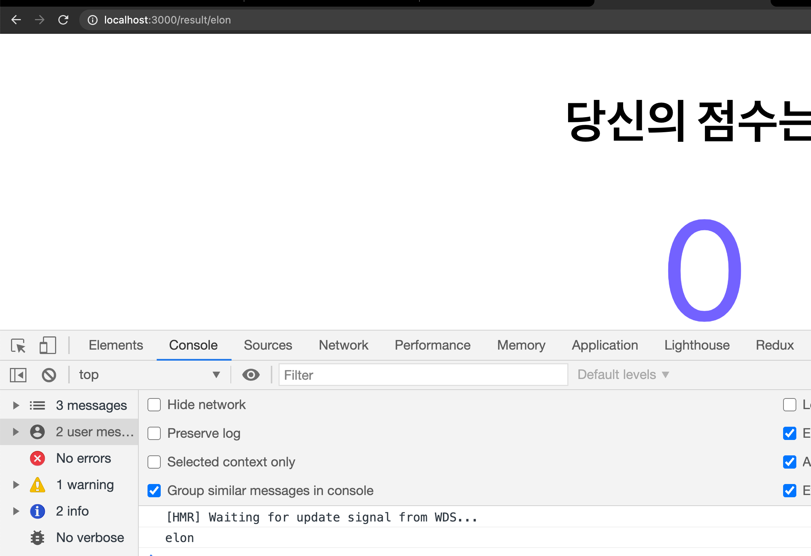
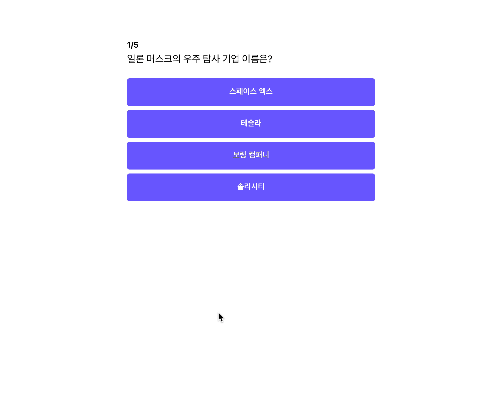
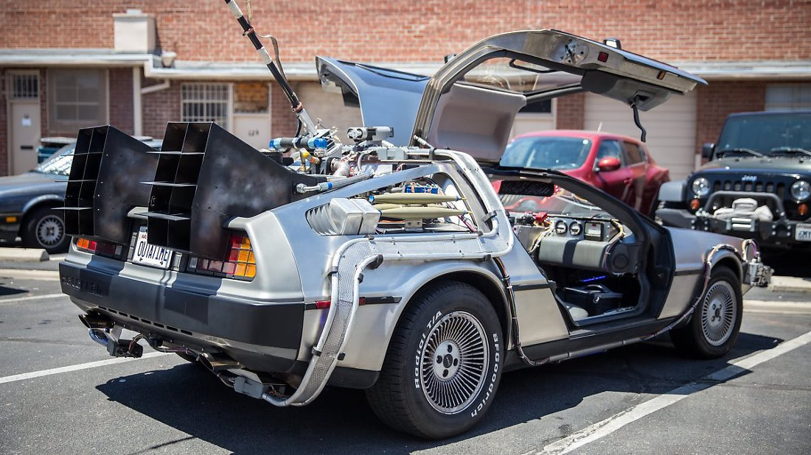
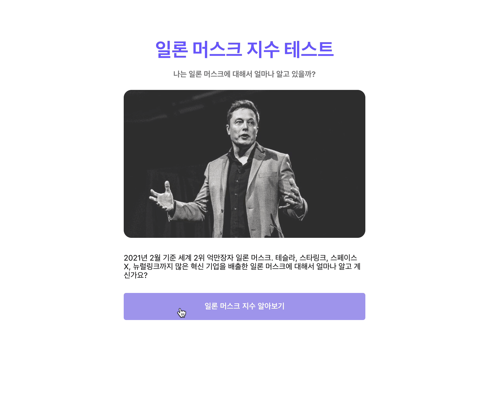

url로 캐릭터 코드를 보냈으니, Result 페이지에서 캐릭터 코드를 받아 코드에 맞는 결과 페이지를 만들어 보도록 하겠습니다.

## Result Page에서 캐릭터 코드 받기

`url`에 포함되어 있는 캐릭터 코드를 받으려면 `react-router` 라이브러리의 도움이 필요합니다.

```jsx
// /components/app.js
function App() {
	return (
		...
				// result/ 뒤에 붙는 값들을 cCode에 매핑시키기.
				<Route path="/result/:cCode">
					<Result convertedScore={convertedScore} setScore={setScore} />
				</Route>
		...
}

export default App;
```

```jsx
// pages/Result/index.js

import { useParams } from "react-router";

const Result = ({ convertedScore, setScore }) => {
	...
	// useParams를 통해 url에 붙어 있는 parameter 가져오기
	const { cCode } = useParams();
	console.log(cCode);
	...
};
```

**변경된 코드 설명**

- `/result/` `url` 뒤에 붙는 값들을 활용하기 위해 `Route` 컴포넌트 뒤에 `:cCode` 를 붙여주었습니다. 이로 인해 `result` 뒤에 붙은 값은 `cCode`에 매핑되게 됩니다.
- Result 컴포넌트에서 `cCode`에 맵핑된 값을 가져오기 위해 `useParams` 함수를 활용하였습니다.

위와 같이 변경하고, 정상적으로 `cCode`를 가져오는지 실행해 보도록 하겠습니다.



[localhost:3000/result/elon](http://localhost:3000/result/elon) 로 접근하였을 때 정상적으로 console 창에 `elon`이 찍히는 것을 알 수 있습니다.

## 캐릭터 코드에 맞추어 결과 페이지 꾸미기

### 캐릭터별 content 저장하기

```jsx
// components/ResultSection/result.js

const RESULT = {
	elon: {
		title: "일론 머스크",
	},
	kimbal: {
		title: "킴벌 머스크",
	},
	bezos: {
		title: "제프 베조스",
	},
	timemachine: {
		title: "과거에서 온 사람",
	},
};

export default RESULT;
```

위와 같이 해당 캐릭터에 맞는 title, content를 포함하고 있는 Object를 하나 만들고, export 명령어를 통해 외부로 내보내 줍니다.

### Result 페이지 캐릭터 별로 꾸미기

이제 Result 페이지를 꾸며 보도록 하겠습니다.

```jsx
// pages/Result/index.js

import React from "react";
import styled from "styled-components";
import RESULT from "./result";

const SectionTitle = styled.h1`
	font-size: 64px;
	font-weight: bold;
	margin-top: 0px;
	margin-bottom: 56px;
	text-align: center;
`;

const ResultTitle = styled.div`
	font-size: 24px;
	margin-bottom: 56px;
	text-align: center;
`;

const ResultSection = ({ cCode }) => (
	<>
		<SectionTitle>당신은 혹시?</SectionTitle>
		<ResultTitle>{RESULT[cCode].title}</ResultTitle>
	</>
);
export default ResultSection;
```

기존의 결과 페이지와 보여줄 내용이 다르므로 위와 같이 코드를 변경합니다. 그리고 `ResultSection`에서 받은 `cCode`를 통해 `RESULT`에서 `title` 를 가져와 렌더링 해줍니다.

코드를 변경했으니, `React`를 재실행 해보도록 하겠습니다.



위와 같이 결과 값에 맞게 정상적으로 페이지가 렌더링 되는 것을 확인할 수 있습니다.

### 캐릭터 코드에 맞는 이미지 노출하기

이제 결과 페이지에서 해당 캐릭터에 맞는 이미지를 노출해 보도록 하겠습니다.

우선 아래의 4가지 이미지를 다운로드하고, `/assets/images` 폴더 안에 넣어주세요.




그리고 `result.js`에 코드를 아래와 같이 변경합니다.

```jsx
import elon from "../../assets/images/elon.jpg";
import kimbal from "../../assets/images/kimbal.jpg";
import bezos from "../../assets/images/bezos.jpg";
import timemachine from "../../assets/images/timemachine.jpg";

const RESULT = {
	elon: {
		title: "일론 머스크",
		src: elon,
	},
	kimbal: {
		title: "킴벌 머스크",
		src: kimbal,
	},
	bezos: {
		title: "제프 베조스",
		src: bezos,
	},
	timemachine: {
		title: "과거에서 온 사람",
		src: timemachine,
	},
};

export default RESULT;
```

이제 이미지 경로를 추가하였으니, 마지막으로 Result 컴포넌트도 수정해 보도록 하겠습니다.

```jsx
import React from "react";
import styled from "styled-components";
import RESULT from "./result";

const SectionTitle = styled.h1`
	font-size: 64px;
	font-weight: bold;
	margin-top: 0px;
	margin-bottom: 56px;
	text-align: center;
`;

// 이미지 컴포넌트 추가
const StyledImage = styled.img`
	border-radius: 16px;
	opacity: 80%;
	margin-bottom: 16px;
	max-width: 100%;
	display: block;
`;

const ResultTitle = styled.div`
	font-size: 24px;
	margin-bottom: 56px;
	text-align: center;
`;

const ResultSection = ({ cCode }) => (
	<>
		<SectionTitle>당신은 혹시?</SectionTitle>
		<StyledImage src={RESULT[cCode].src} />
		<ResultTitle>{RESULT[cCode].title}</ResultTitle>
	</>
);

export default ResultSection;
```

결과 페이지에 이미지를 추가하였으니, 재실행 해보도록 하겠습니다.



결과 값에 맞춰 정상적으로 이미지가 나오는 것을 알 수 있습니다!!! 👏👏👏👏

## 전체 코드 살펴보기

- 깃허브에서 전체 코드 보기 -> [바로가기](https://github.com/CodePotStudio/starter-quiz-app/tree/week06-01)

## Somthing More!!!

반드시 공부해야 하는 건 아니지만, 도움이 될 만한 자료들을 공유하고 있습니다.

- 이미지 저장소로 Public 폴더를 사용하지 마세요 ([링크](https://create-react-app.dev/docs/using-the-public-folder))
