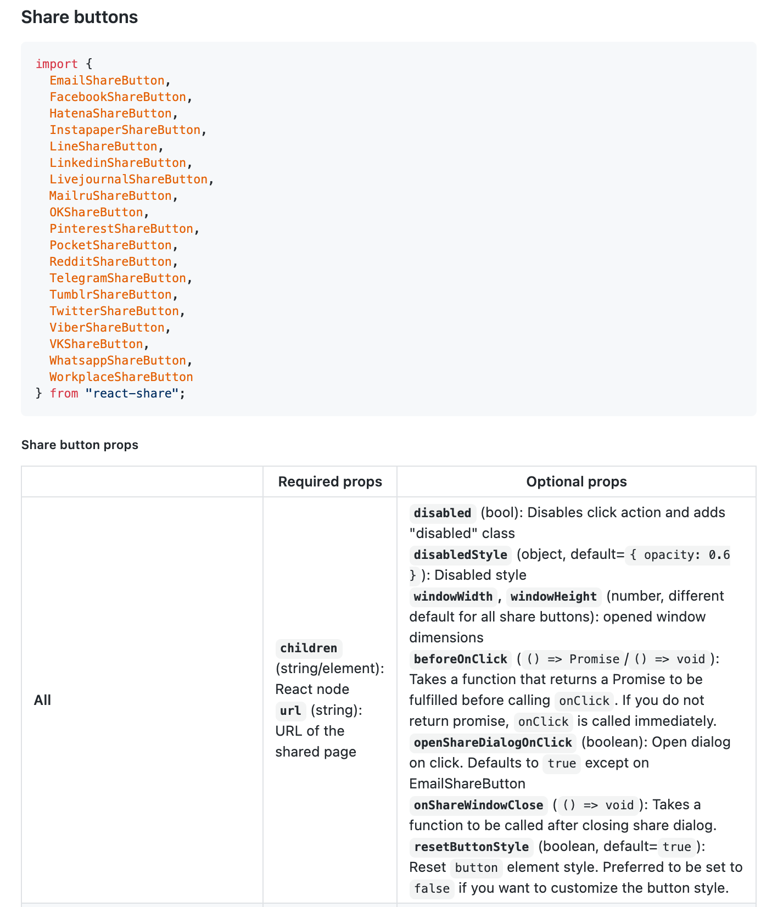
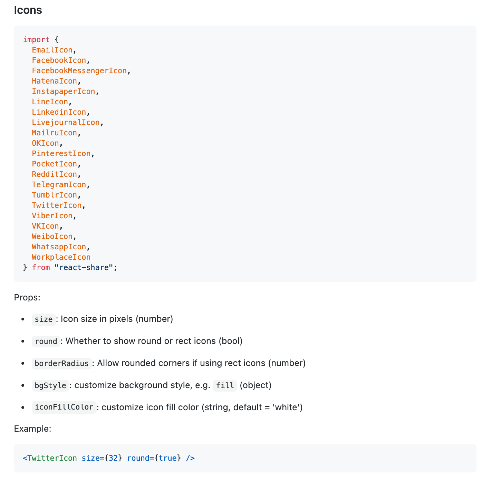
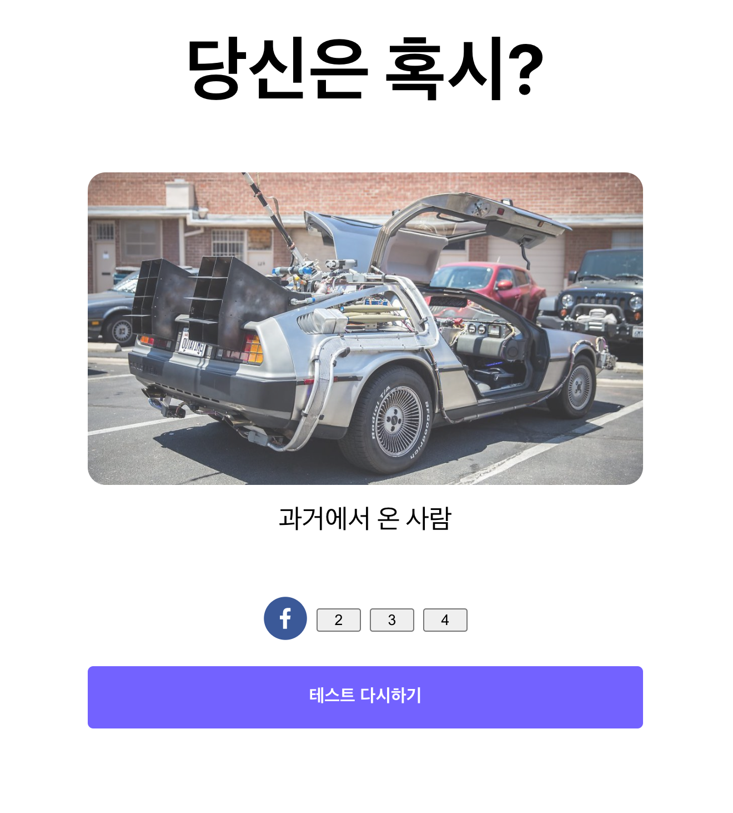
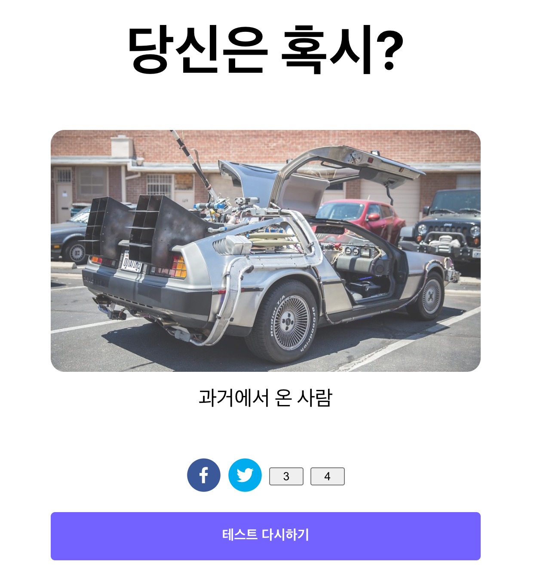

페이스북과 트위터의 경우, 쉽게 만들 수 있는 라이브러리가 존재합니다.

## 라이브러리 설치하기

```jsx
npm install react-share
```

## 라이브러리 사용법 알아보기

라이브러리 주소 → [https://github.com/nygardk/react-share](https://github.com/nygardk/react-share)

`github` 상세 설명을 읽어보면, 아래와 같이 적혀 있습니다.



모든 컴포넌트의 필수 값으로 `children`(자식 컴포넌트)와 `url`을 넣어주어야 한다고 합니다.

그리고 좀 더 아래쪽으로 내려가보면 `Icon` 컴포넌트까지 제공하는 것을 알 수 있습니다.



`size`와 `round` 여부, `radius`까지 손쉽게 활용이 가능합니다.

## React에서 현재 페이지 URL 알아내기

`React`에서는 일반 `javascript`와 마찬가지로 `browser`의 `window` 객체에 접근 할 수 있습니다. 그리고 윈도우 객체 내 `location.href`에는 현재 위치하고 있는 `url`이 저장되어 있습니다.

## 페이스북 공유 버튼 만들기

```jsx
// components/SocialButtonSection/index.js
import { FacebookShareButton, FacebookIcon } from "react-share";
...

const SocialButtonGroup = () => {
	// window 객체에서 현재 url 가져오기
	const currentUrl = window.location.href;
	return (
		<GridContainer>
			{/* 페이스북 버튼 추가 */}
			<FacebookShareButton url={currentUrl}>
				<FacebookIcon size={48} round={true} borderRadius={24}></FacebookIcon>
			</FacebookShareButton>
			...
		</GridContainer>
	);
};

export default SocialButtonGroup;
```

페이스북 버튼을 만들었으니, 실행해 보도록 하겠습니다.



정상적으로 페이스북 공유 버튼이 잘 나오는 것을 알 수 있습니다.

## 트위터 버튼 추가하기

이제 마저 트위터 공유 버튼도 추가해 보도록 하겠습니다.

```jsx
// components/SocialButtonSection/index.js
import {
	TwitterShareButton,
	TwitterIcon,
} from "react-share";

...

const SocialButtonGroup = () => {
	...
	return (
		<GridContainer>
			<FacebookShareButton url={currentUrl}>
				<FacebookIcon size={48} round={true} borderRadius={24}></FacebookIcon>
			</FacebookShareButton>
			<TwitterShareButton url={currentUrl}>
				<TwitterIcon size={48} round={true} borderRadius={24}></TwitterIcon>
			</TwitterShareButton>
			...
		</GridContainer>
	);
};
```

마찬가지로 Twitter 버튼을 추가하였으니, 재실행 해보도록 하겠습니다.



정상적으로 트위터 공유 버튼이 잘 나오는 것을 알 수 있습니다.

## 전체 코드 살펴보기

- 깃허브에서 전체 코드 보기 -> [바로가기](https://github.com/CodePotStudio/starter-quiz-app/tree/week06-04)
