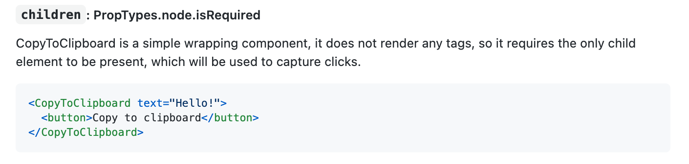
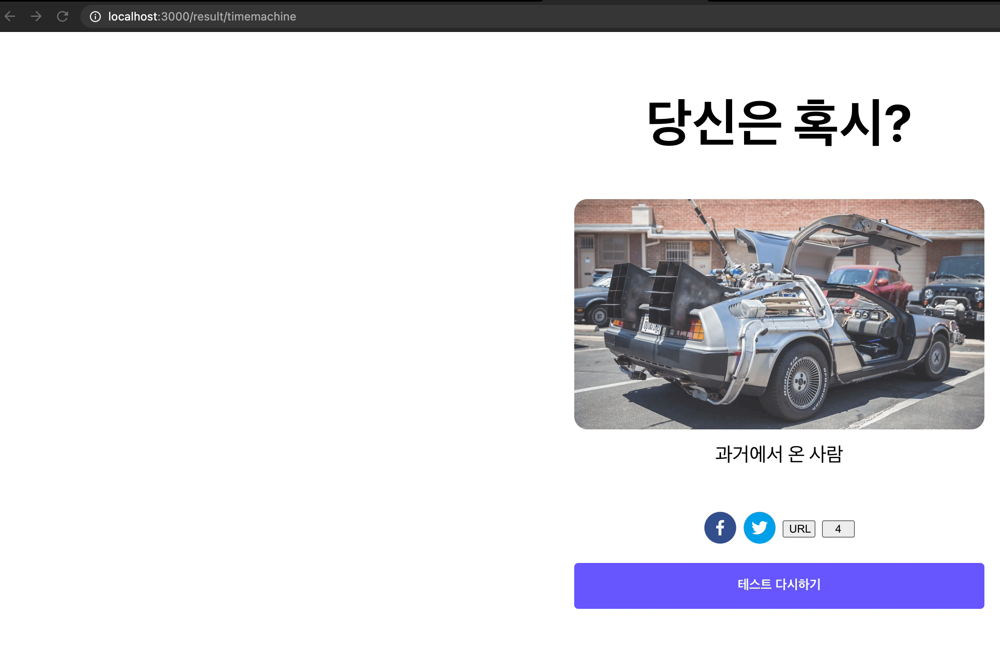
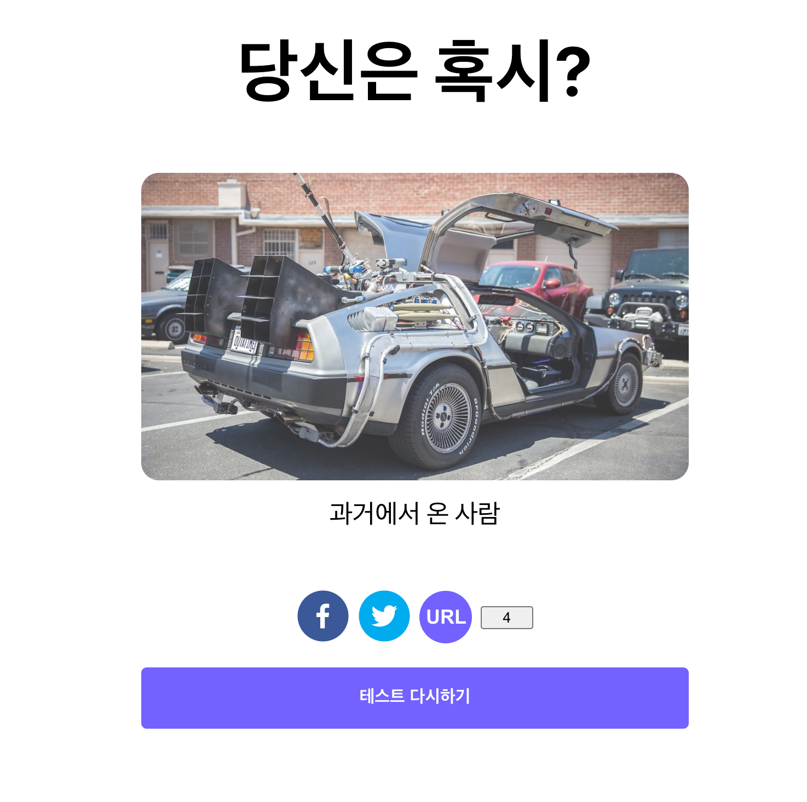

일반적으로 각 운영체제 (모바일 혹은 웹, 앱)에서 무언가를 복사하면 각 운영체제가 사용하는 클립보드에 임시 저장이 됩니다. (클립보드 설명 → [링크](https://ko.wikipedia.org/wiki/%ED%81%B4%EB%A6%BD%EB%B3%B4%EB%93%9C))

즉 링크 복사 버튼을 클릭하면 현재 링크를 복사하여 클립보드에 넣는 과정이 필요합니다. 이것도 마찬가지로 많은 개발자들이 많이 필요로하는 부분이다보니, 라이브러리가 존재합니다.

## 라이브러리 설치하기

```jsx
npm install --save react-copy-to-clipboard
```

## 라이브러리 사용하기

라이브러리 주소 → [https://github.com/nkbt/react-copy-to-clipboard](https://github.com/nkbt/react-copy-to-clipboard)

`github readMe`를 읽어보니, 아래와 같이 `CopyToClipBoard props`에 복사할 값을 넣어주고, `CopyToClipBoard` 컴포넌트로 우리의 버튼 컴포넌트를 감싸주면 되는 것 같습니다.



## 코드 적용하기

```jsx
// components/SocialButtonGroup/index.js
import { CopyToClipboard } from "react-copy-to-clipboard";

const SocialButtonGroup = () => {
	const currentUrl = window.location.href;
	return (
		<GridContainer>
			...
			<CopyToClipboard text={currentUrl}>
				<button>URL</button>
			</CopyToClipboard>
			...
		</GridContainer>
	);
};

export default SocialButtonGroup;
```

코드를 실행해보고, 정상적으로 잘 작동하는지 테스트 해보도록 하겠습니다.



위 그림처럼 버튼을 클릭하고, 붙여넣기를 했더니 현재 URL이 정상적으로 주소창에 입력되는 것을 알 수 있습니다.

## 버튼에 스타일 입히기

```jsx
// components/SocialButtonGroup/index.js

// Style을 적용한 버튼 컴포넌트 추가
const URLShareButton = styled.button`
	width: 48px;
	height: 48px;
	color: white;
	border-radius: 24px;
	border: 0px;
	font-weight: 800;
	font-size: 18px;
	cursor: pointer;
	background-color: ${(props) => props.theme.primaryColor100};
	&:hover {
		background-color: ${(props) => props.theme.primaryColor80};
	}
`;

const SocialButtonGroup = () => {
	const currentUrl = window.location.href;
	return (
		<GridContainer>
			...
			<CopyToClipboard text={currentUrl}>
				<URLShareButton>URL</URLShareButton>
			</CopyToClipboard>
			...
		</GridContainer>
	);
};

export default SocialButtonGroup;
```

코드를 실행하여 스타일이 잘 작동하는지 확인해 보도록 하겠습니다.



URL 복사 버튼이 정상적으로 잘 추가된 것을 확인할 수 있습니다.

## 전체 코드 살펴보기

- 깃허브에서 전체 코드 보기 -> [바로가기](https://github.com/CodePotStudio/starter-quiz-app/tree/week06-05)
