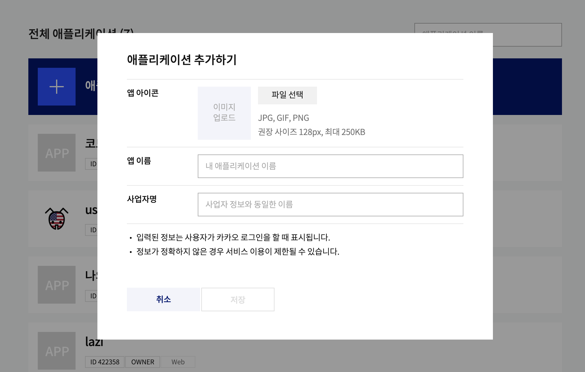
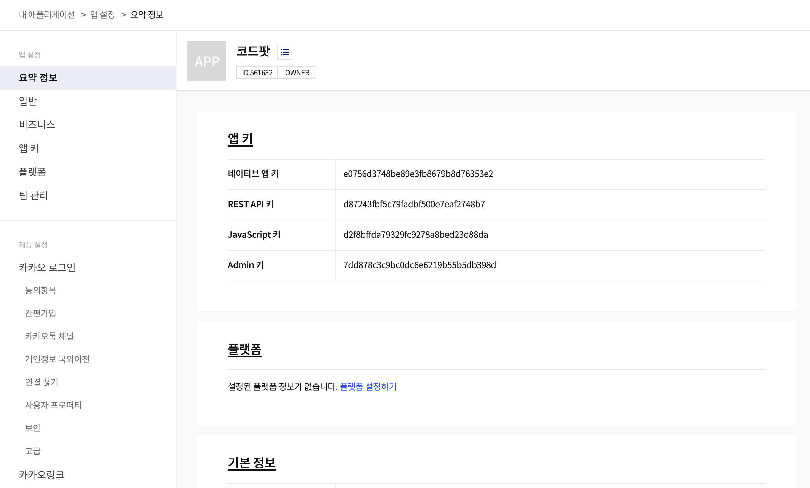
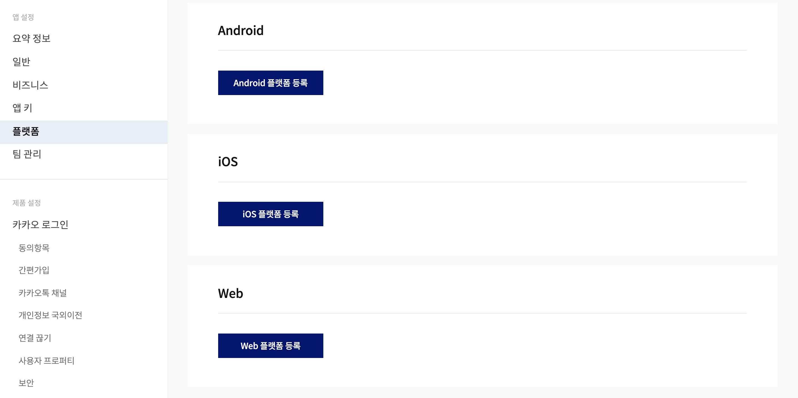
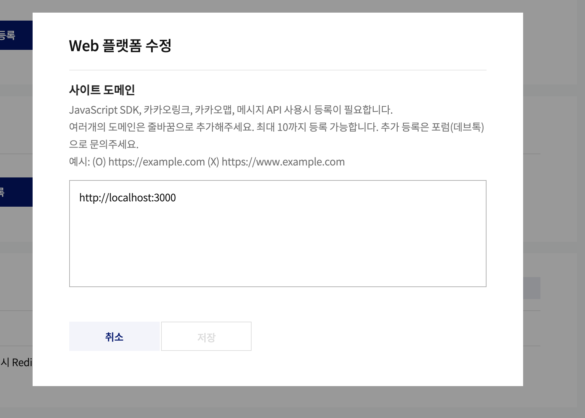
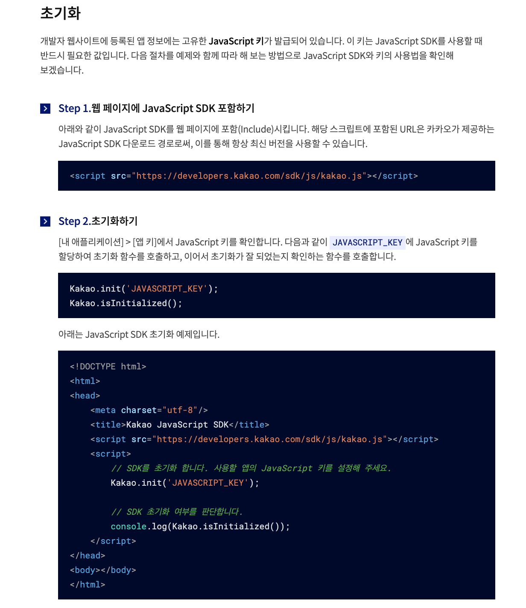
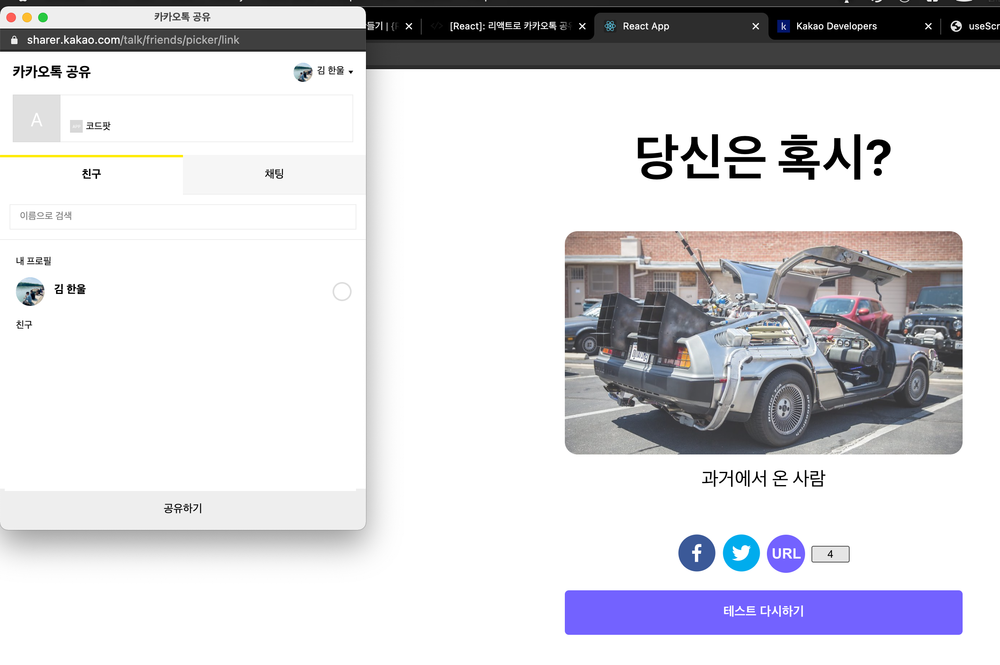
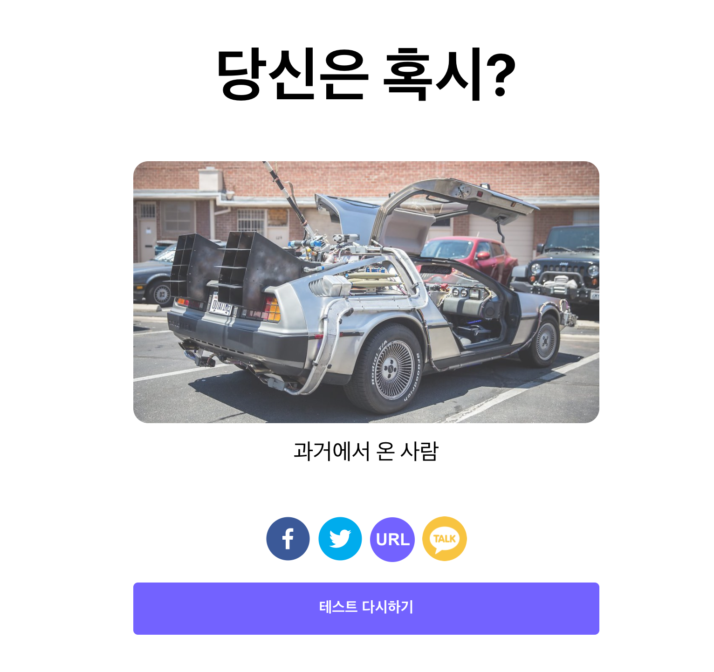

카카오는 다른 소셜 미디어와는 달리 사용하는 방식이 조금 까다롭고, 번거롭습니다. 천천히 하나씩 해보도록 하겠습니다.

### 카카오 ID 등록하기

카카오 공유하기를 사용하려면 카카오에 앱을 등록해야 합니다. [링크](https://developers.kakao.com/console/app)로 이동해서 앱을 등록해 보도록 하겠습니다.

페이지로 이동하면 애플리케이션 추가하기 버튼을 눌러 주세요.

아래와 같이 팝업이 뜨면, 이름과 사업자명을 입력해 줍니다.

현재 우리는 사업자가 없기 때문에 앱 이름과 같은 것을 사업자명에 넣어 줍니다.



그리고 나서 생성된 App 상세 페이지로 들어 갑니다.



여기서 Javascript키를 사용할 예정이니 메모장에 따로 복사해 놓습니다.

그리고 플랫폼 → Web으로 들어가 카카오톡에서 허용할 URL을 추가합니다.



아래와 같이 http://localhost:3000을 등록해주세요.



### 카카오 sdk 사용 방법

카카오의 경우, 아래 사진처럼 `javascript` `SDK`를 불러와서 사용해야 합니다. 즉, `html` 내에서 `script` 태그를 통해서 카카오의 `javascript` 파일을 불러오고, `kakao SDK`를 통해 버튼을 컨트롤해야 합니다.

SDK 사용법 → [링크](https://developers.kakao.com/docs/latest/ko/getting-started/sdk-js)



### useScript hooks 만들기

`React`에서 `html`에 `script`를 넣는 방법을 직접 구현할 수 있지만, 이 것 또한 많은 사람들이 고민해 놓은 과제이므로 [usehooks](https://usehooks.com/useScript/) 사이트에서 다른 사람들이 만들어 놓은 `hooks`를 사용해 보도록 하겠습니다.

`useScript`의 기능은 `src`에 해당하는 `script`를 불러오고, `script`의 상태를 결과 값으로 내려주는 `hooks`입니다. 이렇게 사용하는 이유는 `script`를 비동기로 불러오기 때문에 `script`가 다 불러왔을 때 우리가 원하는 작업들을 하기 위함입니다.

`src` 아래 `hooks.js` 파일을 하나 만들고, 아래 코드를 붙여넣기 해줍니다.

```jsx
// hooks.js
import { useState, useEffect } from "react";

function useScript(src) {
	// Keep track of script status ("idle", "loading", "ready", "error")
	const [status, setStatus] = useState(src ? "loading" : "idle");

	useEffect(
		() => {
			// Allow falsy src value if waiting on other data needed for
			// constructing the script URL passed to this hook.
			if (!src) {
				setStatus("idle");
				return;
			}

			// Fetch existing script element by src
			// It may have been added by another intance of this hook
			let script = document.querySelector(`script[src="${src}"]`);

			if (!script) {
				// Create script
				script = document.createElement("script");
				script.src = src;
				script.async = true;
				script.setAttribute("data-status", "loading");
				// Add script to document body
				document.body.appendChild(script);

				// Store status in attribute on script
				// This can be read by other instances of this hook
				const setAttributeFromEvent = (event) => {
					script.setAttribute(
						"data-status",
						event.type === "load" ? "ready" : "error"
					);
				};

				script.addEventListener("load", setAttributeFromEvent);
				script.addEventListener("error", setAttributeFromEvent);
			} else {
				// Grab existing script status from attribute and set to state.
				setStatus(script.getAttribute("data-status"));
			}

			// Script event handler to update status in state
			// Note: Even if the script already exists we still need to add
			// event handlers to update the state for *this* hook instance.
			const setStateFromEvent = (event) => {
				setStatus(event.type === "load" ? "ready" : "error");
			};

			// Add event listeners
			script.addEventListener("load", setStateFromEvent);
			script.addEventListener("error", setStateFromEvent);

			// Remove event listeners on cleanup
			return () => {
				if (script) {
					script.removeEventListener("load", setStateFromEvent);
					script.removeEventListener("error", setStateFromEvent);
				}
			};
		},
		[src] // Only re-run effect if script src changes
	);

	return status;
}

export { useScript };
```

### SocialButtonGroup 컴포넌트에서 script 불러오기

```jsx
// components/SocialButtonSection/index.js
...
import { useScript } from "hooks";
...
const SocialButtonGroup = () => {
...
	const status = useScript("https://developers.kakao.com/sdk/js/kakao.js");
...
};

export default SocialButtonGroup;
```

위와 같이 코드를 추가해 줍니다. 코드의 의미를 설명하자면 렌더링이 시작될 때 `useScript hook`을 통해 `script`를 불러오기 시작합니다. 그리고 나서 `script`가 다 불러와지면 `status` 값이 `ready`로 변경됩니다.

### 카카오 sdk 초기화

`sdk`가 로딩이 완료되면, `sdk` 문서대로 `sdk`를 초기화 하는 과정이 필요합니다.

아래 코드를 `SocialButtonSection`에 추가해 줍니다.

```jsx
// components/SocialButtonSection/index.js
...
const SocialButtonGroup = () => {
	...
	const status = useScript("https://developers.kakao.com/sdk/js/kakao.js");

	// kakao sdk 초기화하기
	// status가 변경될 때마다 실행되며, status가 ready일 때 초기화를 시도합니다.
	useEffect(() => {
		if (status === "ready" && window.Kakao) {
			// 중복 initialization 방지
			if (!window.Kakao.isInitialized()) {
				// 두번째 step 에서 가져온 javascript key 를 이용하여 initialize
				window.Kakao.init("d2f8bffda79329fc9278a8bed23d88da");
			}
		}
	}, [status]);
	...

```

### 카카오 공유 버튼 핸들러 만들기

이제 카카오 SDK도 초기화하였으니, 카카오 버튼을 클릭했을 때 SDK를 활용하여 카카오톡 링크를 생성하는 방법을 알아보도록 하겠습니다. 카카오 메시지에는 여러가지 방법들이 있는데, 그 중에서 가장 간단하게 사용할 수 있는 카카오 스크랩 메시지 보내기 기능을 사용해 보도록 하겠습니다. 상세 설명 ([링크](https://developers.kakao.com/docs/latest/ko/message/js#create-message))

```jsx
// components/SocialButtonSection/index.js
...
const SocialButtonGroup = () => {
	...
	const handleKakaoButton = () => {
		window.Kakao.Link.sendScrap({
			requestUrl: currentUrl,
		});
	};
	...
	return (
		<GridContainer>
			...
			<button onClick={handleKakaoButton}>4</button>
		</GridContainer>
}
```

정상적으로 잘 작동하는지 확인해 보도록 하겠습니다.



위와 같이 4번 버튼을 클릭하면 카카오 홈페이지에 등록한 코드팟 이름으로 공유하기가 정상적으로 열리는 것을 알 수 있습니다.

### 카카오 버튼 디자인하기

이제 카카오 버튼을 디자인해 보도록 하겠습니다.

아래의 아이콘 이미지를 `assets/images` 폴더에 넣어 주세요.


```jsx
// components/SocialButtonSection/index.js
import kakaoLogo from "assets/images/kakao.png";

...
const KakaoShareButton = styled.a`
	cursor: pointer;
`;

const KakaoIcon = styled.img`
	width: 48px;
	height: 48px;
	border-radius: 24px;
`;
...

const SocialButtonGroup = () => {
	...
	return (
		<GridContainer>
			...
			<KakaoShareButton onClick={handleKakaoButton}>
				<KakaoIcon src={kakaoLogo}></KakaoIcon>
			</KakaoShareButton>
			...
		</GridContainer>
	);
};

export default SocialButtonGroup;
```

카카오 버튼의 스타일을 적용하고, 위와 같이 코드를 변경해 줍니다.

이제 다시 실행해 보도록 하겠습니다.



정상적으로 버튼이 이쁘게 나온 것을 알 수 있습니다!!! 👏👏👏

## 전체 코드 살펴보기

- 깃허브에서 전체 코드 보기 -> [바로가기](https://github.com/CodePotStudio/starter-quiz-app/tree/week06-06)

## Somthing More!!!

반드시 공부해야 하는 건 아니지만, 도움이 될 만한 자료들을 공유하고 있습니다.

- javascript에서 script를 불러오는 방법 ([링크](https://www.youtube.com/watch?v=tJieVCgGzhs))
- sdk란? ([링크](https://ko.wikipedia.org/wiki/%EC%86%8C%ED%94%84%ED%8A%B8%EC%9B%A8%EC%96%B4_%EA%B0%9C%EB%B0%9C_%ED%82%A4%ED%8A%B8))
- custom hooks 만들기 ([링크](https://ko.reactjs.org/docs/hooks-custom.html))
