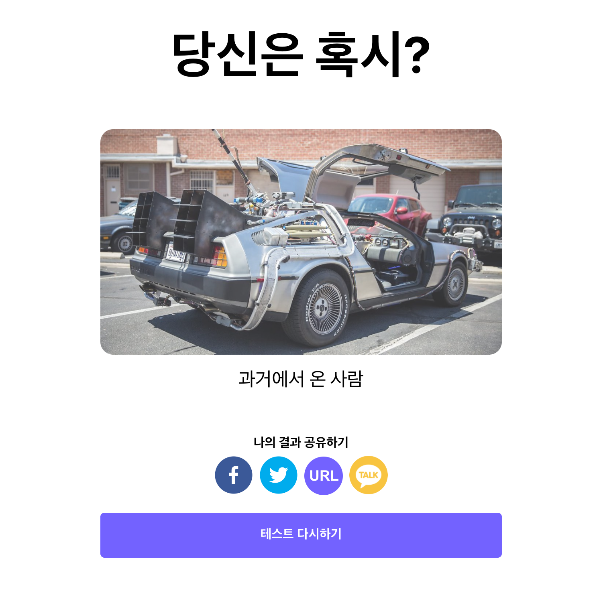

마지막으로 버튼들 위에 나의 결과 공유하기를 문구를 추가해 보도록 하겠습니다.

```jsx
// components/SocialButtonSection/index.js
...
// Button Group을 감싸는 Flex Container 추가
const FlexContainer = styled.div`
	display: flex;
	flex-direction: column;
	align-items: center;
`;

// 공유 버튼 제목란 추가
const Title = styled.div`
	font-size: 16px;
	text-align: center;
	margin-bottom: 8px;
	font-weight: bold;
`;

const SocialButtonGroup = () => {
	...
	return (
		<FlexContainer>
			<Title>나의 결과 공유하기</Title>
			<GridContainer>
				<CopyToClipboard text={currentUrl}>
					<URLShareButton>URL</URLShareButton>
				</CopyToClipboard>
				<KakaoShareButton onClick={handleKakaoButton}>
					<KakaoIcon src={kakaoLogo}></KakaoIcon>
				</KakaoShareButton>
				<FacebookShareButton url={currentUrl}>
					<FacebookIcon size={48} round={true} borderRadius={24}></FacebookIcon>
				</FacebookShareButton>
				<TwitterShareButton url={currentUrl}>
					<TwitterIcon size={48} round={true} borderRadius={24}></TwitterIcon>
				</TwitterShareButton>
			</GridContainer>
		</FlexContainer>
	);
};
```

위와 같이 코드를 변경하고 재실행 해보도록 하겠습니다.



정상적으로 모든게 이쁘게 나온 것을 알 수 있습니다

이로써 길고 길었던 소셜 버튼 공유하기가 끝났습니다!! 👏👏👏

## 전체 코드 살펴보기

- 깃허브에서 전체 코드 보기 -> [바로가기](https://github.com/CodePotStudio/starter-quiz-app/tree/week06-07)
