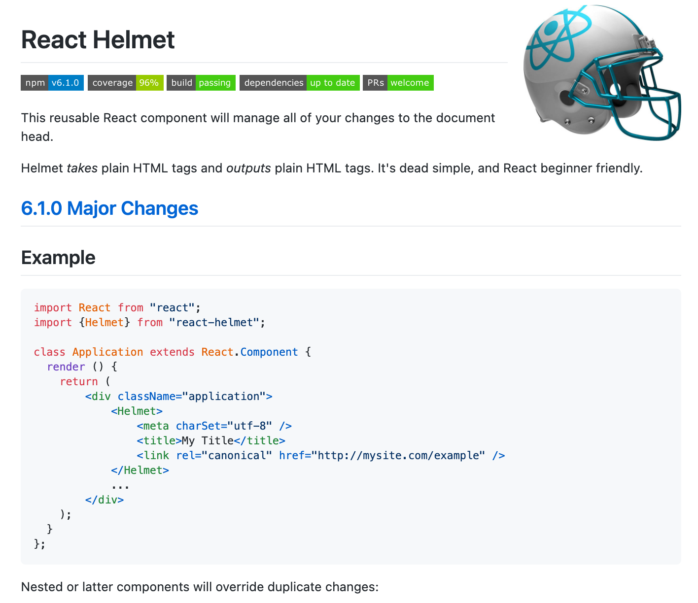
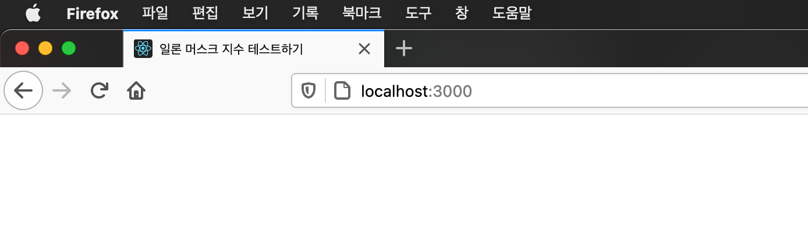
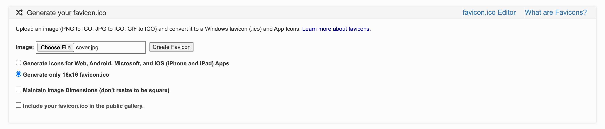
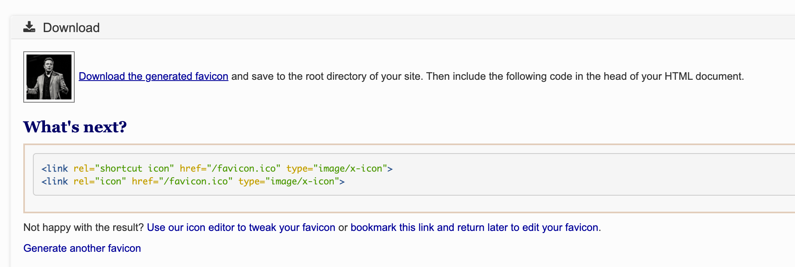
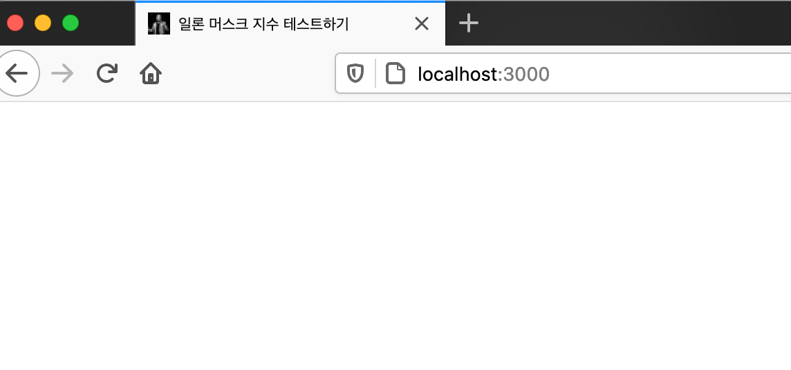

이제 우리의 설문 조사에 메타 데이터를 추가해 보도록 하겠습니다.

메타 데이터를 직접적으로 `index.html`에 추가하는 방법이 있지만, 이는 조건에 따라 동적으로 변경하기 어려운 단점이 있습니다. 왜냐하면 저희는 페이지별로 메타 데이터가 달라야 하기 때문에, `index.html`에 메타 데이터를 추가하면 다뤄줘야 하는 것들이 이만저만이 아닙니다. 그래서 저희는 `React-Helmet` 라이브러리를 사용하여 동적으로 메타 데이터를 변경해 줄 예정입니다.

## React Helmet 설치하기

```jsx
npm install --save react-helmet
```

## React Helmet 사용법 알아보기

라이브러리 `github` 주소 → ([링크](https://github.com/nfl/react-helmet))



`github`의 설명을 보아하니, `Helmet` 컴포넌트를 `import`하고, `Helmet` 컴포넌트 내부 `chlidren`으로 `html`에서 `meta` 태그를 사용하는 방식처럼 사용하면 되는 것 같습니다.

### 기존의 meta 데이터 정리하기

meta 데이터를 바꾸기 전에 CRA에서 셋팅하는 기본 meta 데이터들부터 정리하고 시작하도록 하겠습니다.

```jsx
// public/index.html
<!DOCTYPE html>
<html lang="en">
  <head>
  </head>
  <body>
    <noscript>You need to enable JavaScript to run this app.</noscript>
    <div id="root"></div>
  </body>
</html>
```

위와 같이 `head` 태그 안에 존재하던 `tag`들을 모두 삭제해 주세요.

### title 변경하기

`React-Helmet`을 활용하여 우선 `title`부터 변경해 보도록 하겠습니다.

```jsx
// src/App.js
import { Helmet } from "react-helmet";

function App() {
	...
	return (
		<ThemeProvider theme={theme}>
			...
			<Helmet>
				<title>일론 머스크 지수 테스트하기</title>
			</Helmet>
			...
		</ThemeProvider>
	);
}

export default App;
```

위와 같이 코드를 바꾸고 실행해 보도록 하겠습니다.



_React App_ 에서 _일론 머스크 지수 테스트하기_ 로 쉽게 변경된 것을 알 수 있습니다.

### 파비콘 이미지 생성하기

파비콘은 인터넷 웹 브라우저의 주소창에 표시되는 웹사이트나 웹페이지를 대표하는 아이콘입니다. 지금은 React 로고로 되어 있는데, 이것을 우리가 원하는 favicon 이미지로 변경해 보도록 하겠습니다.

favicon은 기본적으로 ico 확장자를 사용하며, 파비콘의 맞는 사이즈가 정해져 있습니다. 즉 기존에 가지고 있던 이미지를 이에 맞추어 수정해주어야 하는데, 과정이 존재합니다. 하지만 favicon-generator 페이지를 사용하면 손쉽게 favicon을 만들수 있습니다. favicon-generator → 홈페이지 ([링크](https://www.favicon-generator.org/))

최초 렌더링 페이지에서 노출되는 아래의 일론 머스크 이미지로 파비콘을 만들어 보도록 하겠습니다.




Choose File을 클릭하여, 우리가 사용할 이미지를 추가해 주세요.

그리고 위와 같이 옵션은 데스크탑에서만 필요하기 때문에 _Generate only 16x16 favicon.ico_ 만 추가합니다.



_Download the generated favicon_ 을 클릭하여 favicon을 다운 받습니다.

그리고 다운로드 받은 favicon 이미지를 assets/images 폴더 안에 추가합니다.

### favicon 이미지 적용하기

`favicon`을 변경할 때는 `title`을 변경할 때와 마찬가지로 `React-Helmet`을 사용합니다.

아래와 같이 코드를 바꿔주세요.

```jsx
// src/App.js
import favicon from "assets/images/favicon.ico";
...

function App() {
	...
	return (
		<ThemeProvider theme={theme}>
			<Helmet>
				<title>일론 머스크 지수 테스트하기</title>
				<link rel="icon" href={favicon} />
			</Helmet>
			...
		</ThemeProvider>
	);
}

export default App;
```

실행해 보도록 하겠습니다.



우리가 원하는대로 favicon이 바뀐 것을 확인 할 수 있습니다.

다음 파트에서는 open-graph를 업데이트 하는 방법에 대해서 알아보도록 하겠습니다.

## 전체 코드 살펴보기

- 깃허브에서 전체 코드 보기 -> [바로가기](https://github.com/CodePotStudio/starter-quiz-app/tree/week07-01)
