우선 open graph를 테스트하기 위해선 실제 배포된 사이트가 필요합니다. 이유는 메타태그가 있는 사이트에 접속해서 검색 엔진이 메타태그를 크롤링해야 하는데, 내 컴퓨터에만 있는 localhost는 검색엔진이 크롤링을 할 수 없기 때문입니다.

그래서 실제 유효한 url를 주소를 가지도록 netlify에 배포해 보도록 하겠습니다.

### github으로 현재 프로젝트 push하기

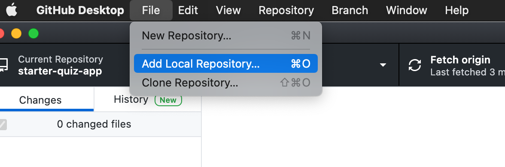

우선 github desktop을 열고, 왼쪽 상단에 File → Add Local Repository를 클릭해 주세요.

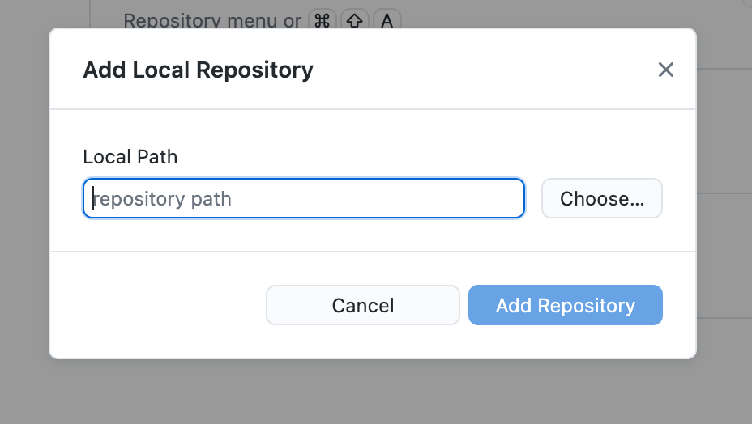

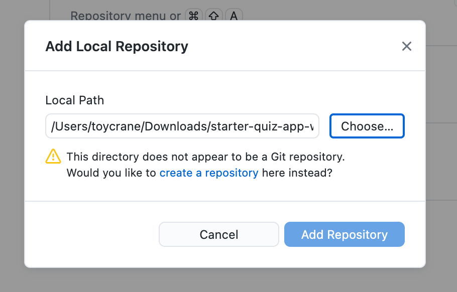

그리고 7주차 코드를 다운 받은 폴더를 지정해 줍니다.

그리고 나서 create a repository를 클릭해 레포지터리를 하나 생성해 줍니다.

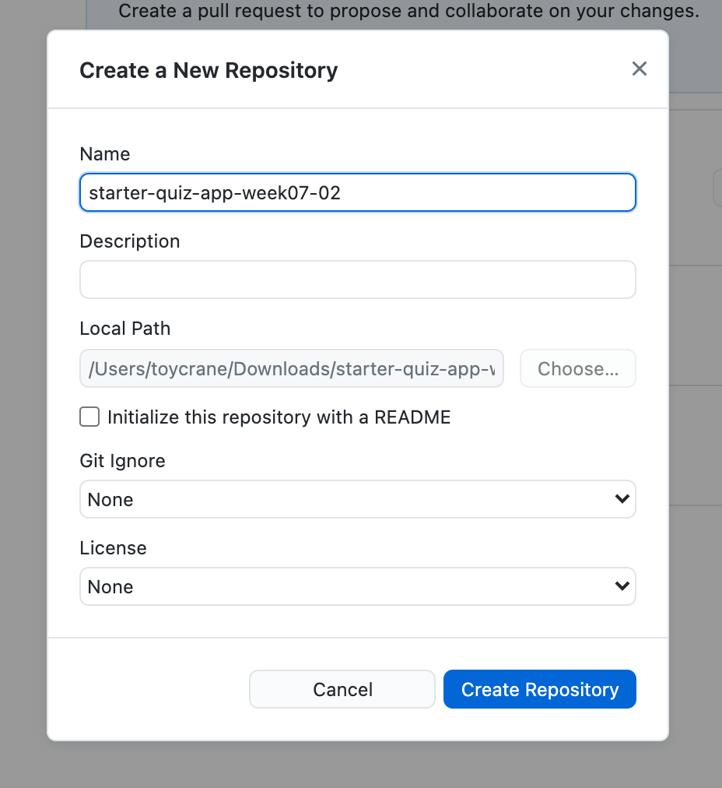

이름을 정하고, 맨 아래 Create Repository를 클릭해 Repository 생성을 완료합니다.

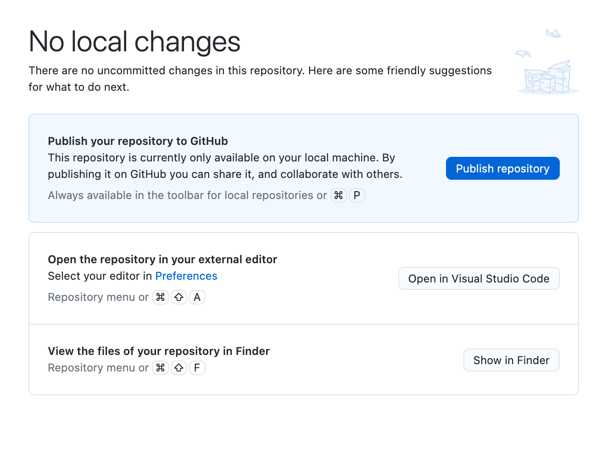

그리고 나서 메인 페이지에서 Publish Repository 버튼을 클릭하여 github에 local Repository를 Push하여 줍니다.

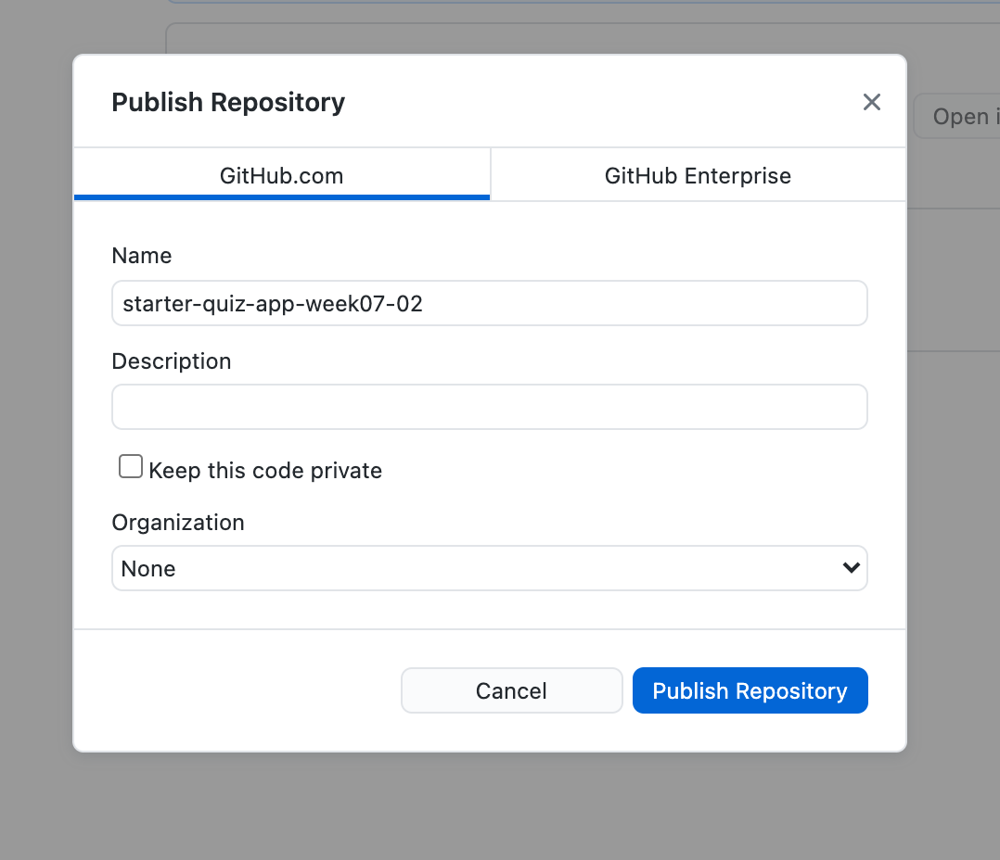

여기서 Keep this code private에 check를 풀어주고, Publish Repository를 클릭하여 레포지터리를 생성합니다.

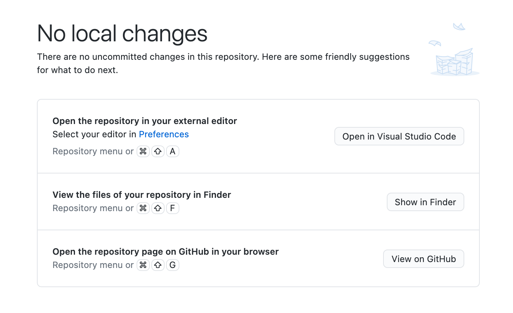

view on Github 버튼을 클릭하여, 정상적으로 push가 잘되었는지 github 페이지에서 확인합니다.

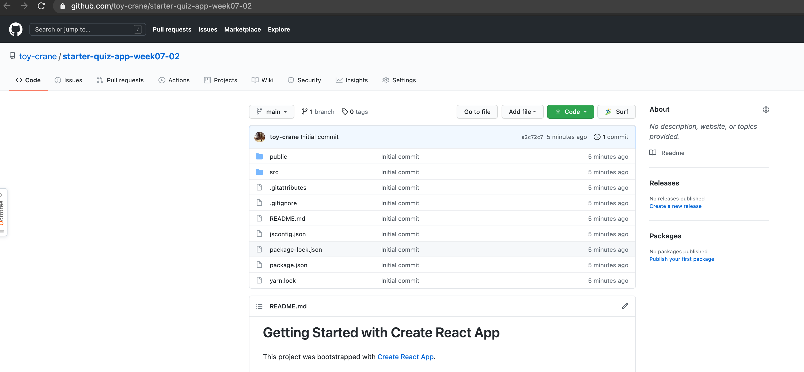

## netlify에서 github repository 배포하기

정상적으로 Repository가 생성된 것이 확인되었고, 이제 Netlify 홈페이지([링크](https://app.netlify.com/))로 이동합니다.

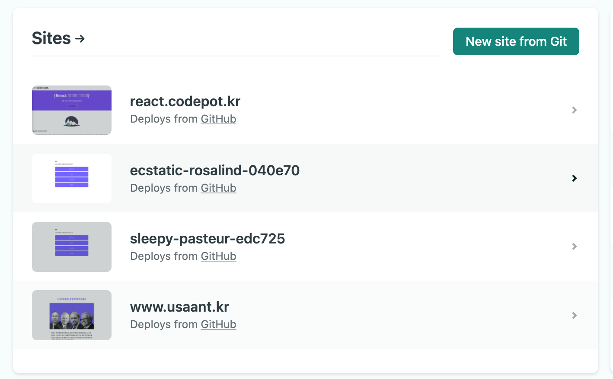

화면 중앙에 있는 New site from Git 버튼을 클릭해 줍니다.

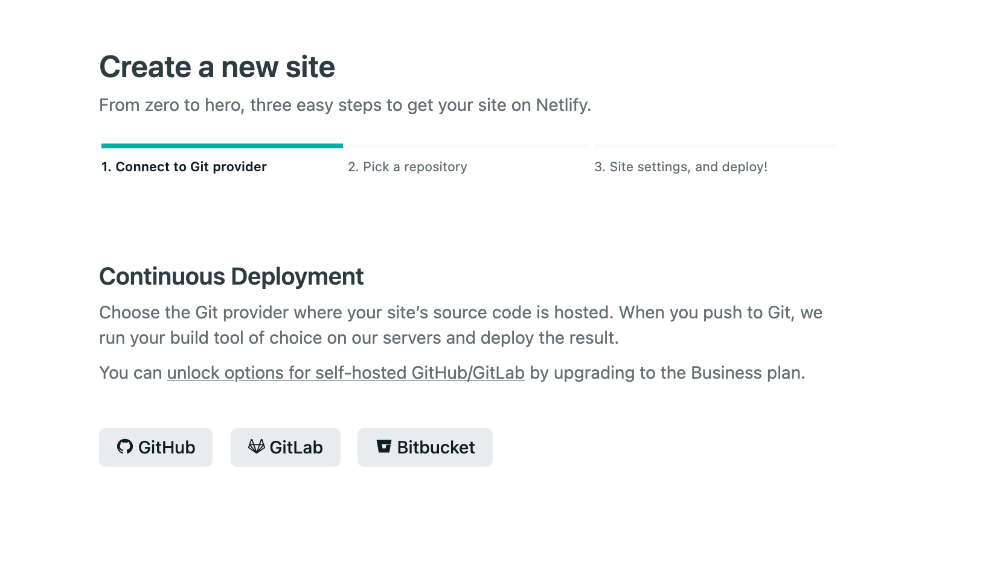

netlify에서 어디에서 소스를 가져와서 배포할 것이냐를 묻는데, github를 클릭해 줍니다.

Github 로그인 절차를 진행합니다.

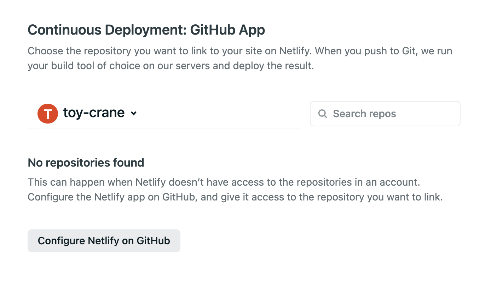

위 화면처럼 repository를 찾을 수 없다고 나오는데, 이는 repository에 대해 접근 권한을 설정해주지 않아서 입니다. configure Netlify on Github 버튼을 클릭합니다.

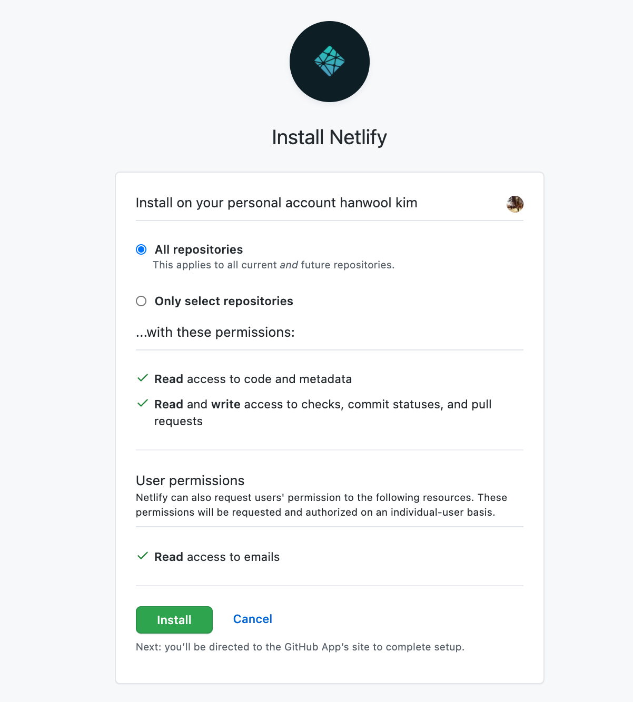

All repositories를 선택하고, Install 버튼을 클릭해 줍니다.

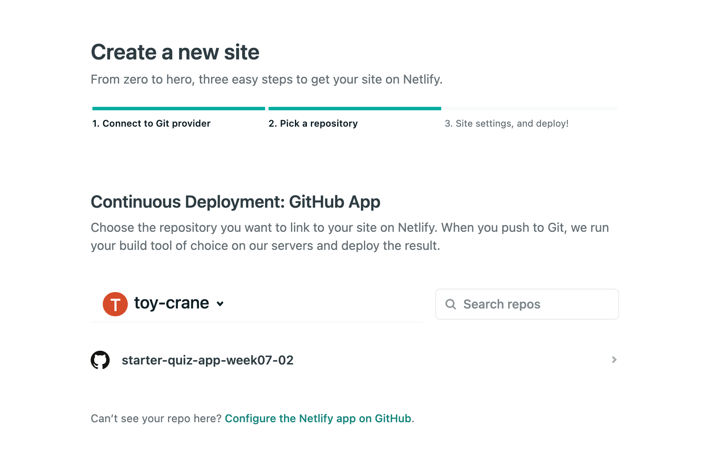

위와 같이 repository가 추가되었다면 우리가 배포할 repository를 클릭해 줍니다.

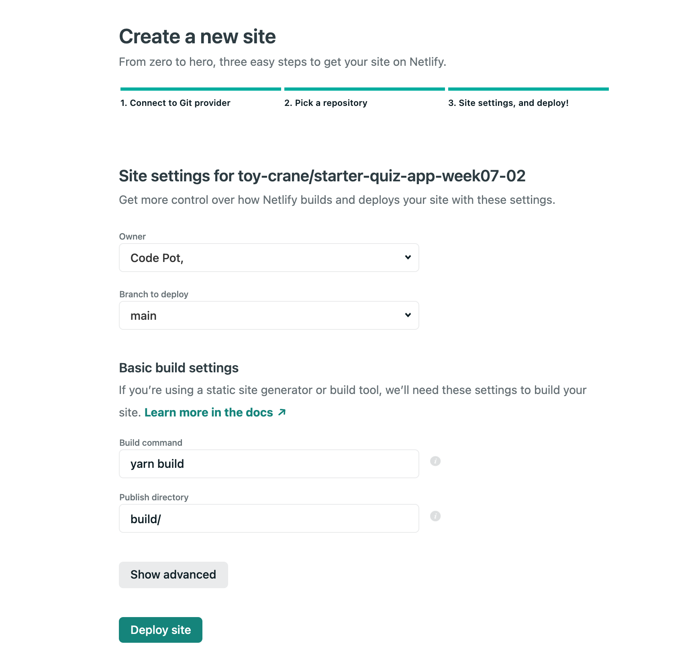

여기서 **주의할 사항이 하나** 있습니다.

- github에서 소스 코드를 한 번에 받으신 분들은 main branch로 설정해 주세요
- git clone을 통해 받으신 분들은 week07-01 브랜치로 설정해 주세요.

그리고 나서 Deploy site 버튼을 눌러 배포를 시작합니다.

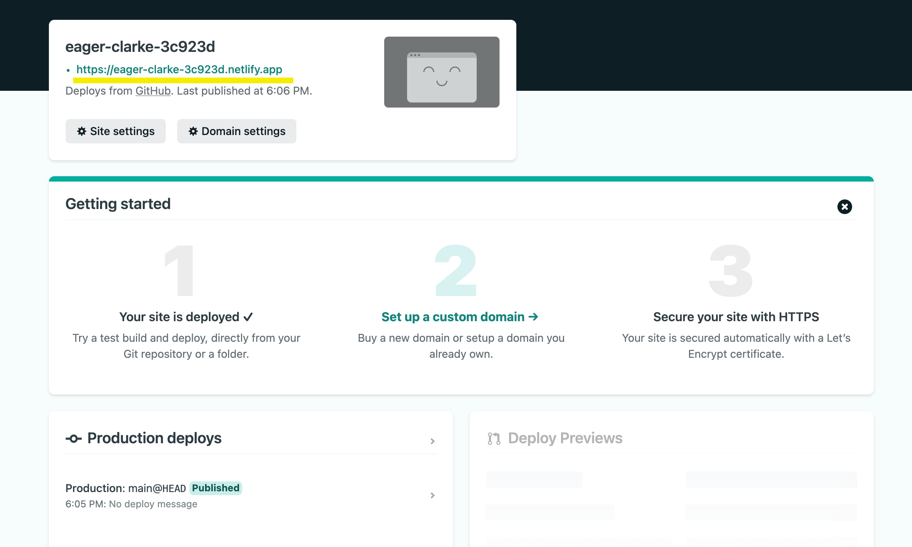

위와 같이 publish 태그 버튼이 추가되면 형광색으로 표시된 URL로 접속하여 정상적으로 배포가 되었는지 확인합니다.

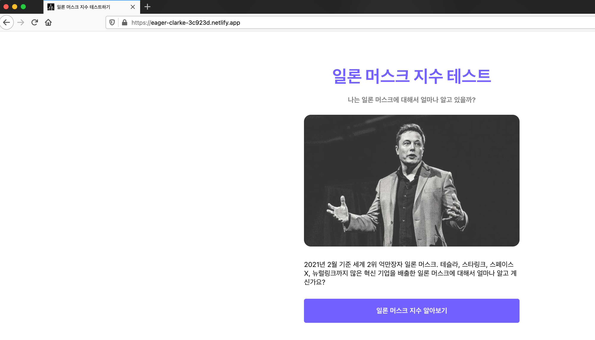

정상적으로 랜딩 페이지가 뜨는 것 뿐만 아니라, 우리가 적용했던 title과 favicon도 정상적으로 잘 나오는 것을 알 수 있습니다.
