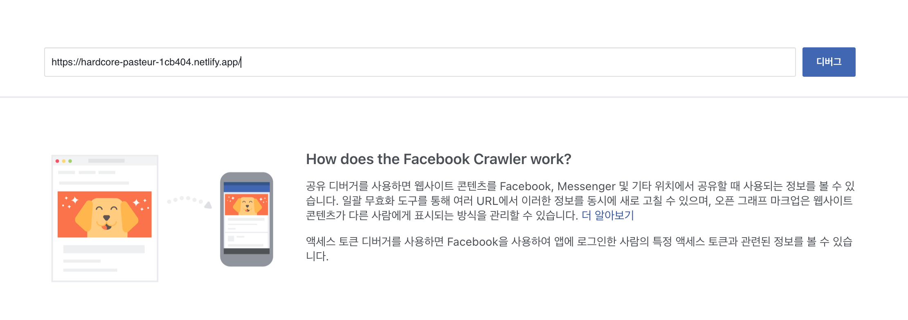

## Open Graph?


카카오톡이나 페이스북 같은데 링크를 공유하면 아래처럼 제목과 간단한 설명, 그리고 이미지가 나오는 것을 많이 보셨을껍니다. 위 링크에 포함되는 데이터들은 전부 다 head 안 meta 태그에 포함되어 있습니다. 이렇게 사용하는 방식을 open graph 프로토콜 이라고 합니다.

## Open Graph의 작동원리

Open Graph는 아래와 같은 순서로 작동합니다.

- 유저가 open graph가 포함된 링크를 입력합니다.
- 각 서비스 (카카오톡, 페이스북, 트위터, 슬랙 등)가 입력된 문자가 유효한 링크인지를 파악합니다.
- 링크임을 확인했으면 해당 사이트로 접속하여 head 태그 안 meta 태그의 정보를 긁어 옵니다 (크롤링)
- 긁어온 meta 태그의 정보를 유저에게 보여 줍니다

## Open Graph 데이터 추가하기

open graph의 원리에 대해 얼추 알았으니, 이제 메타 태그를 추가 해보도록 하겠습니다.

```jsx
// src/App.js
...
import elon from "assets/images/elon.jpg";
...

function App() {
	...
	return (
		<ThemeProvider theme={theme}>
			<Helmet>
				...
				{/* URL 정보 */}
				<meta property="og:url" content={currentUrl} />
				{/* title 정보 */}
				<meta property="og:title" content="일론 머스크 지수 테스트하기" />
				{/* 페이지 상세 정보 */}
				<meta
					property="og:description"
					content="나는 일론 머스크에 대해서 얼마나 알고 있을까?"
				/>
				{/* 페이지 대표 이미지 정보 */}
				<meta property="og:image" content={elon} />

				{/* 트위터 메타 정보 */}
				<meta name="twitter:title" content="일론 머스크 지수 테스트하기" />
				<meta name="twitter:description" content="나는 일론 머스크에 대해서 얼마나 알고 있을까?" />
				<meta name="twitter:image" content={elon} />
			</Helmet>
			...
			</ThemeProvider>
	);
}

export default App;
```

실행해 보도록 하겠습니다


개발자 도구를 열어 우리가 원하는대로 meta tag가 잘 들어 갔는지 확인합니다.

정상적으로 추가된 것을 확인할 수 있습니다.

## netlify에 배포하기

메타 태그가 추가하였으니, 이제 다시 배포를 해보도록 하겠습니다.

배포를 하는 것은 간단한데, 변경된 내용을 커밋하고, github로 코드를 push하면 자동으로 netlify에서 코드의 변경 사항을 감지하고 배포를 시작합니다.

### 코드 커밋하기


VS Code 왼쪽에서 3번째 아이콘을 클릭합니다.
그리고 커밋 메시지를 작성 후 Command + Enter 혹은 Control + Enter를 입력합니다.


그리고 Source Control 탭에서 마지막 ... 을 클릭하고, Push를 클릭합니다.

위 쪽의 파란색 선이 보이다가 사라지면 정상적으로 push가 완료된 것입니다.

### 배포 확인하기


github에 push가 되면 자동으로 netlify가 코드의 변경사항을 인지하고, build를 시작합니다.


배포가 완료되면 URL로 접속하여 meta 정보가 잘 들어갔는지 확인합니다.

정상적으로 태그가 있는 것이 확인되니, 카카오톡에 링크를 공유해 보도록 하겠습니다.


그런데 Preview not available이 나오면서 우리가 원하는 대로 동작하지 않습니다 ㅠㅠ

이유가 무엇일까요??

## Prerendering (SEO 최적화)

카카오톡 입장에서 생각해 보겠습니다.

카카오톡에 링크가 입력이 완료된 것을 확인했고, 카카오톡에서 링크로 접속하여 메타데이터를 긁어 오려고 합니다.

```jsx
// index.html
<!DOCTYPE html>
<html lang="en">
	<head> </head>
	<body>
		<noscript>You need to enable JavaScript to run this app.</noscript>
		<div id="root"></div>
	</body>
</html>
```

그런데 웹페이지에 접속했더니 위와 같이 아무것도 없는 html만 내려줍니다. 그래서 카카오톡 입장에서는 아무것도 표현해 줄 수 가 없습니다.
React는 javascript가 실행되어야 HTML에 element들이 추가되는데, 크롤러는 javascript를 실행하지 않습니다. (javascript를 실행하는 크롤러도 있지만, 없다는 가정하에 만드는 것이 좋습니다)

그래서 주로 많이 사용하는 방법은 `react-snap` 라이브러리를 활용하여 각 페이지 별로 최초에 내려줄 HTML을 내려주는 방법이 있습니다. 또는 SSR 프레임 워크(Next-JS)를 사용하는 방법이 있습니다.

하지만 netlify에는 그 것보다 훨씬 더 쉽게 처리할 수 있습니다.

### netlify에 pre-rendering 설정하기


왼쪽 상단 Site Setting 버튼을 클릭합니다.


왼쪽에서 Build & Deploy 탭을 선택하고, 아래쪽으로 내려와 Prerendering에서 Enable prerendering with Netlify를 선택해 줍니다. 그리고 Save를 눌러 꼭 저장해 주세요.


설정을 다시 했으니, 배포를 다시 해보도록 하겠습니다.

메인 페이지에서 하단 Production deploys를 클릭합니다.


Trigger deploy 버튼을 클릭하고, Deploy site를 클릭합니다.

그러면 netlify에서 build와 deploy가 진행됩니다.

배포가 완료되었으니, 링크를 다시 한 번 공유 해보도록 하겠습니다.


여전히 작동을 안합니다 ㅠㅠ

## 카카오, 페이스북 Open Graph 초기화하기

이유는 각 서비스(카카오, 페이스북, 트위터 등등)에서 링크가 입력될 때마다 크롤링을 하는 것이 아니라 이전의 결과를 저장해 놓고 일정 기간은 그 결과를 사용하기 때문입니다.

그렇기 때문에 메타 데이터를 업데이트 한 경우에는 가장 많이 쓰는 페이스북과 카카오의 메타 데이터는 초기화를 해주는 것이 좋습니다.

### 카카오 Open Graph 데이터 초기화 하기


카카오 캐시 초기화 사이트 ([링크](https://developers.kakao.com/tool/clear/og))로 이동해서 우리 서비스의 주소를 넣고 초기화 해주세요.


그리고 나서 다시 실행하면 위와 같이 정상적으로 나오는 것을 알 수 있습니다.

### 페이스북 Open Graph 데이터 초기화하기

페이스북 Open Graph 캐시 초기화 ([링크](https://developers.facebook.com/tools/debug/))로 이동해 주세요.

마찬가지로 URL을 입력하고, 디버그 버튼을 클릭합니다.



초기화가 필요하다면 다시 스크랩을 클릭합니다.


이로써 로딩 페이지에 Open Graph 데이터를 추가하는 방법을 알아 보았습니다.

다음 파트에서는 결과 페이지에서 동적으로 Open Graph를 추가하는 방법을 알아보도록 하겠습니다.

## 전체 코드 살펴보기

- 깃허브에서 전체 코드 보기 -> [바로가기](https://github.com/CodePotStudio/starter-quiz-app/tree/week07-02)

## Somthing More!!!

반드시 공부해야 하는 건 아니지만, 도움이 될 만한 자료들을 공유하고 있습니다.

- 링크의 미리보기 제목, 설명, 이미지를 결정하는 open graph 태그 ([링크](https://blog.ab180.co/posts/open-graph-as-a-website-preview))
- SPA에서 서버사이드 렌더링을 구축하지 않고 SEO 최적화하기 ([링크](https://velog.io/@byseop/SPA%EC%97%90%EC%84%9C-%EC%84%9C%EB%B2%84%EC%82%AC%EC%9D%B4%EB%93%9C-%EB%A0%8C%EB%8D%94%EB%A7%81%EC%9D%84-%EA%B5%AC%EC%B6%95%ED%95%98%EC%A7%80-%EC%95%8A%EA%B3%A0-SEO-%EC%B5%9C%EC%A0%81%ED%99%94%ED%95%98%EA%B8%B0))
