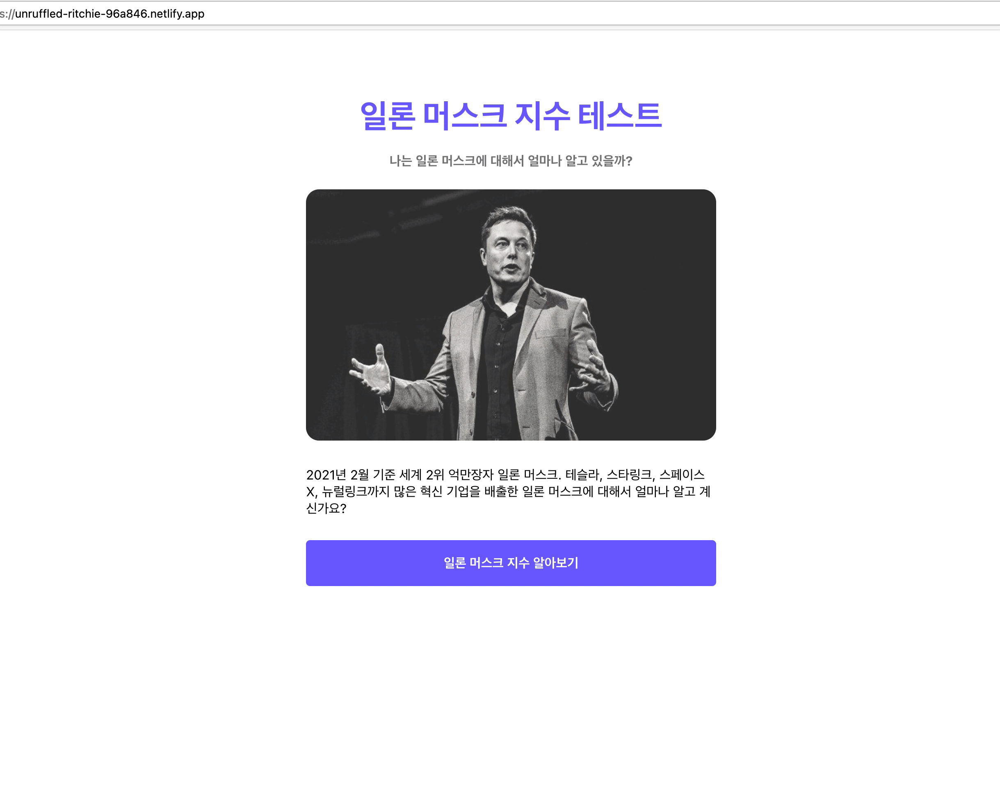

동적으로 Open Graph를 추가하기 전에 한 가지 문제점이 있는데, 이 것부터 해결하고 가도록 하겠습니다.



위 화면처럼 결과 페이지 혹은 로딩 페이지에서 새로고침을 하면 netlify 404 페이지가 뜹니다. 이는 localhost에서는 발생하지 않고, netlify에 배포했을 때만 발생하게 됩니다.

## React Router 문제 해결하기

이러한 문제가 발생하는 이유는 우리가 각 URL에 맞추어 페이지를 보여주는 Router 역시 React에 포함되어 있기 때문입니다.

netlify의 최초 설정은 / 로 들어왔을 때, `index.html`을 내려주는 것으로 되어 있습니다. 그런데 netlify에는 `/result/elon` 으로 들어왔을 땐 어떤 html을 내려주어야 할지 설정이 되어 있지 않습니다.

그래서 `/result/elon` url로 들어오더라도 `index.html`을 내려주고, `index.html`에 있는 React-Router가 Routing을 해 결과 페이지를 보여주도록 변경하여야 합니다.

## netlify Redirect 조건 설정하기

public 폴더 내에 \_redirects 파일을 하나 만듭니다. 확장자 없이 \_redirects입니다.

그리고 아래의 코드를 저장합니다.

```jsx
* /index.html 200
```

위 코드의 의미는 어떠한 경로로 들어오던 간에 index.html를 내려주겠다는 의미입니다.

위 코드를 추가하고 커밋을 하여, 배포합니다


이제 새로고침을 하더라도, 404 페이지가 뜨지 않고, 정상적으로 동작하는 것을 알 수 있습니다.

## 전체 코드 살펴보기

- 깃허브에서 전체 코드 보기 -> [바로가기](https://github.com/CodePotStudio/starter-quiz-app/tree/week07-03)

## Somthing More!!!

반드시 공부해야 하는 건 아니지만, 도움이 될 만한 자료들을 공유하고 있습니다.

- Page Not Found Error on Netlify Reactjs React Router solved ([링크](https://dev.to/rajeshroyal/page-not-found-error-on-netlify-reactjs-react-router-solved-43oa))
