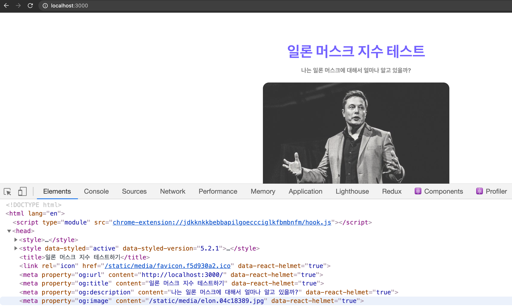
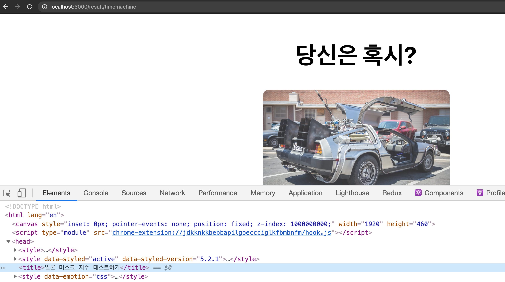
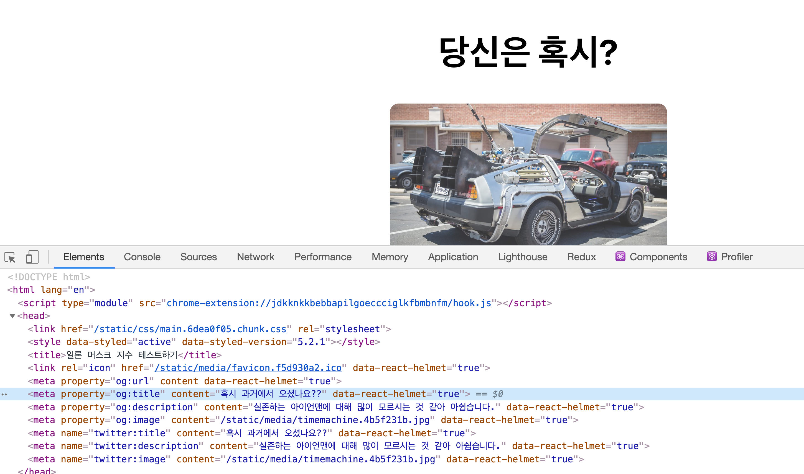
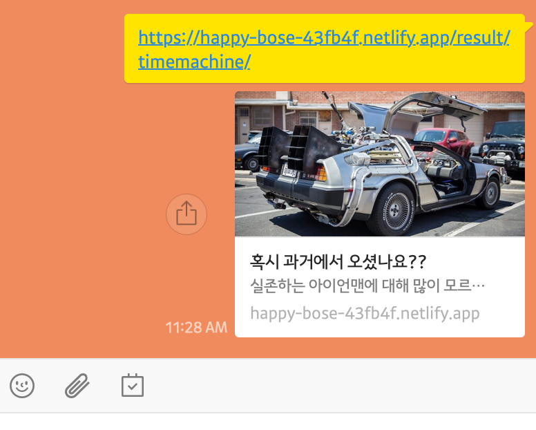

이제 결과 페이지의 결과도 공유할 수 있게끔 만들어 보도록 하겠습니다.

## Landing 페이지로 메타데이터 이동시키기

우선 기존에 있던 메타 데이터는 `Landiing` 페이지에서만 적용되도록 `Landing` 페이지로 이동 시키도록 하겠습니다.

```jsx
// src/App.js
...
import favicon from "assets/images/favicon.ico";
import { Helmet } from "react-helmet";

function App() {
	...
	return (
		<ThemeProvider theme={theme}>
			...
			<Helmet>
				{/* 오픈 그래프 메타 데이터 이전 */}
				<title>일론 머스크 지수 테스트하기</title>
				<link rel="icon" href={favicon} />
			</Helmet>
			...
		</ThemeProvider>
	);
}

export default App;
```

```jsx
// src/pages/Landing/index.js
...
import { Helmet } from "react-helmet";
import elon from "assets/images/elon.jpg";
...
const Landing = () => {
	const currentUrl = window.location.href;
	return (
		{/* Helmet을 포함하여 감싸주기 위해 <> 추가 */}
		<>
			<Helmet>
				{/* URL 정보 */}
				<meta property="og:url" content={currentUrl} />
				{/* title 정보 */}
				<meta property="og:title" content="일론 머스크 지수 테스트하기" />
				{/* 페이지 상세 정보 */}
				<meta
					property="og:description"
					content="나는 일론 머스크에 대해서 얼마나 알고 있을까?"
				/>
				{/* 페이지 대표 이미지 정보 */}
				<meta property="og:image" content={elon} />
				{/* 트위터 메타 정보 */}
				<meta name="twitter:title" content="일론 머스크 지수 테스트하기" />
				<meta
					name="twitter:description"
					content="나는 일론 머스크에 대해서 얼마나 알고 있을까?"
				/>
				<meta name="twitter:image" content={elon} />
			</Helmet>
			<Container>
				<Title>일론 머스크 지수 테스트</Title>
				<SubTitle>나는 일론 머스크에 대해서 얼마나 알고 있을까?</SubTitle>
				<StyledImage src={cover} alt="cover"></StyledImage>
				<Text>
					2021년 2월 기준 세계 2위 억만장자 일론 머스크. 테슬라, 스타링크,
					스페이스 X, 뉴럴링크까지 많은 혁신 기업을 배출한 일론 머스크에 대해서
					얼마나 알고 계신가요?
				</Text>
				<Button to="/quiz">일론 머스크 지수 알아보기</Button>
			</Container>
		</>
	);
};

export default Landing;
```

코드를 실행해 보도록 하겠습니다.





Loading 페이지에는 메타 데이터가 포함되어 있지만, 결과 페이지에는 로딩 데이터가 포함되어 있지 않은 것을 확인 할 수 있습니다.

## Result 페이지에 메타데이터 추가하기

```jsx
// src/components/ResultSection/Result.js

import elon from "../../assets/images/elon.jpg";
import kimbal from "../../assets/images/kimbal.jpg";
import bezos from "../../assets/images/bezos.jpg";
import timemachine from "../../assets/images/timemachine.jpg";

const RESULT = {
	elon: {
		title: "일론 머스크",
		src: elon,
		ogTitle: "나는 아마도 일론 머스크?",
		ogDescription: "일론 머스크의 모든 것을 아는 나",
		ogImage: elon,
	},
	kimbal: {
		title: "킴벌 머스크",
		src: kimbal,
		ogTitle: "나는 아마도 일론 머스크의 동생?",
		ogDescription: "일론 머스크에 대해 이 정도까지 안다면 동생이나 다름없죠",
		ogImage: kimbal,
	},
	bezos: {
		title: "제프 베조스",
		src: bezos,
		ogTitle: "나는 아마도 일론 머스크의 천적?",
		ogDescription: "음... 설마??",
		ogImage: bezos,
	},
	timemachine: {
		title: "과거에서 온 사람",
		src: timemachine,
		ogTitle: "혹시 과거에서 오셨나요??",
		ogDescription: "실존하는 아이언맨에 대해 많이 모르시는 것 같아요.",
		ogImage: timemachine,
	},
};

export default RESULT;
```

결과 페이지의 데이터를 관리하던 RESULT 변수에 오픈 그래프 데이터를 추가해 주도록 하겠습니다.

```jsx
// src/pages/Result/index.js
...
import { Helmet } from "react-helmet";
import RESULT from "components/ResultSection/result";

const Result = ({ setScore }) => {
	...
	const { cCode } = useParams();
	const currentUrl = window.document.href;
	return (
		<>
			...
			<Helmet>
				{/* URL 정보 */}
				<meta property="og:url" content={currentUrl} />
				{/* title 정보 */}
				<meta property="og:title" content={RESULT[cCode]["ogTitle"]} />
				{/* 페이지 상세 정보 */}
				<meta
					property="og:description"
					content={RESULT[cCode]["ogDescription"]}
				/>
				{/* 페이지 대표 이미지 정보 */}
				<meta property="og:image" content={RESULT[cCode]["ogImage"]} />
				{/* 트위터 메타 정보 */}
				<meta name="twitter:title" content={RESULT[cCode]["ogTitle"]} />
				<meta
					name="twitter:description"
					content={RESULT[cCode]["ogDescription"]}
				/>
				<meta name="twitter:image" content={RESULT[cCode]["ogImage"]} />
			</Helmet>
			...
		</>
	);
};

export default Result;
```

결과 페이지에서 RESULT 변수의 값을 참조하고, 각 캐릭터 코드에 맞추어 메타 데이터를 채워 줍니다.

실행해 보도록 하겠습니다.



정상적으로 메타태그가 추가된 것을 알 수 있습니다.

이제 마지막으로 커밋을 하고, 배포를 해보도록 하겠습니다.



우리가 원하던 대로 메타 데이터가 잘 나오는 것을 알 수 있습니다 👏👏👏

## 전체 코드 살펴보기

- 깃허브에서 전체 코드 보기 -> [바로가기](https://github.com/CodePotStudio/starter-quiz-app/tree/week07-04)
