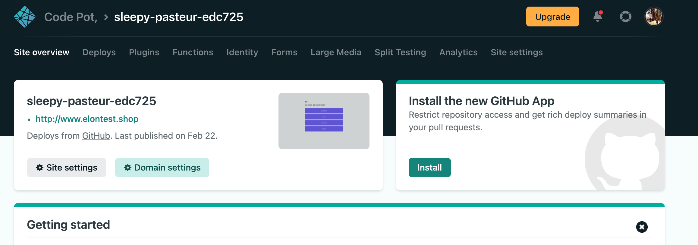
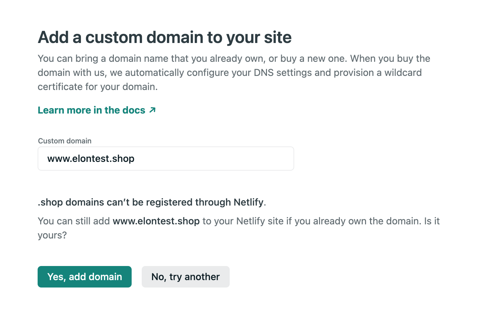
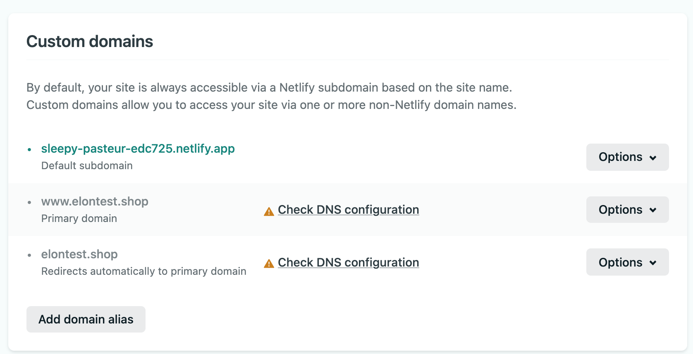
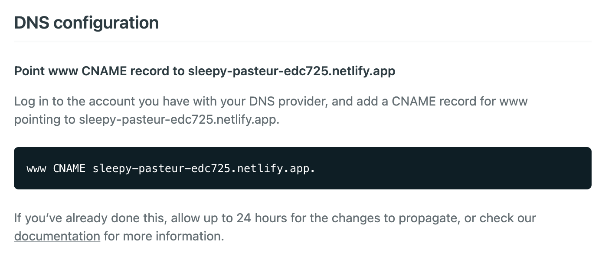
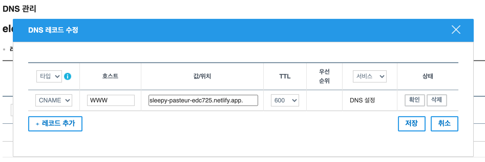
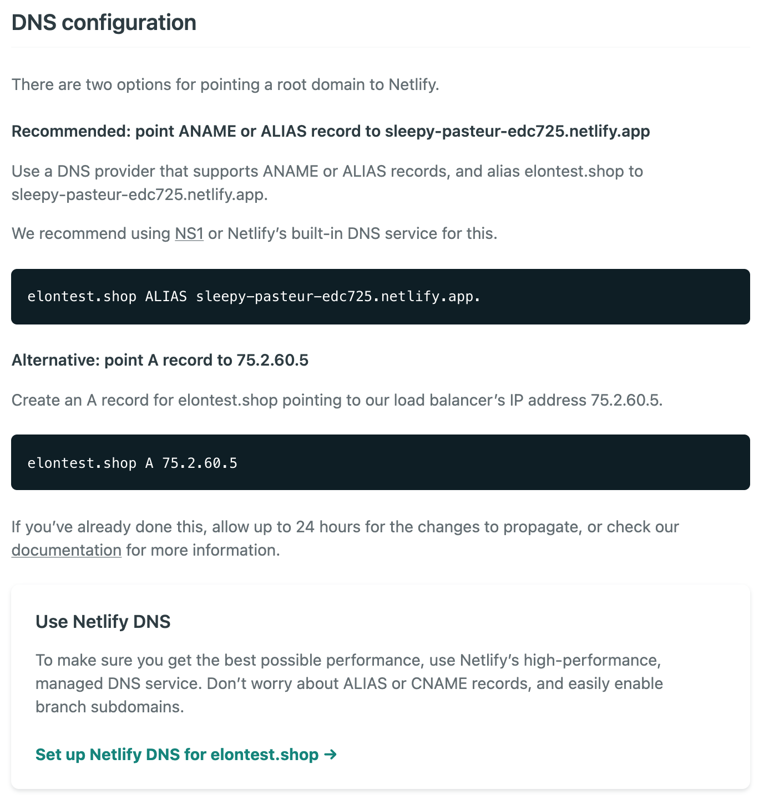
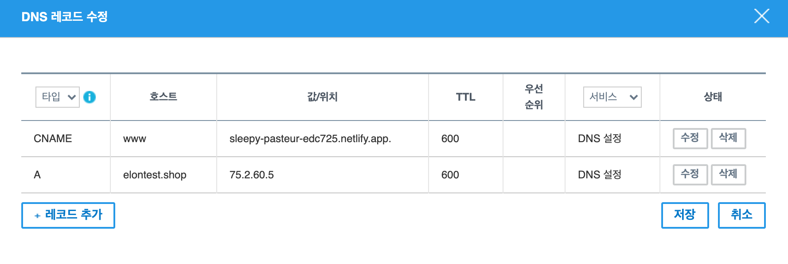
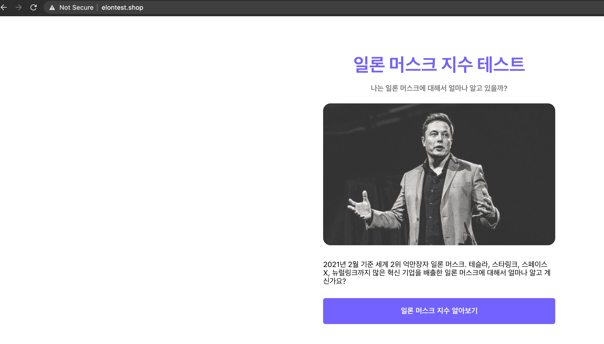

## 도메인 구입하기

도메인은 원하는 사이트 어디에서 구매하셔도 상관 없습니다. 주로 해외는 godaddy, 국내는 gabia를 활용합니다.

## netlify에 도메인 등록하기

netlify 메인 페이지에 접속하여 Domain settings 버튼을 클릭해 줍니다.

Yes, add domain 버튼을 클릭합니다.

위와 같이 에러가 나면 check DNS configuration을 눌러 확인합니다.

각자의 도메인 구입 사이트에서 위와 같은 주소로 CNAME을 추가해 주어야 한다고 합니다.

이 설정의 의미는 **우리가 구매한 도메인으로 접근 했을 때, 우리가 배포한 netlify App과 연결**해 주는 것입니다.

저는 가비아에서 도메인을 구매했으니, 가비아로 가서 셋팅을 해보도록 하겠습니다.

DNS 관리 → DNS 레코드 수정으로 이동하여 위와 같이 레코드를 추가하여 줍니다.

두번째 에러도 클릭하여 확인합니다.

그리고 위 설명에 맞추어 레코드를 추가하여 줍니다.

이제 마지막으로 도메인에 접속해 보도록 하겠습니다.

도메인과 정상적으로 잘 연결된 것을 확인 할 수 있습니다. 👏👏👏

## Somthing More!!!

반드시 공부해야 하는 건 아니지만, 도움이 될 만한 자료들을 공유하고 있습니다.

- CNAME과 A record의 차이 ([링크](https://twpower.github.io/40-difference-between-cname-and-a-record))
