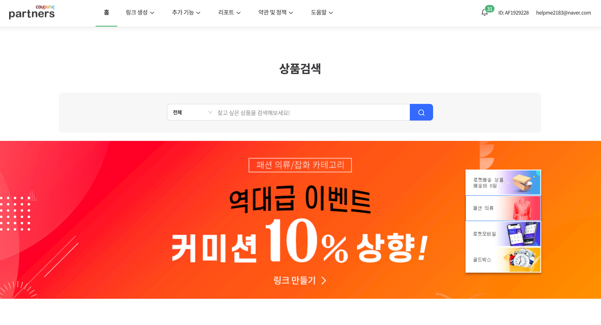

이제는 우리가 만든 성향 테스트에 쿠팡 파트너스 광고를 붙여 수익화를 해보도록 하겠습니다.

## 쿠팡 파트너스 구조


쿠팡 파트너스는 위의 그림처럼 우리가 만든 성향 테스트에 쿠팡의 상품을 대신 광고 해주고, 방문자가 상품을 구매했을 시 일정 부분의 수수료를 지급받는 구조입니다. 수수료는 쿠팡에서 정해주는 수익료로 책정받으며, 주로 1% 내외로 구성되어 있습니다 (수익률은 쿠팡의 정책에 따라 언제든지 변경되오니, 확인이 필요합니다)

## 쿠팡 파트너스 가입하기

[링크](https://partners.coupang.com/)에서 쿠팡 파트너스에 가입해 해주세요.

## 카테고리 배너 추가하기



우측 상단 링크 생성 탭을 클릭하여, 링크 생성 페이지로 이동합니다.


링크 생성에서 가장 무난한 카테고리 링크부터 생성해 보도록 하겠습니다.

카테고리 배너를 클릭하고, 원하는 카테고리를 선택해 주세요.


선택하고 나면 여러 사이즈의 배너를 볼 수 있는데, 성향 테스트의 컨테이너 사이즈가 500px이므로, 320px 이미지를 선택합니다.

그리고 오른쪽에 있는 HTML 파일을 복사합니다.

노출하고자 하는 페이지에 해당 코드를 붙여 넣습니다.

```jsx
//pages/Result/index.js
...

const Result = ({ setScore }) => {
	...
	return (
		<>
			...
				<a
					href="https://coupa.ng/bVY1Us"
					target="_blank"
					referrerpolicy="unsafe-url"
				>
					
				</a>
		  ...
		</>
	);
};

export default Result;
```

추가로 중앙 정렬을 위해 Container 컴포넌트의 스타일 속성을 하나 추가합니다.

```jsx
// components/Container/index.js
...

const ContainerWrapper = styled.div`
	...
	align-items: center;
	...
`;
```

위와 같이 코드를 변경하고 실행해 보도록 하겠습니다.


위와 같이 쿠팡 배너가 잘 추가된 것을 알 수 있습니다

## 다이나믹 배너 추가하기

쿠팡이 추천해주는 아이템으로 계속해서 자동 변경되는 배너를 추가해 보도록 하겠습니다.


우측 상단에서 다이나믹 배너를 클릭한 후, 배너 생성 버튼을 클릭해 주세요.

배너 설정에서 배너의 이름(노출되는 이름이 아니고, 쿠팡 사이트에서 관리하는 이름입니다) 그러므로 아무 이름이나 설정해도 상관 없습니다. 그리고 배너 타입과 데이터는 마음에 드는 것으로 선택해 주세요.


그리고 나면 아래에 Script 파일이 생성되는데 이 것을 활용하여 만들어 보도록 하겠습니다.

아래와 같이 Result Page의 코드를 변경해 줍니다.

```jsx
// Page/Result/index.js
...
import { useEffect } from "react";
import { useScript } from "hooks";

const Result = ({ setScore }) => {
	...
	// 쿠팡 파트너스 script import
	const status = useScript("https://ads-partners.coupang.com/g.js");
	// script가 import 완료되면 script 초기화하기
	useEffect(() => {
		if (status === "ready") {
			new window.PartnersCoupang.G({
				id: 469213,
				template: "carousel",
				trackingCode: "AF1929228",
				width: "600",
				height: "140",
			});
		}
	}, [status]);
	return (
		<>
			...
		</>
	);
};

export default Result;
```

카카오 링크 버튼을 만들 때와 동일한 방식으로 외부 script를 추가해 주었습니다.

그럼 실행해 보도록 하겠습니다.


위와 같이 쿠팡 다이나믹 배너가 추가된 것을 확인할 수 있습니다.

여기서 한 가지 아쉬운 점이 있는데, 쿠팡 다이나믹 배너의 경우 script가 추가되는 코드 바로 옆에 배너가 붙기 때문에 우리가 사이즈를 조절해 줄 수가 없습니다.

그래서 저같은 경우에는 width를 100%로 수정하여 전체 화면을 채워 사용하고 있습니다.

```jsx
  // Page/Result/index.js
...

const Result = ({ setScore }) => {
	...
	useEffect(() => {
		if (status === "ready") {
			new window.PartnersCoupang.G({
				...
				width: "100%",
				...
			});
		}
	}, [status]);
	return (
		<>
			...
		</>
	);
};

export default Result;
```

다시 실행해 보도록 하겠습니다.


위와 같이 배너가 정상적으로 추가된 것을 알 수 있습니다.


PC 화면의 경우, width가 100%에 많은 상품이 보여 지저분해 보이는 경향이 있는데 모바일의 경우 화면이 좁아 2개의 상품만 노출되므로 상황에 따라 활용하시면 좋을 것 같습니다.

## 전체 코드 살펴보기

- 깃허브에서 전체 코드 보기 -> [바로가기](https://github.com/CodePotStudio/starter-quiz-app/tree/week08-01)

## Somthing More!!!

반드시 공부해야 하는 건 아니지만, 도움이 될 만한 자료들을 공유하고 있습니다.

- 구글 애드센스 적용하기 ([링크](https://theorydb.github.io/envops/2020/04/20/envops-blog-how-to-register-google-adsense/))
